# Module 12 Deployment — Diagrams & New Content Implementation Plan

> **For agentic workers:** REQUIRED SUB-SKILL: Use superpowers:subagent-driven-development (recommended) or superpowers:executing-plans to implement this plan task-by-task. Steps use checkbox (`- [ ]`) syntax for tracking.

**Goal:** Add a new diagram-driven sub-module (`05_production_operations`) plus targeted in-place diagrams, navigation, and interview Q&A to `gen-ai-course/12_deployment/`, visualizing request lifecycle, scaling/reliability, release/rollback, and observability/cost.

**Architecture:** One new sibling `README.md` holds the large conceptual Mermaid diagrams across four themed sections; a small number of targeted diagrams are inserted beside relevant code in the existing technique/Azure/AWS files; the module README and interview.md are updated for navigation and prep.

**Tech Stack:** Markdown + Mermaid (plain/unthemed, matching course style in modules 04 & 13: `graph LR`, `flowchart`, `sequenceDiagram`, `stateDiagram-v2`, `subgraph`, `note`) + ASCII box-art for tiny inline structures.

**Spec:** `docs/superpowers/specs/2026-06-22-deployment-module-diagrams-design.md`

**Conventions for every section/file in this plan:**
- H2 (`##`) for top-level sections, H3 (`###`) for sub-parts, matching existing sub-modules.
- Every Mermaid block is preceded by a one-line italic caption: `*Figure: ...*`.
- Each themed section ends with a `> **In practice:**` callout and a `**Maps to:**` line linking to concrete code.
- Mermaid is plain — no `style`/`classDef`/theme directives.

**General verification (run after each content task):**
- Fence balance: count of ` ``` ` lines in the edited file is even.
- Mermaid blocks open with ` ```mermaid ` and close with ` ``` `.
- Links: every relative link target file exists.

---

### Task 1: Scaffold `05_production_operations` and write the Request Lifecycle section

**Files:**
- Create: `gen-ai-course/12_deployment/05_production_operations/README.md`

- [ ] **Step 1: Create the file with header, intro, and table of contents**

```markdown
# Module 12.5 — Production Operations

How a GenAI service actually behaves once real traffic hits it. This section is the visual, conceptual glue between the techniques (Module 12.2) and the cloud-specific implementations (12.3 Azure, 12.4 AWS): it shows the mental models — request flow, scaling, releases, and observability — that the code in those modules implements.

---

## Table of Contents

1. [The Request Lifecycle](#the-request-lifecycle)
2. [Scaling & Reliability](#scaling--reliability)
3. [Release & Rollback](#release--rollback)
4. [Observability & Cost](#observability--cost)
5. [Key Takeaways](#key-takeaways)

---

## The Request Lifecycle

A single inference request is not "call the model and wait." It passes through a gateway, authentication, rate limiting, a queue, and a batching scheduler before a GPU ever sees it — then tokens stream back as they are generated. Understanding this path explains nearly every latency and throughput decision you will make.

*Figure: the journey of one inference request from client to streamed response.*

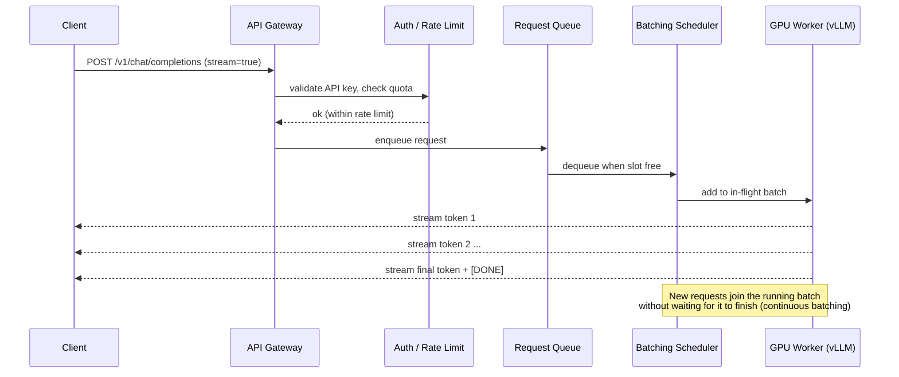

Why a queue and a scheduler instead of one-request-per-GPU? Because GPUs are most efficient when processing many sequences at once. The scheduler packs concurrent requests into a single batch and keeps the GPU saturated.

*Figure: static batching wastes the GPU between batches; continuous batching keeps it full.*

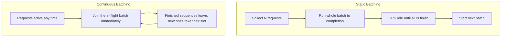

The other half of serving efficiency is the **KV-cache**: the attention keys/values for every token already generated are kept in GPU memory so they are not recomputed each step. This is why long contexts and many concurrent users consume GPU memory fast.

```
GPU Memory (e.g. 80 GB A100)
┌─────────────────────────────────────────────┐
│  Model weights (e.g. 7B @ fp16 ≈ 14 GB)       │
├─────────────────────────────────────────────┤
│  KV-cache  ── grows with (tokens × users)     │
│  [req A ███████      ]                         │
│  [req B ████         ]                         │
│  [req C ██████████   ]  ← evicted/blocked when │
│                          cache is full          │
├─────────────────────────────────────────────┤
│  Activations / scratch                         │
└─────────────────────────────────────────────┘
```

> **In practice:** Latency has two parts — time-to-first-token (queue wait + prompt processing) and inter-token latency (decode speed). Continuous batching improves throughput; it does not shorten a single request. When the KV-cache fills, new requests queue — that is the real meaning of "GPU at capacity."

**Maps to:** vLLM/continuous batching config in [02_deployment_techniques](../02_deployment_techniques/README.md#model-optimization-before-deployment); GPU node pools in [03_azure](../03_deployment_implementation_with_azure/README.md#azure-kubernetes-service-aks) and [04_aws_mlops](../03_deployment_implementation_with_azure/04_deployment_with_aws_mlops/README.md#sagemaker-real-time-endpoints).
```

- [ ] **Step 2: Verify fences balance and Mermaid blocks are well-formed**

Run: `grep -c '```' "gen-ai-course/12_deployment/05_production_operations/README.md"`
Expected: an even number. Confirm 2 ` ```mermaid ` opens this task (sequence + flowchart) and one ASCII ` ``` ` block.

- [ ] **Step 3: Verify the three Maps-to link targets exist**

Run: `ls gen-ai-course/12_deployment/02_deployment_techniques/README.md gen-ai-course/12_deployment/03_deployment_implementation_with_azure/README.md gen-ai-course/12_deployment/03_deployment_implementation_with_azure/04_deployment_with_aws_mlops/README.md`
Expected: all three paths listed, no "No such file".

- [ ] **Step 4: Commit**

```bash
git add gen-ai-course/12_deployment/05_production_operations/README.md
git commit -m "docs(m12.5): add Production Operations sub-module — Request Lifecycle section"
```

---

### Task 2: Add the Scaling & Reliability section

**Files:**
- Modify: `gen-ai-course/12_deployment/05_production_operations/README.md` (append after the Request Lifecycle section, before Key Takeaways)

- [ ] **Step 1: Append the Scaling & Reliability section**

````markdown
---

## Scaling & Reliability

Traffic to a GenAI service is bursty. Scaling well means matching capacity to demand at two levels: scaling **pods** (replicas of your server) and scaling **nodes** (the actual GPU machines). Different signals drive each.

*Figure: the three layers of autoscaling and what triggers each.*

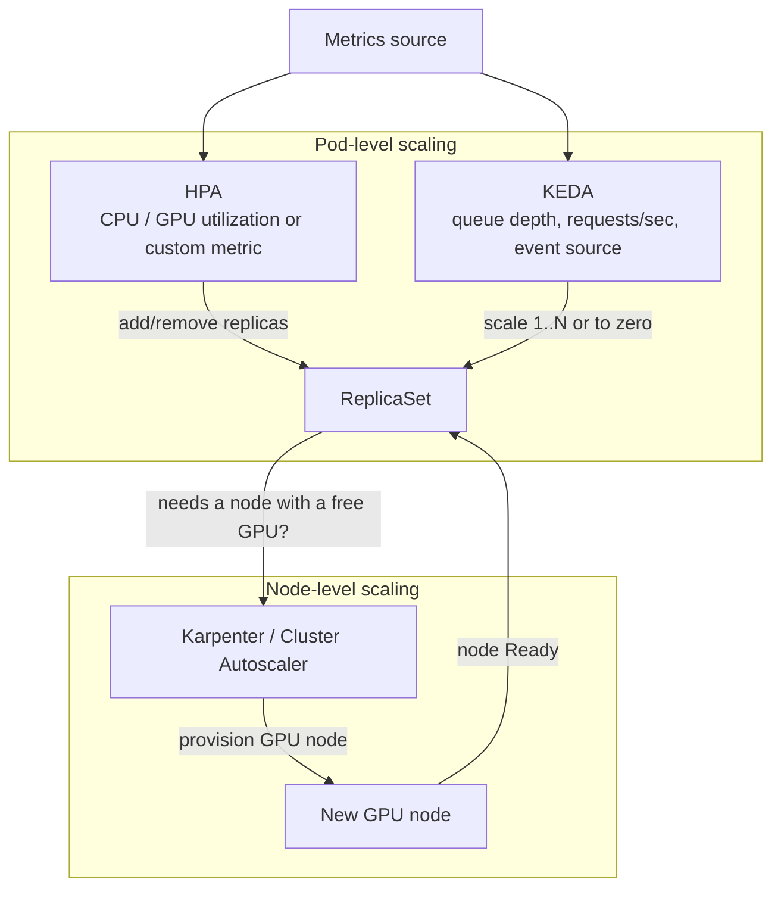

- **HPA** reacts to resource/custom metrics already exposed on running pods.
- **KEDA** reacts to *external* signals (queue length, requests/sec) and uniquely can scale **to zero**.
- **Karpenter / Cluster Autoscaler** adds machines when pods cannot be scheduled for lack of GPUs.

### Scale-to-zero and cold starts

Scaling to zero saves money on idle services but introduces a **cold start**: the next request must wait for a node, image pull, and model load.

*Figure: the cost of the first request after scaling from zero.*

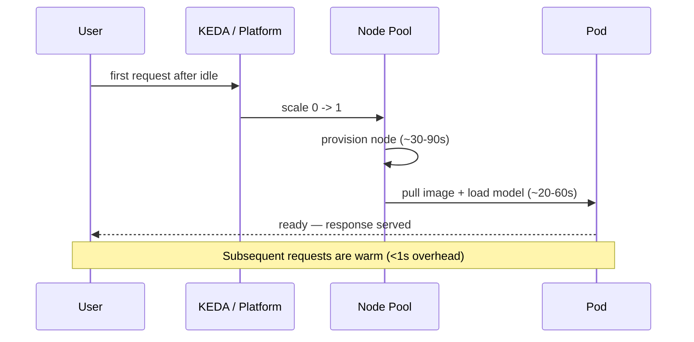

### Multi-region failover & high availability

For resilience, run in more than one region behind a global router that health-checks each backend and fails over automatically.

*Figure: active-active topology with health-checked failover.*

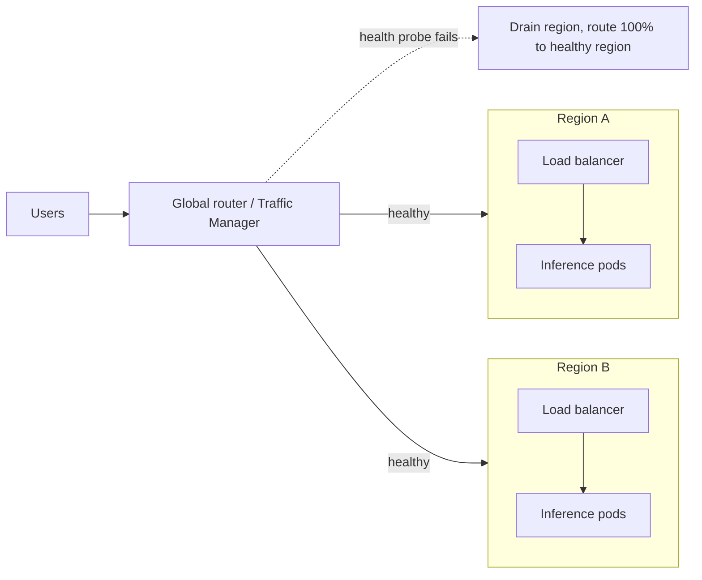

> **In practice:** Pick scaling signals that lead demand, not lag it — queue depth (KEDA) reacts before CPU saturation does. Keep a warm minimum replica for latency-sensitive services; use scale-to-zero only where cold-start latency is acceptable. Rate limiting at the gateway is part of reliability: it protects the GPU fleet from being overwhelmed.

**Maps to:** KEDA `ScaledObject` and GPU node pools in [03_azure](../03_deployment_implementation_with_azure/README.md#azure-kubernetes-service-aks); Karpenter and SageMaker auto-scaling in [04_aws_mlops](../03_deployment_implementation_with_azure/04_deployment_with_aws_mlops/README.md#ecs--eks-container-deployment); serverless cold starts in [02_deployment_techniques](../02_deployment_techniques/README.md#serverless-techniques).
````

- [ ] **Step 2: Verify fences and links**

Run: `grep -c '```' "gen-ai-course/12_deployment/05_production_operations/README.md"`
Expected: still even. Three new ` ```mermaid ` blocks added this task.

- [ ] **Step 3: Commit**

```bash
git add gen-ai-course/12_deployment/05_production_operations/README.md
git commit -m "docs(m12.5): add Scaling & Reliability section with diagrams"
```

---

### Task 3: Add the Release & Rollback section

**Files:**
- Modify: `gen-ai-course/12_deployment/05_production_operations/README.md` (append after Scaling section)

- [ ] **Step 1: Append the Release & Rollback section**

````markdown
---

## Release & Rollback

Shipping a new model or app version safely means controlling how much traffic it sees and being able to undo instantly. The three core strategies trade speed of rollout against blast radius.

*Figure: how traffic shifts under blue-green, canary, and rolling releases.*

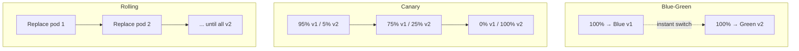

- **Blue-green:** two full environments, switch all traffic at once. Instant rollback (switch back), but double the resources during the cutover.
- **Canary:** shift traffic in small increments, watching metrics at each step. Smallest blast radius; slowest rollout.
- **Rolling:** replace replicas one batch at a time. No extra environment, but old and new run simultaneously mid-rollout.

### CI/CD pipeline with quality gates

Releases should be automated and gated — each stage must pass before the next runs.

*Figure: pipeline from commit to production with automated gates.*

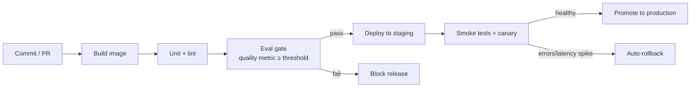

### Rollback decision flow

When a release misbehaves, the decision to roll back should be mechanical, not a debate.

*Figure: deciding whether to roll back.*

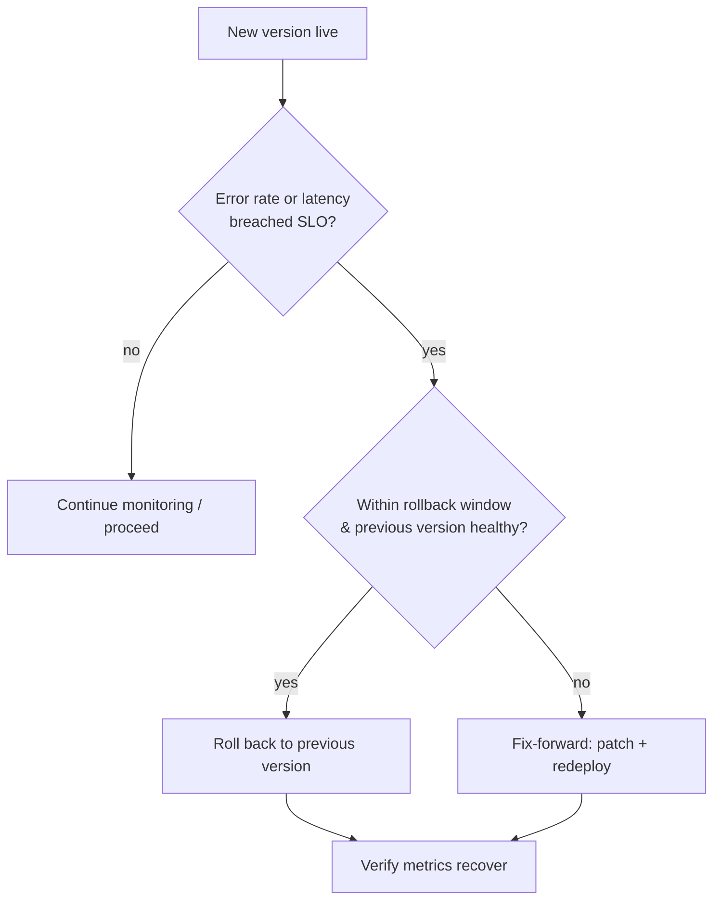

> **In practice:** Use canary for model changes where quality regressions are subtle (you need real traffic to detect them) and blue-green for infrastructure changes you can validate before the switch. Always wire an automatic rollback trigger on error-rate/latency SLO breach — humans are too slow at 3 a.m. The eval gate is what makes a GenAI pipeline different from a normal one: a green unit-test run does not mean the model still answers well.

**Maps to:** blue-green/canary/rolling configs in [02_deployment_techniques](../02_deployment_techniques/README.md#deployment-strategies-blue-green-canary-rolling); Azure ML traffic-split deployments in [03_azure](../03_deployment_implementation_with_azure/README.md#azure-machine-learning-endpoints); SageMaker production variants in [04_aws_mlops](../03_deployment_implementation_with_azure/04_deployment_with_aws_mlops/README.md#sagemaker-real-time-endpoints).
````

- [ ] **Step 2: Verify fences and links**

Run: `grep -c '```' "gen-ai-course/12_deployment/05_production_operations/README.md"`
Expected: even. Three new ` ```mermaid ` blocks this task.

- [ ] **Step 3: Commit**

```bash
git add gen-ai-course/12_deployment/05_production_operations/README.md
git commit -m "docs(m12.5): add Release & Rollback section with diagrams"
```

---

### Task 4: Add the Observability & Cost section + Key Takeaways + footer

**Files:**
- Modify: `gen-ai-course/12_deployment/05_production_operations/README.md` (append after Release section)

- [ ] **Step 1: Append the Observability & Cost section, Key Takeaways, and footer**

````markdown
---

## Observability & Cost

You cannot operate what you cannot see. Observability for a GenAI service combines the three classic signals — metrics, logs, traces — with two GenAI-specific ones: **token usage** and **answer quality**.

*Figure: how signals flow from the service to dashboards and alerts.*

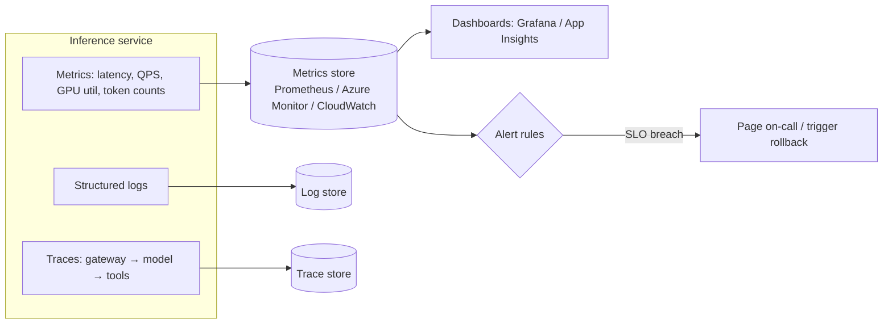

A useful LLM dashboard groups panels by question, not by raw metric:

```
┌───────────────────────────┬───────────────────────────┐
│ Latency                   │ Reliability               │
│  • p50 / p95 TTFT         │  • error rate (4xx/5xx)   │
│  • inter-token latency    │  • timeouts / retries     │
├───────────────────────────┼───────────────────────────┤
│ Throughput & Capacity     │ Cost                      │
│  • requests/sec           │  • tokens/min (in/out)    │
│  • GPU utilization        │  • $ spend/hour           │
│  • queue depth            │  • $ per request          │
└───────────────────────────┴───────────────────────────┘
```

### Token spend & cost attribution

For LLM services, cost ≈ tokens. Attributing spend back to teams or customers requires tagging every request and aggregating by token counts × price.

*Figure: from a single request to a per-customer cost report.*

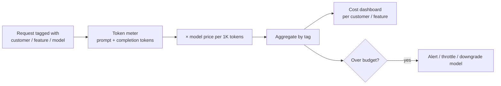

> **In practice:** Track p95, not averages — tail latency is what users feel. Always log `prompt_tokens` and `completion_tokens`; they are both your bill and your capacity signal. Tag requests at the gateway so cost attribution is automatic rather than a quarterly forensics exercise. Cache hits, shorter prompts, and routing easy requests to cheaper models are the three biggest cost levers.

**Maps to:** Prometheus/Grafana and middleware metrics in [02_deployment_techniques](../02_deployment_techniques/README.md#monitoring--observability); App Insights in [03_azure](../03_deployment_implementation_with_azure/README.md#monitoring-with-azure-monitor--application-insights); CloudWatch in [04_aws_mlops](../03_deployment_implementation_with_azure/04_deployment_with_aws_mlops/README.md#monitoring-with-cloudwatch--sagemaker-clarify).

---

## Key Takeaways

- A request flows gateway → auth/rate-limit → queue → batching scheduler → GPU → streamed tokens; the queue and KV-cache explain most latency and capacity behaviour.
- Continuous batching maximizes throughput, not single-request speed.
- Scale pods (HPA/KEDA) and nodes (Karpenter/Cluster Autoscaler) on signals that lead demand; scale-to-zero trades cost for cold-start latency.
- Choose canary for subtle model-quality risk, blue-green for validated infra cutovers; always wire automatic rollback on SLO breach.
- Observe metrics + logs + traces **plus** tokens and quality; tag requests for automatic cost attribution.

---

*Previous: [12.2 Deployment Techniques →](../02_deployment_techniques/README.md)*
*Next: [12.3 Azure Implementation →](../03_deployment_implementation_with_azure/README.md)*
````

- [ ] **Step 2: Verify fences and links**

Run: `grep -c '```' "gen-ai-course/12_deployment/05_production_operations/README.md"`
Expected: even. Two new ` ```mermaid ` blocks + one ASCII block this task.

- [ ] **Step 3: Verify total Mermaid count for the file**

Run: `grep -c '```mermaid' "gen-ai-course/12_deployment/05_production_operations/README.md"`
Expected: 10 (sequence ×2, flowchart ×8 across the four sections).

- [ ] **Step 4: Commit**

```bash
git add gen-ai-course/12_deployment/05_production_operations/README.md
git commit -m "docs(m12.5): add Observability & Cost section, takeaways, footer"
```

---

### Task 5: Insert targeted in-place diagrams in existing files

**Files:**
- Modify: `gen-ai-course/12_deployment/02_deployment_techniques/README.md` (Deployment Strategies section)
- Modify: `gen-ai-course/12_deployment/03_deployment_implementation_with_azure/README.md` (AKS / KEDA section)
- Modify: `gen-ai-course/12_deployment/03_deployment_implementation_with_azure/04_deployment_with_aws_mlops/README.md` (SageMaker Real-Time Endpoints section)

- [ ] **Step 1: Locate the three insertion points**

Run: `grep -n -E '## Deployment Strategies|## Azure Kubernetes Service|## SageMaker Real-Time Endpoints' gen-ai-course/12_deployment/02_deployment_techniques/README.md gen-ai-course/12_deployment/03_deployment_implementation_with_azure/README.md gen-ai-course/12_deployment/03_deployment_implementation_with_azure/04_deployment_with_aws_mlops/README.md`
Expected: one line number per heading. Insert each diagram immediately *after* the heading's intro paragraph (before the first code block in that section). If a heading text differs slightly, use the actual heading found.

- [ ] **Step 2: Insert canary traffic-shift diagram into `02_deployment_techniques` (Deployment Strategies)**

Add after the section's intro paragraph:

````markdown
*Figure: canary release — traffic shifts to v2 in monitored increments.*

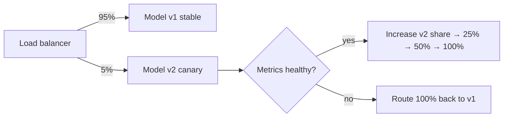

> For the conceptual comparison of blue-green vs canary vs rolling, see [12.5 Release & Rollback](../05_production_operations/README.md#release--rollback).
````

- [ ] **Step 3: Insert KEDA scaling-trigger diagram into `03_azure` (AKS section)**

Add after the AKS section's intro paragraph:

````markdown
*Figure: KEDA scales the deployment on queue depth, then the cluster autoscaler adds GPU nodes if needed.*

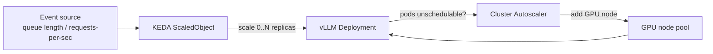

> For how pod-level and node-level scaling fit together, see [12.5 Scaling & Reliability](../05_production_operations/README.md#scaling--reliability).
````

- [ ] **Step 4: Insert SageMaker endpoint + autoscaling diagram into `04_aws_mlops`**

Add after the SageMaker Real-Time Endpoints intro paragraph:

````markdown
*Figure: a SageMaker real-time endpoint with target-tracking auto-scaling across variants.*

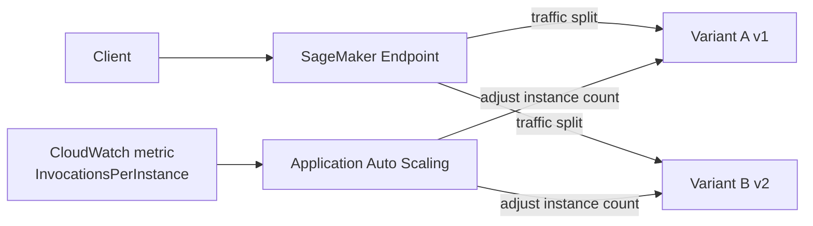

> For the conceptual model of scaling signals and cold starts, see [12.5 Scaling & Reliability](../05_production_operations/README.md#scaling--reliability).
````

- [ ] **Step 5: Verify fences in all three edited files**

Run: `for f in gen-ai-course/12_deployment/02_deployment_techniques/README.md gen-ai-course/12_deployment/03_deployment_implementation_with_azure/README.md gen-ai-course/12_deployment/03_deployment_implementation_with_azure/04_deployment_with_aws_mlops/README.md; do echo "$f"; grep -c '```' "$f"; done`
Expected: each count even.

- [ ] **Step 6: Verify back-links resolve**

Run: `ls gen-ai-course/12_deployment/05_production_operations/README.md`
Expected: path listed (the three new back-links all point here).

- [ ] **Step 7: Commit**

```bash
git add gen-ai-course/12_deployment/02_deployment_techniques/README.md gen-ai-course/12_deployment/03_deployment_implementation_with_azure/README.md gen-ai-course/12_deployment/03_deployment_implementation_with_azure/04_deployment_with_aws_mlops/README.md
git commit -m "docs(m12): add in-place diagrams for canary, KEDA, SageMaker scaling"
```

---

### Task 6: Update module navigation in `12_deployment/README.md`

**Files:**
- Modify: `gen-ai-course/12_deployment/README.md`

- [ ] **Step 1: Add `05_production_operations/` to the Module Map tree**

In the Module Map code block, after the `04_deployment_with_aws_mlops` block and before the closing of the tree, add:

```
│
├── 05_production_operations/         ← Conceptual glue (diagram-driven)
│   └── README.md                     Request lifecycle, scaling, releases,
│                                     observability & cost — visualized
```

(Place it as a top-level child of `12_deployment/`, sibling to `01`–`03`, matching existing indentation.)

- [ ] **Step 2: Add a "Step 2.5" box to the Learning Path**

In the Learning Path ASCII diagram, insert between the Step 2 box and the branch to Step 3a/3b:

```
                               │
┌──────────────────────────────▼──────────────────────────────────┐
│  Step 2.5 — 05_production_operations                            │
│  "How does this behave under real traffic?"                     │
│  Visual mental models: request flow, scaling, releases, cost    │
└──────────────────────────────┬──────────────────────────────────┘
```

Ensure the connector lines (`│`, `▼`) still chain Step 2 → Step 2.5 → the 3a/3b branch.

- [ ] **Step 3: Add a row to the Estimated Time table and update the total**

Add the row after `02 Deployment Techniques`:

```
| 02.5 Production Operations | 1.5–2 hours |
```

Update the `**Total**` row from `**~10 hours**` to `**~12 hours**`.

- [ ] **Step 4: Verify the new path link and fences**

Run: `grep -n '05_production_operations' gen-ai-course/12_deployment/README.md`
Expected: at least the Module Map and Learning Path references appear.
Run: `grep -c '```' gen-ai-course/12_deployment/README.md`
Expected: even.

- [ ] **Step 5: Commit**

```bash
git add gen-ai-course/12_deployment/README.md
git commit -m "docs(m12): add 05_production_operations to module map, learning path, time table"
```

---

### Task 7: Add interview Q&A for the new themes

**Files:**
- Modify: `gen-ai-course/12_deployment/interview.md`

- [ ] **Step 1: Inspect the existing Q&A format**

Run: `grep -n -E '^###|^##|^\*\*Q|^Q[0-9]' gen-ai-course/12_deployment/interview.md | head -20`
Expected: shows the heading/Q&A pattern in use. Match that exact format (heading level and "Q/A" styling) for the new entries.

- [ ] **Step 2: Append six new Q&A using the file's existing format**

Add these (reformatted to match the existing pattern found in Step 1). Content:

1. **Q: Walk me through what happens to an inference request from gateway to response.**
   A: Client hits the API gateway → auth + rate-limit check → request is enqueued → a batching scheduler dequeues it and adds it to the in-flight batch on a GPU worker → tokens stream back as generated. Key point: the queue + continuous batching keep the GPU saturated; the KV-cache holds prior tokens' attention state so they are not recomputed.

2. **Q: Why use continuous batching instead of static batching?**
   A: Static batching collects N requests, runs them to completion, and leaves the GPU idle until the slowest finishes. Continuous batching lets new requests join the running batch immediately and finished sequences free their slot, keeping the GPU full. It raises throughput; it does not make a single request faster.

3. **Q: HPA vs KEDA vs Karpenter — when does each apply?**
   A: HPA scales pod replicas on resource/custom metrics already on the pods. KEDA scales on external event signals (queue depth, requests/sec) and can scale to zero. Karpenter (or Cluster Autoscaler) adds/removes nodes when pods can't be scheduled for lack of GPUs. Pods vs nodes, internal vs external signals.

4. **Q: How do you roll back a bad model deployment safely?**
   A: Prefer strategies with fast undo — blue-green (switch traffic back instantly) or canary (small blast radius, abort by routing 100% to the old version). Wire an automatic trigger on SLO breach (error rate / p95 latency). If the previous version is unhealthy or the window passed, fix-forward instead. Verify metrics recover after either path.

5. **Q: What metrics matter most for an LLM service?**
   A: p50/p95 time-to-first-token and inter-token latency; error/timeout rate; throughput (req/s) and GPU utilization; queue depth; and GenAI-specific signals — prompt/completion token counts (bill + capacity) and answer quality. Track p95, not averages.

6. **Q: How do you attribute token cost per customer?**
   A: Tag each request at the gateway (customer/feature/model), meter prompt + completion tokens, multiply by per-1K-token price, and aggregate by tag into a cost dashboard. Add a budget check that can alert, throttle, or downgrade to a cheaper model. Tagging at the edge makes attribution automatic.

- [ ] **Step 3: Verify formatting and fences**

Run: `grep -c '```' gen-ai-course/12_deployment/interview.md`
Expected: even (the new Q&A add prose only, no code fences).

- [ ] **Step 4: Commit**

```bash
git add gen-ai-course/12_deployment/interview.md
git commit -m "docs(m12): add interview Q&A on request lifecycle, scaling, rollback, cost"
```

---

### Task 8: Final cross-file verification

**Files:** none (verification only)

- [ ] **Step 1: Confirm total diagram count across the module**

Run: `grep -rc '```mermaid' gen-ai-course/12_deployment/ | grep -v ':0'`
Expected: `05_production_operations/README.md` = 10; `02_deployment_techniques` +1, `03_.../README.md` +1, `04_deployment_with_aws_mlops` +1 over their pre-change counts. ~13 Mermaid total + 2 new ASCII blocks in 05.

- [ ] **Step 2: Confirm no broken relative links introduced**

Run: `grep -rno '\](\.\./[^)]*\|\](05_production_operations[^)]*' gen-ai-course/12_deployment/`
For each `../`-style target, confirm the resolved path exists with `ls`. Expected: every target resolves.

- [ ] **Step 3: Visual render check (manual)**

Open `gen-ai-course/12_deployment/05_production_operations/README.md` and the three edited files on GitHub (or a Mermaid-rendering preview). Confirm every Mermaid block renders without a syntax error banner and ASCII blocks are aligned.

- [ ] **Step 4: Final commit if any fixes were needed**

```bash
git add -A gen-ai-course/12_deployment/
git commit -m "docs(m12): fix diagram/link issues found in final verification"
```

(Skip if Steps 1–3 found nothing to fix.)

---

## Self-Review Notes

- **Spec coverage:** Request Lifecycle (Task 1) ✓, Scaling & Reliability (Task 2) ✓, Release & Rollback (Task 3) ✓, Observability & Cost (Task 4) ✓, all 12 in-file diagrams ✓, 3 in-place diagrams (Task 5) ✓, navigation updates (Task 6) ✓, interview Q&A (Task 7) ✓, verification incl. Mermaid validity + link resolution + consistency (Tasks 1–8) ✓.
- **Out of scope respected:** no runnable code, no image files, no edits to other modules, existing cloud code samples only gain adjacent diagrams.
- **Diagram total:** 10 in `05` (matches spec's "~12 in new file" minus the 2 ASCII, which spec counts separately as #3 and #11 → 10 Mermaid + 2 ASCII = 12 entries) + 3–4 in-place = ~15–16. Consistent with spec inventory.
