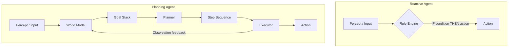

# Pattern 01 — Reactive vs Planning Agents

---

## Theoretical Overview

The foundational divide in agentic AI is between **reactive** and **planning** agents. This distinction determines how an agent maps inputs to actions.

A **Reactive Agent** operates on a stimulus-response model. It maintains no internal world model and applies no lookahead. Every decision is a direct function of the current percept. This makes reactive agents extremely fast and robust in well-scoped domains, but fundamentally incapable of handling tasks that require remembering past state or reasoning about future consequences.

A **Planning Agent** maintains an internal model of the world, a representation of goals, and the ability to reason over sequences of actions before committing to any. It answers: *"Given where I am and where I need to be, what sequence of steps gets me there?"* Planning agents are essential for multi-step workflows, tasks with dependencies, and scenarios where actions have long-term consequences.

| | Reactive | Planning |
|---|---|---|
| **State** | Stateless | Maintains world model |
| **Lookahead** | None | Multi-step |
| **Speed** | Near-zero latency | Higher latency |
| **Scope** | Narrow, well-defined | Open-ended goals |

---

## Architectural Diagram



**Components:**
- **Rule Engine** — Stateless lookup table mapping inputs to outputs directly.
- **World Model** — Internal representation of the current environment state.
- **Goal Stack** — Ordered list of objectives the agent must satisfy.
- **Planner** — Generates a step sequence to satisfy the top goal.
- **Executor** — Carries out individual steps; feeds observations back to the world model.

---

## Real-World Analogy

**Reactive → Traffic Light**
A traffic light switches states based purely on timers or sensor triggers. No awareness of broader city traffic, no memory of yesterday's congestion, no ability to plan a route. It simply reacts: *sensor detects car → change signal*.

**Planning → Human Driver Using GPS**
The driver knows the destination (goal), observes current traffic (world model), and the GPS computes an optimal sequence of turns (plan). If a road is blocked, it replans. The driver is not blindly reacting — they are executing a deliberate strategy.

---

## Implementation Example

```python
from anthropic import Anthropic
import json

client = Anthropic()
MODEL = "claude-sonnet-4-6"


# ── Reactive Agent ─────────────────────────────────────────────────────────────

REACTIVE_RULES: dict[str, str] = {
    "order status":  "Your order is currently being processed and will ship within 2 business days.",
    "store hours":   "We are open Monday–Friday, 9 AM–6 PM EST.",
    "return policy": "Returns are accepted within 30 days of purchase with original receipt.",
    "contact":       "Reach us at support@store.com or call 1-800-555-0100.",
    "refund":        "Refunds are processed within 5–7 business days after we receive your return.",
    "track package": "Visit track.store.com and enter your order number to see live tracking.",
}


class ReactiveAgent:
    """
    Stateless stimulus-response agent.
    Matches the user's query against known triggers; falls back to LLM for unknowns.
    """

    def respond(self, query: str) -> tuple[str, bool]:
        """Returns (response, was_rule_matched)."""
        lowered = query.lower()
        for trigger, answer in REACTIVE_RULES.items():
            if trigger in lowered:
                return answer, True
        # LLM fallback — still stateless (no conversation history)
        response = client.messages.create(
            model=MODEL,
            max_tokens=256,
            messages=[{"role": "user", "content": query}],
        )
        return response.content[0].text, False


# ── Planning Agent ─────────────────────────────────────────────────────────────

SYSTEM_PLANNER = """You are a travel planning assistant.
When given a travel request, output ONLY valid JSON using this schema:
{
  "goal": "<restate the goal concisely>",
  "steps": [
    {"step": 1, "action": "<imperative verb phrase>", "tool": "<optional tool name or null>"}
  ]
}
No commentary outside the JSON."""

SYSTEM_EXECUTOR = """You are a travel booking executor.
You receive a single step from a travel plan and a context log of steps completed so far.
Simulate executing the step and return a single observation sentence describing the result.
Be concrete — include fake but realistic data (flight numbers, prices, times)."""


class PlanningAgent:
    """
    Goal-directed agent: generates a full step plan, then executes each step
    sequentially, accumulating observations as world-model updates.
    """

    def plan(self, goal: str) -> list[dict]:
        response = client.messages.create(
            model=MODEL,
            max_tokens=600,
            system=SYSTEM_PLANNER,
            messages=[{"role": "user", "content": goal}],
        )
        data = json.loads(response.content[0].text)
        return data.get("steps", [])

    def execute_step(self, step: dict, context: str) -> str:
        prompt = (
            f"Context so far:\n{context or 'None'}\n\n"
            f"Execute step {step['step']}: {step['action']}"
        )
        if step.get("tool"):
            prompt += f"\nUse tool: {step['tool']}"
        response = client.messages.create(
            model=MODEL,
            max_tokens=200,
            system=SYSTEM_EXECUTOR,
            messages=[{"role": "user", "content": prompt}],
        )
        return response.content[0].text.strip()

    def run(self, goal: str) -> str:
        print(f"\nGoal: {goal}")
        steps = self.plan(goal)
        print(f"Plan generated: {len(steps)} steps\n")

        observations: list[str] = []
        for step in steps:
            obs = self.execute_step(step, "\n".join(observations))
            observations.append(f"Step {step['step']}: {obs}")
            print(f"  [Step {step['step']}] {obs}")

        return "\n".join(observations)


# ── When to Use Each ───────────────────────────────────────────────────────────

ROUTING_HEURISTICS = {
    "simple FAQ":            "reactive",
    "order status check":    "reactive",
    "customer triage":       "reactive",
    "book flight + hotel":   "planning",
    "research + summarise":  "planning",
    "multi-step onboarding": "planning",
    "real-time monitoring":  "reactive",
}


# ── Demo ───────────────────────────────────────────────────────────────────────

if __name__ == "__main__":
    print("=" * 60)
    print("REACTIVE AGENT DEMO")
    print("=" * 60)
    reactive = ReactiveAgent()
    queries = [
        "What are your store hours?",
        "How do I track my package?",
        "What is the capital of France?",  # falls through to LLM
    ]
    for q in queries:
        answer, matched = reactive.respond(q)
        source = "RULE" if matched else "LLM"
        print(f"[{source}] Q: {q}")
        print(f"       A: {answer[:100]}\n")

    print("=" * 60)
    print("PLANNING AGENT DEMO")
    print("=" * 60)
    planner = PlanningAgent()
    planner.run("Book a round-trip flight from Mumbai to New York for 2 adults departing next Friday.")
```

---

## Code Breakdown

1. **`REACTIVE_RULES` dict** — the entire "intelligence" of the reactive agent is this static lookup table. Matching is O(n) substring scan. Adding a new rule costs one dict entry — no model retraining.

2. **`ReactiveAgent.respond`** — returns a `(response, was_rule_matched)` tuple so callers can log whether the LLM fallback was triggered. The fallback is still stateless — no conversation history is passed.

3. **`SYSTEM_PLANNER` prompt** — constrains the planner to emit only valid JSON. Structured output decouples the planning phase from execution; the plan can be serialised, logged, or shown to a human for approval before any action is taken.

4. **`PlanningAgent.plan`** — a single LLM call that commits the full step graph. `json.loads` extracts the steps array; a malformed response raises immediately rather than silently failing later.

5. **`PlanningAgent.execute_step`** — each step is executed in isolation but receives the cumulative observation history as `context`. This simulates the agent updating its world model after each action, giving the executor awareness of what has already happened.

6. **`PlanningAgent.run`** — the outer loop drives sequential execution and accumulates observations. The printed trace provides a step-by-step audit of the agent's reasoning.

7. **`ROUTING_HEURISTICS`** — a decision table showing when each agent type is appropriate. In production systems this becomes a routing classifier that decides which agent to invoke based on the user's intent.

---

## Pros and Cons

| Dimension | Reactive Agent | Planning Agent |
|---|---|---|
| **Latency** | Near-zero (dict lookup) | Higher (multiple LLM calls) |
| **Cost** | Minimal — LLM only on miss | Proportional to plan depth |
| **Scope** | Narrow, well-defined queries | Open-ended, multi-step goals |
| **Reliability** | Very high for covered cases | Depends on planner quality |
| **Flexibility** | Rigid — needs rule updates manually | Generalises to novel goals |
| **Debuggability** | Trivial — rule trace is explicit | Moderate — plan trace needed |
| **Failure mode** | Silent miss → LLM fallback | Hallucinated steps, bad plans |
| **Best for** | FAQ bots, triage, monitoring | Research, booking, workflows |

---

## When to Use Each

| Scenario | Agent Type | Reason |
|---|---|---|
| Simple FAQ / lookup | Reactive | Deterministic, zero-cost |
| Customer support triage | Reactive | Fast routing, no planning needed |
| Real-time alerts / monitoring | Reactive | Latency is critical |
| Travel booking | Planning | Multi-step, dependent actions |
| Research + report generation | Planning | Requires world model updates |
| Multi-step onboarding workflow | Planning | Goal with ordered dependencies |
| Hybrid (FAQ + complex tasks) | Both | Route by intent classifier |

---

*Next: [02 — Reflection Pattern](02_reflection_pattern.md)*
