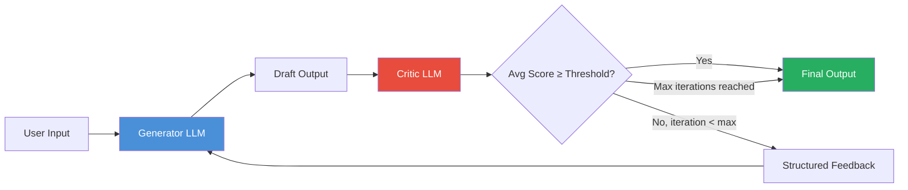

# Pattern 02 — Reflection Pattern

---

## Theoretical Overview

The Reflection Pattern equips an agent with the ability to **critique and revise its own outputs** before returning them to the user. It is inspired by how humans draft, review, and edit work: a first pass produces something, a second pass improves it.

In LLM-based systems, a single generation pass frequently produces outputs that are correct in substance but flawed in form, completeness, or safety. Reflection introduces a **critic** — either the same LLM in a different role or a separate specialised model — that evaluates the draft against explicit criteria and proposes or applies corrections.

The pattern solves three distinct problems:

| Problem | What Reflection Does |
|---|---|
| **Correctness** | Catches factual errors and logical inconsistencies |
| **Quality** | Raises output standard beyond single-pass default |
| **Safety** | Filters policy-violating content before it reaches users |

### Reflection Variants

- **Self-Reflection** — same model, different system prompt for critic role.
- **Cross-Model Reflection** — stronger model critiques output of a weaker generator.
- **Ensemble Reflection** — multiple critics vote; majority drives revision.
- **Constitutional Reflection** — critic checks against a fixed list of principles (Anthropic's Constitutional AI approach).

---

## Architectural Diagram



**Components:**
- **Generator** — Primary LLM producing the initial draft response.
- **Critic** — LLM (same or different model) evaluating draft on defined dimensions.
- **Score** — Numeric or categorical quality assessment per dimension.
- **Feedback** — Structured critique fed back to the generator as revision guidance.
- **Iteration Gate** — Hard cap preventing infinite revision loops.

---

## Real-World Analogy

**Academic Peer Review**
A researcher submits a paper (draft). A reviewer (critic) reads it against a rubric — novelty, methodology, clarity — and returns structured comments. The researcher revises accordingly. This loop runs for at most a fixed number of rounds before a final editorial decision. The reflection pattern is precisely this loop, automated and accelerated.

---

## Implementation Example

```python
from anthropic import Anthropic
from dataclasses import dataclass, field
import json

client = Anthropic()
MODEL = "claude-sonnet-4-6"

# ── Prompts ────────────────────────────────────────────────────────────────────

GENERATOR_SYSTEM = """You are a technical writer producing concise API documentation.
Guidelines:
- Plain language, no jargon
- Include a minimal working code example
- State the purpose in the first sentence
- Keep to 150–250 words"""

CRITIC_SYSTEM = """You are a documentation quality reviewer.
Evaluate the provided draft on these dimensions (score each 1–5):
  clarity      – Is the language plain and unambiguous?
  completeness – Does it include a working code example?
  accuracy     – Are all technical claims correct?
  conciseness  – Is it within 150–250 words without padding?

Return ONLY valid JSON:
{
  "clarity":      <int 1-5>,
  "completeness": <int 1-5>,
  "accuracy":     <int 1-5>,
  "conciseness":  <int 1-5>,
  "feedback":     "<one paragraph of specific, actionable suggestions>"
}"""


# ── Data Types ─────────────────────────────────────────────────────────────────

@dataclass
class CritiqueScore:
    clarity:      int
    completeness: int
    accuracy:     int
    conciseness:  int
    feedback:     str

    @property
    def average(self) -> float:
        return (self.clarity + self.completeness + self.accuracy + self.conciseness) / 4

    def __str__(self) -> str:
        return (
            f"clarity={self.clarity} completeness={self.completeness} "
            f"accuracy={self.accuracy} conciseness={self.conciseness} "
            f"avg={self.average:.2f}"
        )


@dataclass
class ReflectionResult:
    topic:        str
    final_output: str
    iterations:   int
    scores:       list[CritiqueScore] = field(default_factory=list)

    def summary(self) -> str:
        lines = [f"Topic: {self.topic}", f"Iterations used: {self.iterations}"]
        for i, s in enumerate(self.scores, 1):
            lines.append(f"  Round {i}: {s}")
        return "\n".join(lines)


# ── Agent ──────────────────────────────────────────────────────────────────────

class ReflectiveAgent:
    def __init__(self, quality_threshold: float = 4.0, max_iterations: int = 3) -> None:
        self.threshold = quality_threshold
        self.max_iterations = max_iterations

    def generate(self, topic: str, feedback: str = "") -> str:
        user_msg = f"Write API documentation for: {topic}"
        if feedback:
            user_msg += f"\n\nPrevious reviewer feedback to address:\n{feedback}"
        response = client.messages.create(
            model=MODEL,
            max_tokens=600,
            system=GENERATOR_SYSTEM,
            messages=[{"role": "user", "content": user_msg}],
        )
        return response.content[0].text

    def critique(self, draft: str) -> CritiqueScore:
        response = client.messages.create(
            model=MODEL,
            max_tokens=400,
            system=CRITIC_SYSTEM,
            messages=[{"role": "user", "content": f"Review this documentation draft:\n\n{draft}"}],
        )
        raw = json.loads(response.content[0].text)
        return CritiqueScore(**raw)

    def run(self, topic: str) -> ReflectionResult:
        draft = self.generate(topic)
        result = ReflectionResult(topic=topic, final_output=draft, iterations=0)

        for iteration in range(1, self.max_iterations + 1):
            result.iterations = iteration
            print(f"\n{'─'*50}")
            print(f"Iteration {iteration}/{self.max_iterations}")

            score = self.critique(draft)
            result.scores.append(score)
            print(f"Scores: {score}")
            print(f"Feedback: {score.feedback[:120]}...")

            if score.average >= self.threshold:
                print(f"✓ Quality threshold ({self.threshold}) reached.")
                break

            if iteration < self.max_iterations:
                print("Regenerating with feedback...")
                draft = self.generate(topic, score.feedback)
                result.final_output = draft

        return result


# ── Constitutional Reflection (bonus variant) ──────────────────────────────────

PRINCIPLES = [
    "The response must not contain harmful or misleading information.",
    "The response must be respectful and professional in tone.",
    "The response must directly answer the user's question.",
    "The response must not make unsubstantiated claims.",
]

CONSTITUTION_CRITIC_SYSTEM = """You are a constitutional AI reviewer.
Check the draft against each principle and return ONLY valid JSON:
{
  "violations": ["<principle text if violated>"],
  "revised_draft": "<corrected version, or original if no violations>"
}"""


class ConstitutionalReflectiveAgent:
    """Single-pass critic that checks output against a fixed principle list."""

    def critique_and_revise(self, draft: str) -> str:
        principles_block = "\n".join(f"{i+1}. {p}" for i, p in enumerate(PRINCIPLES))
        prompt = f"Principles:\n{principles_block}\n\nDraft to review:\n{draft}"
        response = client.messages.create(
            model=MODEL,
            max_tokens=600,
            system=CONSTITUTION_CRITIC_SYSTEM,
            messages=[{"role": "user", "content": prompt}],
        )
        data = json.loads(response.content[0].text)
        if data["violations"]:
            print(f"Violations found: {data['violations']}")
        return data["revised_draft"]


# ── Demo ───────────────────────────────────────────────────────────────────────

if __name__ == "__main__":
    # Standard reflective agent
    print("=" * 60)
    print("REFLECTIVE AGENT — API Documentation")
    print("=" * 60)
    agent = ReflectiveAgent(quality_threshold=4.0, max_iterations=3)
    result = agent.run("Python contextlib.contextmanager decorator")
    print(f"\n{result.summary()}")
    print(f"\nFinal Output:\n{result.final_output}")

    # Constitutional variant
    print("\n" + "=" * 60)
    print("CONSTITUTIONAL REFLECTION — Safety Check")
    print("=" * 60)
    constitutional = ConstitutionalReflectiveAgent()
    test_draft = "This product is absolutely the best and will definitely cure all your problems."
    revised = constitutional.critique_and_revise(test_draft)
    print(f"Original: {test_draft}")
    print(f"Revised:  {revised}")
```

---

## Code Breakdown

1. **`GENERATOR_SYSTEM` / `CRITIC_SYSTEM`** — separate system prompts give the same underlying model two distinct identities. The critic prompt is explicit about the scoring rubric so output is always parseable JSON with numeric fields.

2. **`CritiqueScore` dataclass** — wraps the four numeric dimensions and feedback text. The `average` property computes the gate value. `__str__` gives a compact one-line summary for log output.

3. **`ReflectionResult` dataclass** — full audit trail: topic, final draft, iterations used, and the full sequence of `CritiqueScore` objects. Downstream systems can analyse score progression to detect stagnation.

4. **`ReflectiveAgent.generate`** — accepts optional `feedback` text. When present, it is appended to the user message, giving the generator *specific* revision guidance rather than a generic "try again".

5. **`ReflectiveAgent.critique`** — makes a fresh LLM call in critic mode. `json.loads` deserialises the response; the `CritiqueScore(**raw)` constructor validates that all expected fields are present.

6. **Average score gate** — four dimension scores are averaged. If the average meets or exceeds `quality_threshold`, the loop exits early — preventing unnecessary API calls when quality is already sufficient.

7. **`max_iterations` cap** — the loop always terminates. The last draft is returned regardless of whether the threshold was met. This bounds both latency and cost.

8. **`ConstitutionalReflectiveAgent`** — demonstrates the constitutional variant. Instead of numeric scores, it checks against a fixed principle list and returns either the original or a corrected draft. No iteration needed — one pass is sufficient for safety checks.

---

## Pros and Cons

| Dimension | Pros | Cons |
|---|---|---|
| **Quality** | Measurably higher output vs single-pass | 2–3× LLM call overhead per iteration |
| **Transparency** | Full audit trail of revision history | Critic may introduce its own biases |
| **Flexibility** | Threshold, dimensions, and iterations are tunable | Critic prompt engineering is non-trivial |
| **Safety** | Catches policy violations before user sees output | Latency increases linearly with iterations |
| **Cost** | Early exit minimises unnecessary calls | Always at least 2 LLM calls per request |
| **Convergence** | Most drafts reach threshold in 1–2 rounds | Some tasks never converge (infinite loops risk) |

---

## Design Guidelines

- **Score dimensions should match your quality bar** — generic "quality" scores are less useful than specific axes (clarity, completeness, accuracy).
- **Set threshold conservatively** — a threshold of 4.5/5 on all dimensions often causes excessive iteration. 4.0 average is a good starting point.
- **Log all scores** — score progression over iterations is a leading indicator of generator capability. Flat scores signal the generator is stuck and needs a stronger feedback signal or a different approach.
- **Use constitutional reflection for safety, numeric for quality** — they solve different problems and can be composed.

---

*Previous: [01 — Reactive vs Planning Agents](01_reactive_vs_planning_agents.md)*  
*Next: [03 — Tool Use Pattern](03_tool_use_pattern.md)*
