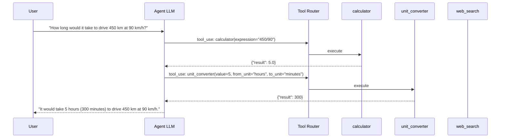

# Pattern 03 — Tool Use Pattern

---

## Theoretical Overview

Language models are frozen at training time — they have no access to live data, computation engines, file systems, or external services. The **Tool Use Pattern** solves this by giving an agent a defined catalogue of callable functions that it can invoke during generation.

The model decides:
- **When** to call a tool (based on the user's intent)
- **Which** tool to call (from the catalogue schema)
- **With what arguments** (inferred from context)

This transforms the LLM from a text predictor into an **action-capable agent**. Tools can represent anything: web search, database queries, code execution, REST APIs, file I/O, or custom business logic.

### Core Design Principle

> **Single Responsibility per Tool** — each tool does one thing, has a clear typed interface, and handles its own errors. This keeps the model's tool selection tractable and makes individual tools testable in isolation.

### Tool Types

| Category | Examples |
|---|---|
| **Information Retrieval** | web search, database query, document lookup |
| **Computation** | calculator, code runner, data transformer |
| **External APIs** | weather, stocks, payments, email |
| **File Operations** | read, write, list directory |
| **Side Effects** | send email, create ticket, update record |

---

## Architectural Diagram



**Components:**
- **Tool Catalogue** — JSON Schema definitions passed to the LLM at inference time.
- **Tool Router** — Dispatches `tool_use` content blocks to the correct Python function.
- **Tool Functions** — Isolated, typed implementations with explicit error returns.
- **Tool Result Feed** — Observations injected back as `tool_result` message blocks.
- **Agentic Loop** — The while-loop that continues until `stop_reason == "end_turn"`.

---

## Real-World Analogy

**A Doctor and Diagnostic Equipment**
A doctor (the LLM) examines a patient and decides which tests to order: blood panel, X-ray, MRI. Each piece of equipment (tool) is specialised and independently operated. The doctor doesn't perform the MRI scan — they *request* it, receive the report (observation), and synthesise a diagnosis. The quality of the diagnosis depends both on clinical reasoning and on choosing the right instruments.

---

## Implementation Example

```python
import json
import math
from anthropic import Anthropic

client = Anthropic()
MODEL = "claude-sonnet-4-6"


# ── Tool Schemas (passed to the LLM) ──────────────────────────────────────────

TOOLS = [
    {
        "name": "calculator",
        "description": (
            "Evaluate a mathematical expression. Supports arithmetic operators, "
            "exponentiation (**), and math module functions (math.sqrt, math.log, etc.). "
            "Use this for any numeric calculation."
        ),
        "input_schema": {
            "type": "object",
            "properties": {
                "expression": {
                    "type": "string",
                    "description": "A Python-evaluable expression. E.g. '2**10', 'math.sqrt(144)', '(3+5)*2'.",
                }
            },
            "required": ["expression"],
        },
    },
    {
        "name": "unit_converter",
        "description": "Convert a numeric value from one unit to another.",
        "input_schema": {
            "type": "object",
            "properties": {
                "value":     {"type": "number",  "description": "The numeric value to convert."},
                "from_unit": {"type": "string",  "description": "Source unit. E.g. 'km', 'kg', 'Celsius', 'hours'."},
                "to_unit":   {"type": "string",  "description": "Target unit. E.g. 'miles', 'pounds', 'Fahrenheit', 'minutes'."},
            },
            "required": ["value", "from_unit", "to_unit"],
        },
    },
    {
        "name": "text_analyzer",
        "description": "Analyze a text string. Returns word count, character count, sentence count, and the top 3 most frequent words.",
        "input_schema": {
            "type": "object",
            "properties": {
                "text": {"type": "string", "description": "The text to analyze."},
            },
            "required": ["text"],
        },
    },
    {
        "name": "currency_converter",
        "description": "Convert an amount between currencies using fixed reference rates (for demo purposes).",
        "input_schema": {
            "type": "object",
            "properties": {
                "amount":        {"type": "number", "description": "Amount to convert."},
                "from_currency": {"type": "string", "description": "3-letter source currency code. E.g. 'USD', 'EUR', 'INR'."},
                "to_currency":   {"type": "string", "description": "3-letter target currency code."},
            },
            "required": ["amount", "from_currency", "to_currency"],
        },
    },
]


# ── Tool Implementations ───────────────────────────────────────────────────────

def calculator(expression: str) -> dict:
    try:
        # Restricted eval: only math module exposed, no builtins
        result = eval(expression, {"__builtins__": {}}, {"math": math})
        return {"result": result, "expression": expression}
    except Exception as exc:
        return {"error": str(exc), "expression": expression}


UNIT_CONVERSIONS: dict[tuple[str, str], float] = {
    ("km", "miles"):       0.621371,
    ("miles", "km"):       1.60934,
    ("kg", "pounds"):      2.20462,
    ("pounds", "kg"):      0.453592,
    ("meters", "feet"):    3.28084,
    ("feet", "meters"):    0.3048,
    ("hours", "minutes"):  60.0,
    ("minutes", "hours"):  1 / 60,
    ("hours", "seconds"):  3600.0,
    ("liters", "gallons"): 0.264172,
    ("gallons", "liters"): 3.78541,
}


def unit_converter(value: float, from_unit: str, to_unit: str) -> dict:
    # Temperature special cases
    if from_unit == "Celsius" and to_unit == "Fahrenheit":
        return {"result": round(value * 9 / 5 + 32, 4), "from_unit": from_unit, "to_unit": to_unit}
    if from_unit == "Fahrenheit" and to_unit == "Celsius":
        return {"result": round((value - 32) * 5 / 9, 4), "from_unit": from_unit, "to_unit": to_unit}
    if from_unit == "Celsius" and to_unit == "Kelvin":
        return {"result": round(value + 273.15, 4), "from_unit": from_unit, "to_unit": to_unit}

    factor = UNIT_CONVERSIONS.get((from_unit, to_unit))
    if factor is None:
        return {"error": f"Unsupported conversion: {from_unit} → {to_unit}"}
    return {"result": round(value * factor, 6), "from_unit": from_unit, "to_unit": to_unit}


def text_analyzer(text: str) -> dict:
    from collections import Counter
    import re

    words = re.findall(r"\b[a-zA-Z]+\b", text.lower())
    sentences = re.split(r"[.!?]+", text)
    sentences = [s.strip() for s in sentences if s.strip()]

    freq = Counter(words)
    top_3 = [{"word": w, "count": c} for w, c in freq.most_common(3)]

    return {
        "word_count":      len(words),
        "char_count":      len(text),
        "sentence_count":  len(sentences),
        "top_3_words":     top_3,
    }


# Reference exchange rates (USD base)
FX_RATES: dict[str, float] = {
    "USD": 1.0,
    "EUR": 0.92,
    "GBP": 0.79,
    "INR": 83.5,
    "JPY": 149.2,
    "CAD": 1.36,
    "AUD": 1.53,
}


def currency_converter(amount: float, from_currency: str, to_currency: str) -> dict:
    fc = from_currency.upper()
    tc = to_currency.upper()
    if fc not in FX_RATES:
        return {"error": f"Unknown currency: {fc}"}
    if tc not in FX_RATES:
        return {"error": f"Unknown currency: {tc}"}
    usd_amount = amount / FX_RATES[fc]
    result = usd_amount * FX_RATES[tc]
    return {
        "result":          round(result, 4),
        "from_currency":   fc,
        "to_currency":     tc,
        "amount":          amount,
        "exchange_rate":   round(FX_RATES[tc] / FX_RATES[fc], 6),
    }


TOOL_REGISTRY: dict[str, callable] = {
    "calculator":        calculator,
    "unit_converter":    unit_converter,
    "text_analyzer":     text_analyzer,
    "currency_converter": currency_converter,
}


# ── Tool Router ────────────────────────────────────────────────────────────────

def execute_tool(name: str, inputs: dict) -> str:
    fn = TOOL_REGISTRY.get(name)
    if fn is None:
        return json.dumps({"error": f"Unknown tool: '{name}'"})
    try:
        result = fn(**inputs)
    except TypeError as exc:
        result = {"error": f"Bad arguments: {exc}"}
    return json.dumps(result)


# ── Agentic Loop ───────────────────────────────────────────────────────────────

def run_tool_agent(user_query: str, verbose: bool = True) -> str:
    """
    Drives the tool-use agentic loop until the model produces a final text answer.
    Returns the final answer string.
    """
    messages = [{"role": "user", "content": user_query}]

    while True:
        response = client.messages.create(
            model=MODEL,
            max_tokens=1024,
            tools=TOOLS,
            messages=messages,
        )

        # Always append the full assistant turn (may contain tool_use blocks)
        messages.append({"role": "assistant", "content": response.content})

        if response.stop_reason == "end_turn":
            for block in response.content:
                if hasattr(block, "text"):
                    return block.text

        if response.stop_reason == "tool_use":
            tool_results = []
            for block in response.content:
                if block.type == "tool_use":
                    if verbose:
                        print(f"  → Tool: {block.name}({json.dumps(block.input)})")
                    result_str = execute_tool(block.name, block.input)
                    if verbose:
                        print(f"    Result: {result_str}")
                    tool_results.append({
                        "type":        "tool_result",
                        "tool_use_id": block.id,
                        "content":     result_str,
                    })
            messages.append({"role": "user", "content": tool_results})


# ── Demo ───────────────────────────────────────────────────────────────────────

if __name__ == "__main__":
    queries = [
        # Single tool
        "What is the square root of 1764?",
        # Chained tools
        "If I drive 320 km at 80 km/h, how many minutes will the trip take?",
        # Currency + math
        "I have 50,000 INR. How much is that in EUR? And what is 15% of that EUR amount?",
        # Text analysis
        "Analyze this text: 'To be or not to be, that is the question. Whether tis nobler in the mind to suffer.'",
        # Multi-tool reasoning
        "Convert 100°F to Celsius, then calculate 2 raised to the power of that Celsius value.",
    ]

    for q in queries:
        print(f"\n{'='*60}")
        print(f"Query: {q}")
        print(f"{'='*60}")
        answer = run_tool_agent(q)
        print(f"\nAnswer: {answer}")
```

---

## Code Breakdown

1. **`TOOLS` list (schemas)** — each entry follows the Anthropic tool schema: `name`, `description`, and `input_schema` (JSON Schema format). The `description` field is the most important — it tells the model *when* to pick this tool. Vague descriptions cause incorrect tool selection.

2. **Restricted `eval` in `calculator`** — `eval(expr, {"__builtins__": {}}, {"math": math})` prevents code injection by removing all builtins while still exposing the `math` module. The result is a safe numeric evaluator that handles `math.sqrt`, `math.log`, etc.

3. **`UNIT_CONVERSIONS` dict** — a flat lookup table covering common conversions. Temperature is handled as special cases *before* the dict lookup because it requires formulas, not simple multiplication factors.

4. **`TOOL_REGISTRY` dict** — maps tool name strings to callable functions. The router never uses `eval` or `getattr` on arbitrary strings — tool selection is bounded by the dict keys.

5. **`execute_tool`** — receives the name and inputs from the model's `tool_use` block. Calls the function, catches `TypeError` (bad argument names from the model), and always returns a JSON string. The `tool_result` message type requires a string content field.

6. **`run_tool_agent` loop** — the core agentic loop:
   - Sends messages to the model.
   - Appends the full assistant response (including `tool_use` blocks) to `messages` — required by the API.
   - If `stop_reason == "tool_use"`: execute all requested tools, collect `tool_result` blocks, append as a `user` message, loop.
   - If `stop_reason == "end_turn"`: extract and return the text answer.

7. **Multi-tool turns** — the model can request multiple tools in a single response. The loop handles all of them before sending the next message — this is the correct protocol per the Anthropic API contract.

---

## Pros and Cons

| Dimension | Pros | Cons |
|---|---|---|
| **Capability** | LLMs gain access to live data and computation | Each tool call adds latency and API cost |
| **Accuracy** | Computation delegated to code — no arithmetic hallucinations | Model may hallucinate tool arguments |
| **Modularity** | Tools are independently testable and replaceable | Tool schema design requires significant care |
| **Extensibility** | Adding a tool = one schema entry + one function | Too many tools (>20) degrade selection accuracy |
| **Debuggability** | Tool calls are logged and reproducible | Multi-step tool chains are hard to trace end-to-end |
| **Safety** | Tool functions can validate inputs before execution | Malformed model output may still reach tool code |

---

## Tool Design Checklist

- [ ] **One responsibility** — the tool does exactly one thing.
- [ ] **Precise description** — starts with a verb; states *when* to use it, not just *what* it does.
- [ ] **Typed inputs** — all parameters have `type` and `description` in `input_schema`.
- [ ] **Explicit required fields** — `required` array lists all mandatory parameters.
- [ ] **Error returns, not exceptions** — functions return `{"error": "..."}` dicts; the agentic loop handles them gracefully.
- [ ] **No side effects on error** — idempotent where possible.
- [ ] **Registered in `TOOL_REGISTRY`** — name in schema must exactly match registry key.

---

*Previous: [02 — Reflection Pattern](02_reflection_pattern.md)*  
*Next: [04 — Memory Patterns](04_memory_patterns.md)*
