# Pattern 04 — Memory Patterns

---

## Theoretical Overview

LLMs are inherently **stateless**: each API call is a fresh context window with no memory of previous interactions. Memory patterns are architectural strategies for giving agents persistent, accessible context across turns and sessions.

Choosing the right memory pattern requires reasoning across four axes:

| Axis | Questions to Ask |
|---|---|
| **Retention horizon** | Do I need last 5 turns or the last 5,000? |
| **Access pattern** | Sequential recall (last N) or semantic retrieval (most relevant)? |
| **Storage cost** | Tokens in context vs. external store vs. compressed summary? |
| **Write frequency** | Every turn? Episodically? On-demand? |

### The Five Canonical Memory Patterns

| Pattern | Retention | Access | Cost | Use Case |
|---|---|---|---|---|
| **Buffer** | Full history | Sequential | Unbounded | Short sessions |
| **Sliding Window** | Last N messages | Sequential | Fixed | Cost-bounded chat |
| **Summary** | Compressed + recent | Sequential | Medium | Long sessions |
| **Vector** | All history | Semantic search | Medium + embedding | Large knowledge bases |
| **Scratchpad** | Ephemeral notes | Key-value | Negligible | Intermediate computation |

---

## Architectural Diagram

```mermaid
graph TD
    subgraph BM["1. Buffer Memory — full verbatim history"]
        direction LR
        BT1[Turn 1] --> BT2[Turn 2] --> BT3[...] --> BTN[Turn N]
        BTN --> BLLM[LLM Context]
    end

    subgraph SW["2. Sliding Window — last N messages only"]
        direction LR
        SX1[Turn 1 evicted] -.->|evict| SX2[Turn N-2] --> SX3[Turn N-1] --> SX4[Turn N]
        SX4 --> SWLLM[LLM Context]
    end

    subgraph SM["3. Summary Memory — compress old, keep recent raw"]
        direction LR
        SO[Old Turns] -->|compress via LLM| SUM[Summary Block]
        SUM --> SR[Recent Turns]
        SR --> SMLLM[LLM Context]
    end

    subgraph VM["4. Vector Memory — semantic retrieval"]
        direction LR
        VQ[Current Query] -->|embed| VE[Query Vector]
        VE -->|ANN search| VDB[(Vector Store)]
        VDB -->|top-k relevant chunks| VMLLM[LLM Context]
    end

    subgraph SP["5. Scratchpad — ephemeral key-value workspace"]
        direction LR
        SPKV[Key: Value pairs] <-->|read/write| SPLLM[LLM Context]
    end
```



---

## Real-World Analogies

| Pattern | Analogy |
|---|---|
| **Buffer** | A court stenographer — every word verbatim, grows forever |
| **Sliding Window** | A whiteboard in a meeting — erased periodically, only recent items visible |
| **Summary** | A personal diary — daily raw notes summarised weekly, originals discarded |
| **Vector** | A search engine over your email archive — instant recall of relevant history |
| **Scratchpad** | Scrap paper during a math exam — used and discarded per problem |

---

## Implementation Example

```python
import json
from anthropic import Anthropic
from collections import deque
from dataclasses import dataclass, field
from typing import Protocol

client = Anthropic()
MODEL = "claude-sonnet-4-6"


# ── Memory Protocol (common interface) ────────────────────────────────────────

class Memory(Protocol):
    def add(self, role: str, content: str) -> None: ...
    def get_messages(self) -> list[dict]: ...


# ── 1. Buffer Memory ───────────────────────────────────────────────────────────

class BufferMemory:
    """Stores every message verbatim. Grows without bound."""

    def __init__(self) -> None:
        self._store: list[dict] = []

    def add(self, role: str, content: str) -> None:
        self._store.append({"role": role, "content": content})

    def get_messages(self) -> list[dict]:
        return list(self._store)

    def token_estimate(self) -> int:
        """Rough estimate: 1 token ≈ 4 characters."""
        total_chars = sum(len(m["content"]) for m in self._store)
        return total_chars // 4

    def __len__(self) -> int:
        return len(self._store)

    def __repr__(self) -> str:
        return f"BufferMemory({len(self)} messages, ~{self.token_estimate()} tokens)"


# ── 2. Sliding Window Memory ───────────────────────────────────────────────────

class SlidingWindowMemory:
    """Retains only the last `window_size` messages. O(1) eviction."""

    def __init__(self, window_size: int = 10) -> None:
        self.window_size = window_size
        self._window: deque[dict] = deque(maxlen=window_size)

    def add(self, role: str, content: str) -> None:
        self._window.append({"role": role, "content": content})

    def get_messages(self) -> list[dict]:
        return list(self._window)

    def is_full(self) -> bool:
        return len(self._window) == self.window_size

    def __repr__(self) -> str:
        return f"SlidingWindowMemory({len(self._window)}/{self.window_size} messages)"


# ── 3. Summary Memory ──────────────────────────────────────────────────────────

SUMMARISE_SYSTEM = """You are a conversation summariser.
Given a JSON list of messages, produce a concise third-person narrative summary (max 150 words) capturing:
- Key facts and entities established
- Decisions or conclusions reached
- User preferences and constraints expressed
Return ONLY the summary text — no JSON, no labels."""


class SummaryMemory:
    """
    Compresses old turns into a running summary via LLM.
    Keeps only the most recent `recent_window` turns raw in context.
    Compression is triggered automatically when the buffer overflows.
    """

    def __init__(self, recent_window: int = 6) -> None:
        self.recent_window = recent_window
        self._recent: list[dict] = []
        self._summary: str = ""
        self._compression_count: int = 0

    def add(self, role: str, content: str) -> None:
        self._recent.append({"role": role, "content": content})
        if len(self._recent) > self.recent_window * 2:
            self._compress()

    def _compress(self) -> None:
        to_compress = self._recent[: -self.recent_window]
        self._recent = self._recent[-self.recent_window :]
        self._compression_count += 1

        prompt = json.dumps(to_compress, ensure_ascii=False)
        resp = client.messages.create(
            model=MODEL,
            max_tokens=300,
            system=SUMMARISE_SYSTEM,
            messages=[{"role": "user", "content": prompt}],
        )
        new_summary = resp.content[0].text.strip()
        # Append to running summary
        self._summary = (
            (self._summary + " " + new_summary).strip()
            if self._summary
            else new_summary
        )

    def get_messages(self) -> list[dict]:
        messages: list[dict] = []
        if self._summary:
            # Inject summary as synthetic exchange at the start of context
            messages.append({
                "role": "user",
                "content": f"[Conversation summary]\n{self._summary}",
            })
            messages.append({
                "role": "assistant",
                "content": "Understood. I have the context from our earlier conversation.",
            })
        messages.extend(self._recent)
        return messages

    def __repr__(self) -> str:
        return (
            f"SummaryMemory(compressions={self._compression_count}, "
            f"recent={len(self._recent)}, summary_len={len(self._summary)} chars)"
        )


# ── 4. Vector Memory ───────────────────────────────────────────────────────────

@dataclass
class VectorEntry:
    role:      str
    content:   str
    embedding: list[float] = field(default_factory=list)
    metadata:  dict        = field(default_factory=dict)


class VectorMemory:
    """
    Semantic memory using cosine-similarity retrieval.
    Uses keyword-overlap embedding as a dependency-free proxy.
    In production: replace _embed() with a real embedding API call.
    """

    def __init__(self, top_k: int = 3) -> None:
        self.top_k = top_k
        self._store: list[VectorEntry] = []

    def _embed(self, text: str) -> list[float]:
        """
        Keyword-overlap embedding (demo only).
        Production: use voyageai, OpenAI, or Anthropic embeddings.
        """
        import re
        words = sorted(set(re.findall(r"\b[a-z]+\b", text.lower())))
        return [1.0] * len(words), words  # returns vector + vocabulary

    def _embed_to_vec(self, text: str, vocab: list[str]) -> list[float]:
        import re
        words = set(re.findall(r"\b[a-z]+\b", text.lower()))
        return [1.0 if w in words else 0.0 for w in vocab]

    def _cosine(self, a: list[float], b: list[float]) -> float:
        if not a or not b:
            return 0.0
        max_len = max(len(a), len(b))
        a = a + [0.0] * (max_len - len(a))
        b = b + [0.0] * (max_len - len(b))
        dot = sum(x * y for x, y in zip(a, b))
        norm_a = sum(x**2 for x in a) ** 0.5
        norm_b = sum(x**2 for x in b) ** 0.5
        return (dot / (norm_a * norm_b)) if norm_a and norm_b else 0.0

    def add(self, role: str, content: str, metadata: dict | None = None) -> None:
        vec, vocab = self._embed(content)
        # Re-embed with full vocabulary for consistency
        full_vec = self._embed_to_vec(content, vocab)
        entry = VectorEntry(
            role=role,
            content=content,
            embedding=full_vec,
            metadata=metadata or {},
        )
        self._store.append(entry)

    def retrieve(self, query: str, top_k: int | None = None) -> list[dict]:
        if not self._store:
            return []
        k = top_k or self.top_k
        # Build shared vocabulary from all stored content + query
        import re
        all_text = query + " " + " ".join(e.content for e in self._store)
        vocab = sorted(set(re.findall(r"\b[a-z]+\b", all_text.lower())))
        q_vec = self._embed_to_vec(query, vocab)

        scored = []
        for entry in self._store:
            e_vec = self._embed_to_vec(entry.content, vocab)
            score = self._cosine(q_vec, e_vec)
            scored.append((score, entry))

        scored.sort(key=lambda x: x[0], reverse=True)
        return [
            {"role": e.role, "content": e.content, "similarity": round(s, 4)}
            for s, e in scored[:k]
        ]

    def get_messages(self, query: str = "") -> list[dict]:
        """For drop-in compatibility: retrieve top-k relevant messages."""
        retrieved = self.retrieve(query)
        return [{"role": r["role"], "content": r["content"]} for r in retrieved]

    def __len__(self) -> int:
        return len(self._store)

    def __repr__(self) -> str:
        return f"VectorMemory({len(self)} entries, top_k={self.top_k})"


# ── 5. Scratchpad Memory ───────────────────────────────────────────────────────

class ScratchpadMemory:
    """
    Ephemeral key-value workspace for intermediate computation.
    Serialised into a structured context block injected into the system prompt.
    Cleared between tasks; not persisted across sessions.
    """

    def __init__(self) -> None:
        self._pad: dict[str, str] = {}
        self._history: list[tuple[str, str, str]] = []  # (op, key, value)

    def write(self, key: str, value: str) -> None:
        self._pad[key] = value
        self._history.append(("write", key, value))

    def read(self, key: str) -> str | None:
        return self._pad.get(key)

    def delete(self, key: str) -> bool:
        if key in self._pad:
            del self._pad[key]
            self._history.append(("delete", key, ""))
            return True
        return False

    def clear(self) -> None:
        self._pad.clear()

    def as_context_block(self) -> str:
        if not self._pad:
            return "[Scratchpad: empty]"
        lines = "\n".join(f"  {k}: {v}" for k, v in self._pad.items())
        return f"[Scratchpad]\n{lines}"

    def keys(self) -> list[str]:
        return list(self._pad.keys())

    def __repr__(self) -> str:
        return f"ScratchpadMemory({len(self._pad)} entries: {list(self._pad.keys())})"


# ── Unified Chat Runner ────────────────────────────────────────────────────────

def chat_with_memory(memory_name: str, memory, turns: list[str]) -> None:
    print(f"\n{'='*60}")
    print(f"Memory Type: {memory_name}")
    print(f"{'='*60}")

    for user_msg in turns:
        memory.add("user", user_msg)

        # Retrieve messages for context
        if isinstance(memory, VectorMemory):
            messages = memory.get_messages(query=user_msg)
            if not messages:
                messages = [{"role": "user", "content": user_msg}]
        else:
            messages = memory.get_messages()

        resp = client.messages.create(
            model=MODEL,
            max_tokens=256,
            messages=messages,
        )
        reply = resp.content[0].text.strip()
        memory.add("assistant", reply)

        print(f"\n  User:  {user_msg}")
        print(f"  Agent: {reply[:150]}{'...' if len(reply) > 150 else ''}")

    print(f"\n  [{repr(memory)}]")


# ── Demo ───────────────────────────────────────────────────────────────────────

if __name__ == "__main__":
    CONVERSATION = [
        "Hi! My name is Priya and I'm building a RAG pipeline for legal documents.",
        "I'm using Python and want to avoid external vector DBs for the MVP.",
        "What embedding model would work well without a separate service?",
        "What was the main constraint I mentioned at the start?",  # tests recall
    ]

    chat_with_memory("Buffer Memory",         BufferMemory(),                 CONVERSATION)
    chat_with_memory("Sliding Window (6msg)", SlidingWindowMemory(window_size=6), CONVERSATION)

    # Scratchpad demo
    print(f"\n{'='*60}")
    print("Scratchpad Memory Demo")
    print(f"{'='*60}")
    pad = ScratchpadMemory()
    pad.write("user_name", "Priya")
    pad.write("use_case", "RAG pipeline for legal documents")
    pad.write("constraint", "no external vector DB for MVP")
    print(pad.as_context_block())

    system_with_pad = f"You are a helpful AI assistant.\n\n{pad.as_context_block()}"
    resp = client.messages.create(
        model=MODEL,
        max_tokens=256,
        system=system_with_pad,
        messages=[{"role": "user", "content": "Given what you know about me, what approach would you suggest?"}],
    )
    print(f"\nAgent: {resp.content[0].text.strip()}")
```

---

## Code Breakdown

1. **`Memory` Protocol** — a structural typing interface. Any class with `add(role, content)` and `get_messages()` is a valid memory. This enables drop-in swapping without inheritance hierarchies.

2. **`BufferMemory`** — wraps a plain list. `token_estimate()` provides a rough token count to help detect when context limits are approaching. Zero compression, zero retrieval overhead.

3. **`SlidingWindowMemory`** — backed by `collections.deque(maxlen=N)`. Python's deque automatically evicts the oldest element on overflow. No explicit eviction logic is needed — the data structure enforces the invariant.

4. **`SummaryMemory._compress`** — triggered when `_recent` exceeds `recent_window * 2`. Sends the oldest messages to the LLM for compression, slices them off `_recent`, and concatenates the new summary onto `_summary`. `get_messages` injects the summary as a synthetic user/assistant exchange — a common trick to avoid breaking the alternating message requirement.

5. **`VectorMemory._embed`** — uses keyword-overlap as a dependency-free embedding proxy. In production, replace with `voyageai.Client().embed()`, `openai.embeddings.create()`, or any embedding endpoint. The cosine function pads mismatched-length vectors with zeros to handle vocabulary differences between stored entries and queries.

6. **`VectorMemory.retrieve`** — builds a shared vocabulary across all stored content and the query before computing embeddings. This ensures vectors are in the same space regardless of insertion order.

7. **`ScratchpadMemory.as_context_block`** — serialises the key-value store into a structured string suitable for injection into a system prompt. The LLM can read but not directly write to the scratchpad — the application controls writes based on parsed model output.

---

## Pros and Cons

| Pattern | Best For | Limitation |
|---|---|---|
| **Buffer** | Short sessions, audit-complete logs | Unbounded token growth → context overflow |
| **Sliding Window** | Fixed-cost chat, customer service bots | Hard cutoff — old context lost entirely |
| **Summary** | Long sessions, high-level continuity | Compression loses detail; extra LLM cost per compression |
| **Vector** | Large knowledge bases, document Q&A | Embedding cost; irrelevant chunks may surface |
| **Scratchpad** | Intermediate computation, multi-step tasks | Ephemeral — lost between sessions by design |

---

## Choosing a Memory Pattern

```
Is the session short (< 20 turns)?
  YES → Buffer Memory
  NO  →
    Is cost/token budget a hard constraint?
      YES → Sliding Window
      NO  →
        Is semantic recall more important than order?
          YES → Vector Memory
          NO  → Summary Memory
        Do you need temporary working storage within a task?
          YES → Scratchpad (compose with another pattern)
```

---

*Previous: [03 — Tool Use Pattern](03_tool_use_pattern.md)*  
*Next: [05 — ReAct Pattern](05_react_pattern.md)*
