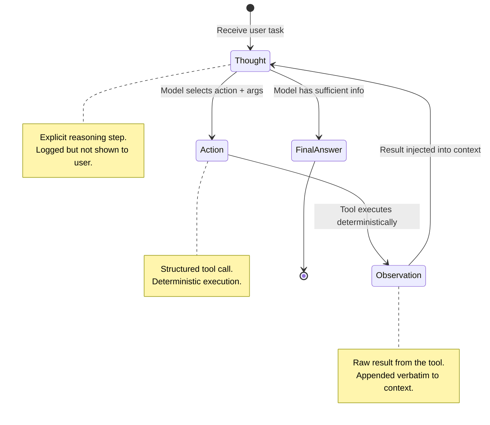
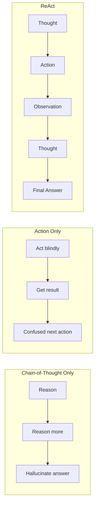

# Pattern 05 — ReAct Pattern (Reasoning + Acting)

---

## Theoretical Overview

**ReAct** (Reasoning + Acting) is a prompting and architectural pattern that interleaves **explicit chain-of-thought reasoning** with **executable actions**. Introduced in the paper *"ReAct: Synergizing Reasoning and Acting in Language Models"* (Yao et al., 2022), it addresses a fundamental failure mode of both:

- **Pure chain-of-thought** — the model reasons but cannot act; it hallucinates facts it cannot verify.
- **Pure action agents** — the model acts without visible reasoning; errors are opaque and hard to debug.

ReAct combines both: the model *thinks aloud* before each action, grounding its reasoning in real tool results.

### The ReAct Cycle

```
Thought  →  Action  →  Observation  →  Thought  →  ...  →  Final Answer
```

| Step | What Happens |
|---|---|
| **Thought** | Model articulates current understanding and next intention |
| **Action** | Model calls a tool or performs a concrete operation |
| **Observation** | Environment returns a result from the action |
| *(repeat)* | Observation feeds the next Thought |
| **Final Answer** | Model has enough information to respond to the user |

### Why It Matters

By making reasoning **explicit and checkable**, ReAct:
- Reduces hallucination (claims are grounded in tool results)
- Dramatically improves **interpretability** — every reasoning step is visible
- Allows humans or automated systems to intervene when reasoning goes off-track
- Creates a natural **audit trail** of agent decision-making

---

## Architectural Diagram



### ReAct vs Pure Approaches



---

## Real-World Analogy

**Sherlock Holmes Investigating a Case**
Holmes doesn't leap to conclusions. He observes a clue (observation), reasons about its implications aloud (thought), decides to examine the study for further evidence (action), finds a muddy boot print (observation), reasons it matches the gardener's size (thought), questions the gardener (action)... until he reaches the final answer.

Each reasoning step is *traceable*. Each action is *purposeful*. No step is taken without prior articulation of intent. ReAct is the computational formalisation of this investigative method.

---

## Implementation Example

```python
import json
import re
from anthropic import Anthropic
from dataclasses import dataclass, field

client = Anthropic()
MODEL = "claude-sonnet-4-6"


# ── System Prompt ──────────────────────────────────────────────────────────────

REACT_SYSTEM = """You are a research and reasoning assistant using the ReAct framework.

For EVERY response, structure your output in one of two ways:

FORMAT A — when you need to take an action:
Thought: <your reasoning about the current situation and why you need this action>
Action: <tool_name>({"arg1": "value1", "arg2": "value2"})

FORMAT B — when you have enough information to answer:
Thought: <reasoning about why you now have sufficient information>
Final Answer: <your complete, well-formed answer to the user's original question>

Available tools:
  search(query: str)                          → searches a knowledge base
  calculate(expression: str)                  → evaluates a math expression
  lookup(entity: str, attribute: str)         → retrieves a specific fact
  compare(value_a: float, value_b: float)     → returns which is larger and by how much

Rules:
  - ALWAYS include a Thought step before every Action or Final Answer
  - NEVER skip the Thought step
  - Use Final Answer only when you are confident you have all needed information
  - Base your Final Answer on the Observations you received, not on prior assumptions"""


# ── Simulated Tool Implementations ────────────────────────────────────────────

KNOWLEDGE_BASE: dict[tuple[str, str], str] = {
    ("Python",       "release_year"):     "1991",
    ("Python",       "creator"):          "Guido van Rossum",
    ("Python",       "latest_version"):   "3.13 (2024)",
    ("JavaScript",   "release_year"):     "1995",
    ("JavaScript",   "creator"):          "Brendan Eich",
    ("Rust",         "release_year"):     "2015",
    ("Rust",         "creator"):          "Graydon Hoare",
    ("Claude",       "creator"):          "Anthropic",
    ("Claude",       "release_year"):     "2023",
    ("GPT-4",        "release_year"):     "2023",
    ("Earth",        "distance_from_sun"): "149.6 million km",
    ("Mars",         "distance_from_sun"): "227.9 million km",
    ("Moon",         "distance_from_earth"): "384,400 km",
    ("India",        "population"):       "1.44 billion (2024)",
    ("USA",          "population"):       "334 million (2024)",
}

SEARCH_INDEX: dict[str, str] = {
    "python history":     "Python was created by Guido van Rossum in 1989 and released publicly in 1991. It emphasises readability.",
    "rust programming":   "Rust was released by Mozilla in 2015, designed by Graydon Hoare. Known for memory safety without GC.",
    "llm react pattern":  "ReAct combines chain-of-thought reasoning with tool-use actions in an interleaved loop (Yao et al. 2022).",
    "machine learning":   "Machine learning is a subset of AI where models learn patterns from data rather than explicit rules.",
    "vector database":    "Vector databases store high-dimensional embeddings and support approximate nearest-neighbour search.",
    "transformer model":  "Transformers use self-attention to process sequences in parallel, introduced by Vaswani et al. in 2017.",
}


def search(query: str) -> str:
    q = query.lower()
    for key, result in SEARCH_INDEX.items():
        if any(word in q for word in key.split()):
            return result
    return f"No relevant results found for: '{query}'"


def calculate(expression: str) -> str:
    try:
        import math
        result = eval(expression, {"__builtins__": {}}, {"math": math})
        return str(round(result, 6) if isinstance(result, float) else result)
    except Exception as exc:
        return f"Calculation error: {exc}"


def lookup(entity: str, attribute: str) -> str:
    key = (entity.strip(), attribute.strip())
    return KNOWLEDGE_BASE.get(key, f"No data found for {entity} → {attribute}")


def compare(value_a: float, value_b: float) -> str:
    if value_a > value_b:
        diff = value_a - value_b
        return f"{value_a} is larger by {diff:.4f} ({diff/value_b*100:.2f}% more than {value_b})"
    elif value_b > value_a:
        diff = value_b - value_a
        return f"{value_b} is larger by {diff:.4f} ({diff/value_a*100:.2f}% more than {value_a})"
    return f"Both values are equal: {value_a}"


TOOL_MAP: dict[str, callable] = {
    "search":    search,
    "calculate": calculate,
    "lookup":    lookup,
    "compare":   compare,
}


# ── Data Types ─────────────────────────────────────────────────────────────────

@dataclass
class ReActStep:
    step_num:    int
    thought:     str
    action:      str | None   = None
    action_args: dict         = field(default_factory=dict)
    observation: str | None   = None
    is_final:    bool         = False
    final_answer: str | None  = None


@dataclass
class ReActTrace:
    question: str
    steps:    list[ReActStep] = field(default_factory=list)
    answer:   str             = ""

    def print_trace(self) -> None:
        print(f"\nQuestion: {self.question}")
        print("─" * 60)
        for s in self.steps:
            print(f"[Step {s.step_num}] Thought: {s.thought}")
            if s.action:
                print(f"          Action:      {s.action}({s.action_args})")
                print(f"          Observation: {s.observation}")
            if s.is_final:
                print(f"          Final Answer: {s.final_answer}")
        print(f"\nAnswer: {self.answer}")


# ── ReAct Parser ───────────────────────────────────────────────────────────────

def parse_react_output(text: str) -> tuple[str, str | None, dict | None, str | None]:
    """
    Returns (thought, action_name, action_args, final_answer).
    final_answer is not None when the model produces a Final Answer.
    """
    # Extract Thought
    thought_match = re.search(
        r"Thought:\s*(.+?)(?=\nAction:|\nFinal Answer:|$)", text, re.S
    )
    thought = thought_match.group(1).strip() if thought_match else ""

    # Check for Final Answer
    final_match = re.search(r"Final Answer:\s*(.+)", text, re.S)
    if final_match:
        return thought, None, None, final_match.group(1).strip()

    # Check for Action
    action_match = re.search(
        r"Action:\s*(\w+)\s*\((\{.*?\}|\".*?\"|'.*?')\)", text, re.S
    )
    if action_match:
        tool_name = action_match.group(1)
        raw_args  = action_match.group(2).strip()
        try:
            args = json.loads(raw_args)
            if not isinstance(args, dict):
                args = {"query": str(args)}
        except json.JSONDecodeError:
            # Strip quotes and treat as a single string argument
            args = {"query": raw_args.strip("'\"").strip()}
        return thought, tool_name, args, None

    return thought, None, None, None


# ── ReAct Agent ────────────────────────────────────────────────────────────────

class ReActAgent:
    def __init__(self, max_steps: int = 8) -> None:
        self.max_steps = max_steps

    def run(self, question: str) -> ReActTrace:
        messages: list[dict] = [{"role": "user", "content": question}]
        trace = ReActTrace(question=question)

        for step_num in range(1, self.max_steps + 1):
            response = client.messages.create(
                model=MODEL,
                max_tokens=512,
                system=REACT_SYSTEM,
                messages=messages,
            )
            raw = response.content[0].text.strip()
            messages.append({"role": "assistant", "content": raw})

            thought, tool_name, tool_args, final_answer = parse_react_output(raw)

            react_step = ReActStep(step_num=step_num, thought=thought)

            if final_answer is not None:
                react_step.is_final    = True
                react_step.final_answer = final_answer
                trace.steps.append(react_step)
                trace.answer = final_answer
                break

            if tool_name is not None:
                react_step.action      = tool_name
                react_step.action_args = tool_args or {}

                fn = TOOL_MAP.get(tool_name)
                if fn is None:
                    observation = f"Error: tool '{tool_name}' not found."
                else:
                    try:
                        observation = fn(**tool_args) if isinstance(tool_args, dict) else fn(tool_args)
                    except Exception as exc:
                        observation = f"Tool execution error: {exc}"

                react_step.observation = observation
                trace.steps.append(react_step)

                obs_msg = f"Observation: {observation}"
                messages.append({"role": "user", "content": obs_msg})
            else:
                # Model produced neither an action nor a final answer
                trace.steps.append(react_step)
                trace.answer = raw
                break

        if not trace.answer:
            trace.answer = "Maximum steps reached without a final answer."

        return trace


# ── Demo ───────────────────────────────────────────────────────────────────────

if __name__ == "__main__":
    agent = ReActAgent(max_steps=8)

    questions = [
        # Single lookup
        "Who created Python and when was it released?",
        # Multi-step with calculation
        "What is the year Python was released subtracted from 2024, then multiplied by 7?",
        # Comparison requiring two lookups
        "How much farther is Mars from the Sun compared to Earth? Express the answer in millions of km.",
        # Chained search + lookup
        "What is the ReAct pattern in AI, and who created the Python language that's often used to implement it?",
    ]

    for q in questions:
        trace = agent.run(q)
        trace.print_trace()
        print()
```

---

## Code Breakdown

1. **`REACT_SYSTEM` prompt** — the most critical component. It enforces a strict output format (`Thought:` + `Action:` or `Final Answer:`). The two-format structure gives the model a clear termination signal (`Final Answer`) vs. a continuation signal (`Action`).

2. **`parse_react_output`** — uses regex to extract `Thought`, `Action`, and `Final Answer` from semi-structured text. Regex is intentional here — the model output is *almost* structured but not reliably valid JSON. The parser handles both JSON dict arguments and single-string arguments gracefully.

3. **`ReActStep` / `ReActTrace` dataclasses** — capture the full reasoning trace. `print_trace()` produces a human-readable audit log. In production, this trace can be stored for debugging, fine-tuning data collection, or user-facing "show reasoning" features.

4. **Tool argument normalisation** — `json.loads` first; if that fails, the raw string is treated as a single `query` argument. This handles the common case where the model omits curly braces for single-argument tools.

5. **`ReActAgent.run` loop** — processes one complete Thought→Action→Observation cycle per iteration. The observation is injected as a `user` message (matching Anthropic's alternating turn structure). The loop exits on `Final Answer`, exhausted steps, or malformed output.

6. **`TOOL_MAP` dispatch** — maps tool names to functions. All four tools (`search`, `calculate`, `lookup`, `compare`) are pure functions with no side effects, making them deterministic and easily testable.

7. **`max_steps` guard** — hard cap prevents runaway loops. In production, combine with a wall-clock timeout to guard against slow tool calls.

---

## Pros and Cons

| Dimension | Pros | Cons |
|---|---|---|
| **Interpretability** | Every reasoning step is visible and auditable | Verbose — Thought steps consume tokens |
| **Accuracy** | Tool results ground claims; reduces hallucination | Model may reason incorrectly despite correct observations |
| **Flexibility** | Works with any tool set; no fixed plan needed | Requires careful prompt engineering for format compliance |
| **Debuggability** | Trace shows exactly which step caused a wrong answer | Long chains of steps are expensive |
| **Adaptability** | Adapts dynamically as observations arrive | May take more steps than necessary for simple tasks |

---

## ReAct vs Related Patterns

| Pattern | Planning Style | Reasoning Visible | Tool Use | Replanning |
|---|---|---|---|---|
| **Reactive Agent** | None | No | No | No |
| **Planning Agent** | Upfront | No | Optional | No |
| **ReAct** | Interleaved | Yes | Yes | Implicit |
| **Plan-and-Execute** | Upfront | No | Yes | Explicit |

---

## Common Failure Modes

| Failure | Cause | Fix |
|---|---|---|
| Model skips `Thought:` | Underspecified prompt | Make format non-negotiable in system prompt |
| Infinite action loop | No termination condition | Hard `max_steps` cap |
| Wrong tool arguments | Vague tool description | Improve `description` and `input_schema` |
| Ignores observations | Observation not in context | Ensure observation is appended before next turn |
| Premature `Final Answer` | Low confidence threshold | Add "make sure you have verified facts" instruction |

---

*Previous: [04 — Memory Patterns](04_memory_patterns.md)*  
*Next: [06 — Multi-Agent Orchestration](06_multi_agent_orchestration.md)*
