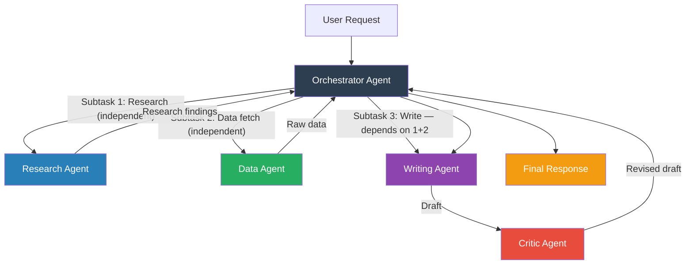

# Pattern 06 — Multi-Agent Orchestration

---

## Theoretical Overview

A single LLM agent has fundamental limits: a finite context window, limited specialisation breadth, and sequential throughput. **Multi-Agent Orchestration** addresses all three by decomposing a complex task into subtasks and assigning each to a **specialised agent**, coordinated by an **orchestrator**.

### Why Multiple Agents?

| Limitation of Single Agent | Multi-Agent Solution |
|---|---|
| Context window overflow on large tasks | Each agent handles a bounded subtask |
| One model can't be expert at everything | Specialised agents with tuned prompts/models |
| Sequential processing is slow | Independent subtasks run in parallel |
| Single point of failure | Multiple agents = graceful degradation |

### Primary Topologies

**Hierarchical (Manager-Worker)**
```
Orchestrator
├── Worker A (Research)
├── Worker B (Analysis)
└── Worker C (Writing)
```
The orchestrator decomposes the goal, delegates subtasks, collects results, and synthesises the final output.

**Pipeline (Sequential)**
```
Agent A → Agent B → Agent C → Output
```
Agents are chained: each processes the output of its predecessor. Good for multi-stage transformations.

**Peer-to-Peer (Collaborative)**
```
Agent A ←→ Agent B ←→ Agent C
```
Agents communicate directly. Good for debate, adversarial critique, or consensus-building.

---

## Architectural Diagram



**Components:**
- **Orchestrator** — Decomposes the goal, produces a dependency-aware task graph, collects and synthesises results.
- **Specialised Workers** — Each has a single-purpose system prompt and appropriate token budget.
- **Critic Agent** — Optional quality gate; mirrors the Reflection pattern at the multi-agent level.
- **Task Graph** — Directed acyclic graph (DAG) encoding which tasks depend on which.

---

## Real-World Analogy

**A Management Consulting Engagement**
A partner (orchestrator) receives a client brief. They assign:
- A market analyst to research the competitive landscape.
- A financial analyst to model revenue scenarios.
- A writer to draft the executive summary.

Each works independently. The partner collects all deliverables, a peer reviewer checks quality, and the partner synthesises the final presentation. No single analyst does everything — specialisation and parallelism deliver a better result faster.

---

## Implementation Example

```python
import json
from anthropic import Anthropic
from concurrent.futures import ThreadPoolExecutor, as_completed
from dataclasses import dataclass, field
from enum import Enum

client = Anthropic()
MODEL = "claude-sonnet-4-6"


# ── Agent Registry ─────────────────────────────────────────────────────────────

AGENT_CONFIGS: dict[str, dict] = {
    "researcher": {
        "system": (
            "You are a research specialist. Given a topic, produce a concise factual summary "
            "with 4–6 key facts. Be precise and specific. Avoid hedging language. "
            "Output only the summary text — no preamble."
        ),
        "max_tokens": 500,
    },
    "analyst": {
        "system": (
            "You are a strategic analyst. Given research findings, identify exactly 3 key "
            "implications or forward-looking trends. Be analytical and concrete. "
            "Output a numbered list — no preamble."
        ),
        "max_tokens": 400,
    },
    "writer": {
        "system": (
            "You are an executive communication specialist. Given research and analysis, "
            "craft a 3-paragraph executive summary. Paragraph 1: context and situation. "
            "Paragraph 2: key findings and implications. Paragraph 3: recommendation or call to action. "
            "Tone: professional, direct, action-oriented."
        ),
        "max_tokens": 700,
    },
    "critic": {
        "system": (
            "You are a senior editor and quality reviewer. Given an executive summary, "
            "identify up to 4 specific issues: gaps in logic, missing context, unsubstantiated claims, "
            "or unclear language. For each issue, provide a one-line fix suggestion. "
            "If the summary is already strong, say 'No significant issues found.' "
            "Output a bullet list."
        ),
        "max_tokens": 350,
    },
    "synthesiser": {
        "system": (
            "You are a senior editor. You receive a draft executive summary and reviewer feedback. "
            "Revise the draft to address the feedback without changing the overall structure or tone. "
            "Output only the revised summary — no commentary."
        ),
        "max_tokens": 700,
    },
}


# ── Task Graph Types ───────────────────────────────────────────────────────────

class TaskStatus(Enum):
    PENDING   = "pending"
    RUNNING   = "running"
    DONE      = "done"
    FAILED    = "failed"


@dataclass
class Task:
    agent:      str
    prompt:     str
    depends_on: list[str] = field(default_factory=list)
    status:     TaskStatus = TaskStatus.PENDING
    result:     str = ""


# ── Core Functions ─────────────────────────────────────────────────────────────

def call_agent(agent_name: str, prompt: str) -> str:
    cfg = AGENT_CONFIGS[agent_name]
    response = client.messages.create(
        model=MODEL,
        max_tokens=cfg["max_tokens"],
        system=cfg["system"],
        messages=[{"role": "user", "content": prompt}],
    )
    return response.content[0].text.strip()


# ── Orchestrator ───────────────────────────────────────────────────────────────

ORCHESTRATOR_SYSTEM = """You are a task orchestrator for a research and writing pipeline.
Given a user's question, decompose it into a JSON array of tasks.

Each task object:
{
  "agent":      "<one of: researcher, analyst, writer>",
  "prompt":     "<specific instruction for that agent; use {agent_name} as placeholder for dependency output>",
  "depends_on": ["<agent names this task must wait for>"]
}

Rules:
- researcher runs first (no dependencies)
- analyst depends on researcher
- writer depends on researcher AND analyst
- Output ONLY valid JSON — no commentary"""


def plan_tasks(user_question: str) -> list[Task]:
    response = client.messages.create(
        model=MODEL,
        max_tokens=600,
        system=ORCHESTRATOR_SYSTEM,
        messages=[{"role": "user", "content": user_question}],
    )
    raw: list[dict] = json.loads(response.content[0].text)
    return [
        Task(
            agent=t["agent"],
            prompt=t["prompt"],
            depends_on=t.get("depends_on", []),
        )
        for t in raw
    ]


def resolve_prompt(prompt: str, results: dict[str, str]) -> str:
    """Replace {agent_name} placeholders with actual results."""
    for agent_name, result in results.items():
        prompt = prompt.replace(f"{{{agent_name}}}", result)
    return prompt


def execute_task_graph(tasks: list[Task]) -> dict[str, str]:
    """
    Executes tasks in dependency order.
    Independent tasks run in parallel via ThreadPoolExecutor.
    Returns a dict of {agent_name: result}.
    """
    results: dict[str, str] = {}
    task_map = {t.agent: t for t in tasks}
    remaining = list(tasks)

    while remaining:
        # Find tasks whose all dependencies are satisfied
        ready = [
            t for t in remaining
            if all(dep in results for dep in t.depends_on)
        ]
        if not ready:
            raise RuntimeError("Circular dependency detected in task graph.")

        # Run all ready tasks concurrently
        with ThreadPoolExecutor(max_workers=len(ready)) as executor:
            future_to_agent = {}
            for task in ready:
                task.status = TaskStatus.RUNNING
                resolved_prompt = resolve_prompt(task.prompt, results)
                future = executor.submit(call_agent, task.agent, resolved_prompt)
                future_to_agent[future] = task

            for future in as_completed(future_to_agent):
                task = future_to_agent[future]
                try:
                    task.result = future.result()
                    task.status = TaskStatus.DONE
                    results[task.agent] = task.result
                    print(f"  [{task.agent}] ✓ Done ({len(task.result)} chars)")
                except Exception as exc:
                    task.status = TaskStatus.FAILED
                    task.result = f"ERROR: {exc}"
                    results[task.agent] = task.result
                    print(f"  [{task.agent}] ✗ Failed: {exc}")

        remaining = [t for t in remaining if t.status == TaskStatus.PENDING]

    return results


def orchestrate(user_question: str) -> str:
    print(f"\nQuestion: {user_question}")
    print("─" * 60)

    # Phase 1: Plan
    print("Planning task graph...")
    tasks = plan_tasks(user_question)
    for t in tasks:
        dep_str = f" [depends on: {', '.join(t.depends_on)}]" if t.depends_on else " [independent]"
        print(f"  • {t.agent}{dep_str}")

    # Phase 2: Execute task graph
    print("\nExecuting tasks...")
    results = execute_task_graph(tasks)

    # Phase 3: Critic pass
    print("\nRunning critic review...")
    writer_output = results.get("writer", list(results.values())[-1])
    critique = call_agent("critic", f"Review this executive summary:\n\n{writer_output}")
    print(f"  [critic] ✓ Done")

    # Phase 4: Final synthesis
    print("\nSynthesising final output...")
    final = call_agent(
        "synthesiser",
        f"Draft:\n{writer_output}\n\nReviewer feedback:\n{critique}"
    )

    return final


# ── Pipeline Topology (Sequential) ────────────────────────────────────────────

class AgentPipeline:
    """
    Sequential pipeline: output of each agent becomes input of the next.
    Useful when each stage genuinely transforms the output of the prior stage.
    """

    def __init__(self, stages: list[str]) -> None:
        self.stages = stages

    def run(self, initial_input: str) -> str:
        current = initial_input
        for agent_name in self.stages:
            print(f"  [{agent_name}] Processing...")
            current = call_agent(agent_name, current)
            print(f"  [{agent_name}] ✓ ({len(current)} chars)")
        return current


# ── Demo ───────────────────────────────────────────────────────────────────────

if __name__ == "__main__":
    # Hierarchical orchestration demo
    print("=" * 60)
    print("HIERARCHICAL MULTI-AGENT ORCHESTRATION")
    print("=" * 60)
    answer = orchestrate(
        "What is the current state of open-source large language models "
        "and what are the key implications for enterprise AI adoption?"
    )
    print(f"\n{'='*60}\nFinal Answer:\n{answer}")

    # Sequential pipeline demo
    print(f"\n\n{'='*60}")
    print("SEQUENTIAL PIPELINE")
    print("=" * 60)
    pipeline = AgentPipeline(stages=["researcher", "analyst", "writer", "critic"])
    result = pipeline.run(
        "Explain the impact of retrieval-augmented generation (RAG) on enterprise AI systems."
    )
    print(f"\nPipeline Output:\n{result}")
```

---

## Code Breakdown

1. **`AGENT_CONFIGS` dict** — each specialised agent is defined by its system prompt and token budget. Swapping a model or prompt for one agent requires changing a single dict entry — the orchestration logic is unchanged.

2. **`Task` dataclass** — encapsulates a single unit of work: which agent runs, what prompt it receives, which tasks it depends on, and its current status. The status enum enables precise lifecycle tracking.

3. **`plan_tasks`** — the orchestrator LLM produces a JSON task graph with explicit `depends_on` lists. This separates *what needs to be done* from *how and when to do it*. The graph can be inspected and logged before any execution begins.

4. **`resolve_prompt`** — replaces `{agent_name}` placeholders in prompts with the actual output of completed agents. This is the data-flow mechanism that connects dependent tasks without hardcoding inter-agent coupling.

5. **`execute_task_graph`** — implements a simple topological sort by repeatedly selecting tasks whose dependencies are all in `results`. `ThreadPoolExecutor` runs all `ready` tasks concurrently. LLM API calls are I/O-bound, so real parallelism is achieved without GIL interference.

6. **`orchestrate` (4 phases)** — makes the pipeline explicit:
   - Phase 1: Plan (one LLM call to get task graph)
   - Phase 2: Execute (parallel where possible)
   - Phase 3: Critique (Reflection pattern applied at multi-agent level)
   - Phase 4: Synthesise (incorporate critique into final output)

7. **`AgentPipeline`** — demonstrates the sequential topology. Each agent receives the previous agent's raw output as its input. Simpler but less parallelism — appropriate when each stage is a genuine transformation.

---

## Pros and Cons

| Dimension | Pros | Cons |
|---|---|---|
| **Specialisation** | Each agent tuned for one role; better quality per subtask | Orchestration logic adds architectural complexity |
| **Parallelism** | Independent tasks run concurrently; faster wall-clock time | Dependency errors can deadlock the entire graph |
| **Scalability** | Add agents/capabilities without changing the core loop | Cost scales linearly with the number of agents |
| **Modularity** | Agents are independently testable and replaceable | Inter-agent data format contracts must be carefully maintained |
| **Fault Isolation** | One failed agent doesn't block independent agents | Failed agent output may silently corrupt dependent agents |

---

## Design Guidelines

- **Keep agents single-purpose** — an agent that does two things is two agents that are harder to debug.
- **Make dependencies explicit** — a task graph is self-documenting; hidden implicit dependencies create fragile systems.
- **Use smaller models for simpler agents** — the researcher and critic don't need the same model as the writer.
- **Log all agent outputs** — in production, persist every agent's output for debugging and fine-tuning data collection.
- **Add a circuit breaker** — if an agent fails, decide upfront whether to retry, skip, or abort the whole pipeline.

---

## Topology Decision Guide

| Situation | Topology | Why |
|---|---|---|
| Tasks have complex dependencies | Hierarchical + DAG | Explicit dependency management |
| Each stage transforms the prior output | Pipeline | Simple, low overhead |
| Tasks need to debate or vote | Peer-to-Peer | No natural orchestrator |
| Some tasks are independent and slow | Hierarchical with parallelism | Concurrency saves wall-clock time |

---

*Previous: [05 — ReAct Pattern](05_react_pattern.md)*  
*Next: [07 — Plan-and-Execute Pattern](07_plan_and_execute_pattern.md)*
