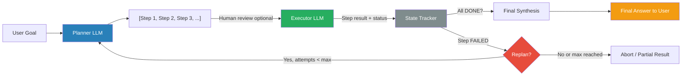

# Pattern 07 — Plan-and-Execute Pattern

---

## Theoretical Overview

The **Plan-and-Execute Pattern** separates the act of *thinking about what to do* from the act of *doing it*. A dedicated **Planner** generates a complete, ordered step sequence upfront. A dedicated **Executor** then carries out each step in sequence, feeding observations back. The plan is revised only when execution reveals new information that invalidates it.

This contrasts with **ReAct**, where planning and acting are interleaved turn-by-turn with no committed plan:

| | ReAct | Plan-and-Execute |
|---|---|---|
| **Planning** | Implicit, one step at a time | Explicit, full plan upfront |
| **Visibility** | Plan emerges during execution | Plan is inspectable before execution |
| **Human oversight** | Difficult to review mid-flight | Plan can be approved before any action |
| **Replanning** | Implicit (next Thought adapts) | Explicit `replan()` call on failure |
| **Cost** | Proportional to steps taken | Planner call + executor calls |

### When to Use Plan-and-Execute

- The full solution path is knowable before execution begins.
- Execution involves **expensive or irreversible side effects** (API writes, database updates, emails) that shouldn't be attempted speculatively.
- **Human review of the plan** before execution is required (compliance, safety-critical systems).
- The task has **well-defined sequential dependencies**.

### Sub-Variants

- **Static Plan-and-Execute** — plan once, execute without replanning.
- **Dynamic Plan-and-Execute** — replan when a step fails or produces unexpected results.
- **Human-in-the-Loop** — plan is shown to a human for approval before execution begins.

---

## Architectural Diagram



**Components:**
- **Planner LLM** — Converts a high-level goal into a structured, ordered step list.
- **Executor LLM** — Carries out individual steps; receives cumulative context from prior steps.
- **State Tracker** — Maintains step lifecycle (`PENDING → RUNNING → DONE / FAILED`).
- **Replanner LLM** — Produces a revised step sequence when a step fails, starting from where execution left off.
- **Final Synthesiser** — Combines all step results into a coherent final answer.

---

## Real-World Analogy

**A Surgeon and Pre-operative Planning**
Before any incision, the surgical team reviews imaging, creates a detailed procedure plan, assigns roles to each team member, and identifies contingencies for known risks. The surgery proceeds according to the plan. If an unexpected complication arises mid-surgery, the lead surgeon reassesses and may alter the approach — but this *replanning* is deliberate, not ad hoc.

The key distinction from improvisation (pure ReAct) is the **upfront commitment to a reasoned strategy that can be reviewed, adjusted, and approved** before irreversible actions are taken.

---

## Implementation Example

```python
import json
from anthropic import Anthropic
from dataclasses import dataclass, field
from enum import Enum
from typing import Callable

client = Anthropic()
MODEL = "claude-sonnet-4-6"


# ── Step Lifecycle ─────────────────────────────────────────────────────────────

class StepStatus(Enum):
    PENDING  = "pending"
    RUNNING  = "running"
    DONE     = "done"
    FAILED   = "failed"
    SKIPPED  = "skipped"


@dataclass
class Step:
    index:       int
    description: str
    tool:        str | None = None
    tool_args:   dict       = field(default_factory=dict)
    status:      StepStatus = StepStatus.PENDING
    result:      str        = ""

    def summary(self) -> str:
        return f"Step {self.index} [{self.status.value}]: {self.description[:60]} → {self.result[:60]}"


# ── LLM Prompts ────────────────────────────────────────────────────────────────

PLANNER_SYSTEM = """You are a task planner. Given a goal, decompose it into an ordered JSON array of steps.
Each step object:
{
  "description": "<imperative sentence: what must happen in this step>",
  "tool":        "<tool name if a tool is needed, or null>",
  "tool_args":   {"<arg>": "<value>"} or {}
}
Available tools: search, calculate, summarise, write_file, fetch_data
Produce between 3 and 7 steps. Output ONLY valid JSON."""

EXECUTOR_SYSTEM = """You are a task executor. You receive a single step to execute and a context log of completed steps.
Simulate executing the step concretely — include plausible specific results (numbers, names, dates).
Return a single clear sentence describing what happened and the key result.
If the step genuinely cannot be completed, start your response with ERROR: followed by the reason."""

REPLANNER_SYSTEM = """You are a task replanner. The original goal is still the same.
Some steps have been completed. One step failed.
Produce a revised JSON array of REMAINING steps only (do not repeat completed steps).
Steps should work around the failure. Output ONLY valid JSON."""

SYNTHESISER_SYSTEM = """You are a synthesis specialist. Given a goal and a log of completed step results,
produce a comprehensive, well-structured final answer (2–4 paragraphs) addressing the original goal.
Draw only from the step results provided — do not add unsupported claims."""


# ── Simulated Tool Layer ───────────────────────────────────────────────────────

def simulate_tool(tool: str, tool_args: dict) -> str:
    """Simulates tool execution for demo purposes."""
    if tool == "search":
        return f"Search results for '{tool_args.get('query', '')}': Found 12 relevant articles covering the topic."
    if tool == "calculate":
        try:
            result = eval(tool_args.get("expression", "0"), {"__builtins__": {}}, {})
            return f"Calculated: {result}"
        except Exception:
            return "Calculation error."
    if tool == "fetch_data":
        return f"Fetched data from {tool_args.get('source', 'API')}: 847 records retrieved successfully."
    if tool == "summarise":
        return f"Summarised {tool_args.get('length', 500)} words into a 50-word abstract."
    if tool == "write_file":
        return f"Written {tool_args.get('content_type', 'content')} to {tool_args.get('filename', 'output.txt')} successfully."
    return f"Tool '{tool}' executed with args {tool_args}."


# ── Plan-and-Execute Agent ─────────────────────────────────────────────────────

@dataclass
class ExecutionReport:
    goal:             str
    total_steps:      int
    completed_steps:  int
    failed_steps:     int
    replan_count:     int
    step_log:         list[Step]
    final_answer:     str

    def print_report(self) -> None:
        print(f"\n{'='*60}")
        print(f"EXECUTION REPORT")
        print(f"Goal: {self.goal[:80]}")
        print(f"{'─'*60}")
        for step in self.step_log:
            icon = {"done": "✓", "failed": "✗", "skipped": "○"}.get(step.status.value, "?")
            print(f"  {icon} {step.summary()}")
        print(f"{'─'*60}")
        print(f"Completed: {self.completed_steps}/{self.total_steps} steps")
        print(f"Replan count: {self.replan_count}")
        print(f"\nFinal Answer:\n{self.final_answer}")


class PlanAndExecuteAgent:
    def __init__(
        self,
        max_replan_attempts: int = 2,
        on_plan_ready: Callable[[list[Step]], bool] | None = None,
    ) -> None:
        """
        Args:
            max_replan_attempts: Maximum number of times the agent may replan.
            on_plan_ready: Optional callback invoked with the plan before execution.
                           Return False to abort execution (human-in-the-loop gate).
        """
        self.max_replan_attempts = max_replan_attempts
        self.on_plan_ready = on_plan_ready
        self._replan_count = 0

    # ── Planning ───────────────────────────────────────────────────────────────

    def plan(self, goal: str) -> list[Step]:
        response = client.messages.create(
            model=MODEL,
            max_tokens=700,
            system=PLANNER_SYSTEM,
            messages=[{"role": "user", "content": f"Goal: {goal}"}],
        )
        raw: list[dict] = json.loads(response.content[0].text)
        return [
            Step(
                index=i + 1,
                description=s["description"],
                tool=s.get("tool"),
                tool_args=s.get("tool_args") or {},
            )
            for i, s in enumerate(raw)
        ]

    # ── Execution ──────────────────────────────────────────────────────────────

    def execute_step(self, step: Step, context_log: str) -> str:
        prompt = (
            f"Context from completed steps:\n{context_log or 'None yet'}\n\n"
            f"Now execute step {step.index}: {step.description}"
        )
        if step.tool:
            tool_result = simulate_tool(step.tool, step.tool_args)
            prompt += f"\nTool result ({step.tool}): {tool_result}"

        response = client.messages.create(
            model=MODEL,
            max_tokens=256,
            system=EXECUTOR_SYSTEM,
            messages=[{"role": "user", "content": prompt}],
        )
        return response.content[0].text.strip()

    # ── Replanning ─────────────────────────────────────────────────────────────

    def replan(self, goal: str, completed: list[Step], failed_step: Step) -> list[Step]:
        if self._replan_count >= self.max_replan_attempts:
            raise RuntimeError(f"Max replan attempts ({self.max_replan_attempts}) exceeded.")
        self._replan_count += 1

        completed_summary = "\n".join(s.summary() for s in completed)
        prompt = (
            f"Goal: {goal}\n\n"
            f"Completed steps:\n{completed_summary}\n\n"
            f"Failed step {failed_step.index}: {failed_step.description}\n"
            f"Failure reason: {failed_step.result}"
        )
        response = client.messages.create(
            model=MODEL,
            max_tokens=600,
            system=REPLANNER_SYSTEM,
            messages=[{"role": "user", "content": prompt}],
        )
        raw: list[dict] = json.loads(response.content[0].text)
        start_idx = max((s.index for s in completed), default=0) + 1
        return [
            Step(
                index=start_idx + i,
                description=s["description"],
                tool=s.get("tool"),
                tool_args=s.get("tool_args") or {},
            )
            for i, s in enumerate(raw)
        ]

    # ── Final Synthesis ────────────────────────────────────────────────────────

    def synthesise(self, goal: str, context_log: str) -> str:
        response = client.messages.create(
            model=MODEL,
            max_tokens=700,
            system=SYNTHESISER_SYSTEM,
            messages=[{
                "role": "user",
                "content": f"Goal: {goal}\n\nCompleted steps:\n{context_log}",
            }],
        )
        return response.content[0].text.strip()

    # ── Main Execution Loop ────────────────────────────────────────────────────

    def run(self, goal: str) -> ExecutionReport:
        print(f"\nGoal: {goal}")

        # Phase 1: Plan
        print("\n[Phase 1] Planning...")
        steps = self.plan(goal)
        print(f"  Generated {len(steps)} steps:")
        for s in steps:
            tool_note = f" [tool: {s.tool}]" if s.tool else ""
            print(f"    {s.index}. {s.description}{tool_note}")

        # Optional human-in-the-loop gate
        if self.on_plan_ready and not self.on_plan_ready(steps):
            print("  Plan rejected. Aborting.")
            return ExecutionReport(
                goal=goal, total_steps=len(steps),
                completed_steps=0, failed_steps=0,
                replan_count=0, step_log=steps, final_answer="Execution aborted by reviewer."
            )

        # Phase 2: Execute
        print("\n[Phase 2] Executing...")
        all_steps: list[Step] = []
        context_lines: list[str] = []
        pending = list(steps)

        while pending:
            step = pending.pop(0)
            step.status = StepStatus.RUNNING
            print(f"\n  Step {step.index}: {step.description}")

            result = self.execute_step(step, "\n".join(context_lines))
            step.result = result

            if result.startswith("ERROR:"):
                step.status = StepStatus.FAILED
                all_steps.append(step)
                print(f"  ✗ Failed: {result}")

                completed_so_far = [s for s in all_steps if s.status == StepStatus.DONE]
                try:
                    new_steps = self.replan(goal, completed_so_far, step)
                    print(f"  ↻ Replanned: {len(new_steps)} new steps")
                    pending = new_steps + pending
                except RuntimeError as exc:
                    print(f"  ⊘ {exc}. Proceeding with partial results.")
                    break
            else:
                step.status = StepStatus.DONE
                all_steps.append(step)
                context_lines.append(f"Step {step.index}: {result}")
                print(f"  ✓ {result[:100]}")

        # Phase 3: Synthesise
        print("\n[Phase 3] Synthesising final answer...")
        final_answer = self.synthesise(goal, "\n".join(context_lines))

        completed = sum(1 for s in all_steps if s.status == StepStatus.DONE)
        failed    = sum(1 for s in all_steps if s.status == StepStatus.FAILED)

        return ExecutionReport(
            goal=goal,
            total_steps=len(all_steps),
            completed_steps=completed,
            failed_steps=failed,
            replan_count=self._replan_count,
            step_log=all_steps,
            final_answer=final_answer,
        )


# ── Human-in-the-Loop Example ─────────────────────────────────────────────────

def human_review_gate(steps: list[Step]) -> bool:
    """Simulates a human approving the plan before execution."""
    print("\n  [Human Review] Plan submitted for approval.")
    print("  [Human Review] Approved automatically in this demo.")
    return True  # In production: show steps to human, wait for input


# ── Demo ───────────────────────────────────────────────────────────────────────

if __name__ == "__main__":
    # Standard plan-and-execute
    print("=" * 60)
    print("PLAN-AND-EXECUTE (Dynamic with Replanning)")
    print("=" * 60)
    agent = PlanAndExecuteAgent(max_replan_attempts=2)
    report = agent.run(
        "Research the top 3 open-source LLM frameworks (LangChain, LlamaIndex, Haystack), "
        "compare them on ease of use and ecosystem maturity, "
        "and write a 200-word recommendation for a startup building a RAG system."
    )
    report.print_report()

    # Human-in-the-loop variant
    print(f"\n\n{'='*60}")
    print("PLAN-AND-EXECUTE (Human-in-the-Loop Gate)")
    print("=" * 60)
    agent_hitl = PlanAndExecuteAgent(
        max_replan_attempts=1,
        on_plan_ready=human_review_gate,
    )
    report2 = agent_hitl.run(
        "Fetch Q3 sales data, calculate YoY growth rate, and draft an investor update email."
    )
    report2.print_report()
```

---

## Code Breakdown

1. **`StepStatus` enum** — gives each step a clear, immutable lifecycle: `PENDING → RUNNING → DONE / FAILED / SKIPPED`. Enum values prevent typos and enable pattern matching.

2. **`Step` dataclass** — self-contained unit of work. `tool` and `tool_args` fields allow the executor to invoke tools without coupling the agent loop to tool implementations. `summary()` produces a compact one-liner for logging.

3. **`PLANNER_SYSTEM` prompt** — instructs the planner to emit a structured JSON array. The plan is produced in a single LLM call and committed to upfront — all subsequent execution is deterministic given the plan.

4. **`on_plan_ready` callback** — the human-in-the-loop gate is an optional callable that receives the full step list and returns `True` (proceed) or `False` (abort). In production, this shows the plan to a human reviewer and waits for confirmation.

5. **`execute_step`** — injects the cumulative `context_log` (prior step results) so each step has awareness of what has already been achieved. Tool results are pre-computed via `simulate_tool` and injected into the executor prompt, making execution deterministic.

6. **`ERROR:` convention** — a simple string protocol between the executor prompt and the parsing logic. When the executor cannot complete a step, it prefixes the result with `ERROR:`. In production, use structured output (JSON with a `success: bool` field) for robustness.

7. **`replan`** — invoked only on step failure. Receives the goal, the log of completed steps, and the failed step. Returns *remaining* steps only — not the full plan — to avoid re-executing work that already succeeded. The `_replan_count` guard prevents infinite replan loops.

8. **`synthesise`** — a clean, fresh LLM call that reads the full step results and produces a coherent narrative answer. Separation of synthesis from execution prevents the synthesiser from being influenced by intermediate failed states.

9. **`ExecutionReport`** — full audit trail with step-level status, replan count, and the final answer. `print_report()` produces a human-readable summary suitable for logs or UI.

---

## Pros and Cons

| Dimension | Pros | Cons |
|---|---|---|
| **Predictability** | Full plan visible and auditable before execution begins | Plan may be invalid by the time the first step executes |
| **Human oversight** | Plan can be reviewed, annotated, and approved | Adds a planning latency cost upfront |
| **Cost control** | Expensive/irreversible steps identified before committing | Replanning adds extra LLM calls on failure |
| **Auditability** | Step-by-step trace with explicit status per step | Static plans struggle with highly dynamic environments |
| **Safety** | Irreversible actions can be gated behind human review | Human review creates a synchronous bottleneck |
| **Debuggability** | Failure is localised to a specific step | Root cause may be in the planner, not the executor |

---

## Plan-and-Execute vs ReAct — Decision Guide

| Factor | Choose ReAct | Choose Plan-and-Execute |
|---|---|---|
| **Task predictability** | Unpredictable, discovery-driven | Well-defined, steps knowable upfront |
| **Side effects** | Read-only or reversible | Irreversible (writes, sends, payments) |
| **Human oversight** | Not required | Required or desirable |
| **Latency budget** | Low — interleaved is faster for simple tasks | Higher — planning cost is acceptable |
| **Debugging needs** | Step-level reasoning trace needed | Plan-level approval trace needed |
| **Environment** | Dynamic, frequently changes | Stable, structured |

---

*Previous: [06 — Multi-Agent Orchestration](06_multi_agent_orchestration.md)*  
*Back to index: [concepts.md](../concepts.md)*
