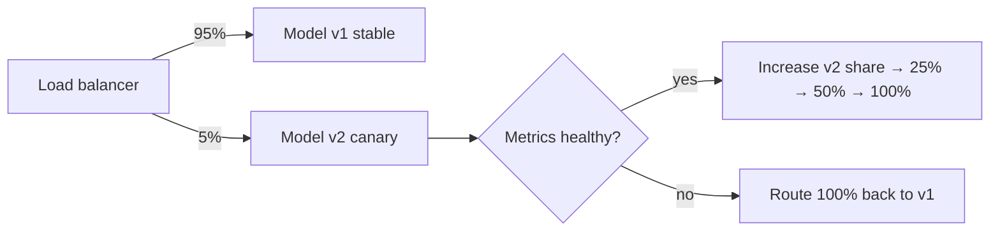

# Module 12.2 — Deployment Techniques

Deep-dive into the specific techniques, tools, and configurations used to deploy GenAI models reliably at scale.

---

## Table of Contents

1. [Containerization for GenAI](#containerization-for-genai)
2. [Kubernetes Orchestration](#kubernetes-orchestration)
3. [Serverless Techniques](#serverless-techniques)
4. [Model Optimization Before Deployment](#model-optimization-before-deployment)
5. [Deployment Strategies (Blue-Green, Canary, Rolling)](#deployment-strategies)
6. [CI/CD Pipeline for GenAI](#cicd-pipeline-for-genai)
7. [Monitoring & Observability](#monitoring--observability)
8. [Security Hardening](#security-hardening)
9. [Cost Optimization Techniques](#cost-optimization-techniques)
10. [Load Testing GenAI APIs](#load-testing-genai-apis)

---

## Containerization for GenAI

Containers package your application, dependencies, and runtime into a portable, reproducible unit. For GenAI this matters because:

- Python/CUDA version mismatches silently break inference
- Model weights are large and need controlled loading strategies
- GPU drivers must match between host and container

### Multi-stage Dockerfile for production inference server

```dockerfile
# ── Stage 1: dependency builder ──────────────────────────────────────────
FROM python:3.11-slim AS builder

WORKDIR /build
COPY requirements.txt .

# Install to a local dir to copy into final image
RUN pip install --no-cache-dir --target=/build/packages -r requirements.txt


# ── Stage 2: production image ─────────────────────────────────────────────
FROM python:3.11-slim AS production

# Non-root user for security
RUN useradd -m -u 1001 appuser

WORKDIR /app

# Copy only installed packages from builder
COPY --from=builder /build/packages /usr/local/lib/python3.11/site-packages

COPY --chown=appuser:appuser app/ ./app/

USER appuser

EXPOSE 8000

# Gunicorn with uvicorn workers for production
CMD ["python", "-m", "gunicorn", "app.main:app", \
     "--workers", "4", \
     "--worker-class", "uvicorn.workers.UvicornWorker", \
     "--bind", "0.0.0.0:8000", \
     "--timeout", "120", \
     "--keep-alive", "5", \
     "--access-logfile", "-"]
```

### Dockerfile for GPU inference (CUDA)

```dockerfile
# Base: NVIDIA CUDA + cuDNN (match your GPU driver version)
FROM nvcr.io/nvidia/cuda:12.1.1-cudnn8-devel-ubuntu22.04

# Install Python
RUN apt-get update && apt-get install -y python3.11 python3-pip \
    && rm -rf /var/lib/apt/lists/*

WORKDIR /app

COPY requirements-gpu.txt .
RUN pip install --no-cache-dir \
    torch==2.2.0+cu121 \
    --extra-index-url https://download.pytorch.org/whl/cu121 \
    && pip install --no-cache-dir -r requirements-gpu.txt

COPY app/ ./app/

# Start vLLM inference server
CMD ["python", "-m", "vllm.entrypoints.openai.api_server", \
     "--model", "/models/llama3-8b", \
     "--tensor-parallel-size", "2", \
     "--port", "8000"]
```

### Docker Compose: full local development stack

```yaml
# docker-compose.yml
version: "3.9"

services:

  # ── API service ─────────────────────────────────────────────────────────
  api:
    build:
      context: .
      target: production
    ports:
      - "8000:8000"
    environment:
      - ANTHROPIC_API_KEY=${ANTHROPIC_API_KEY}
      - REDIS_URL=redis://redis:6379
      - LOG_LEVEL=info
    depends_on:
      redis:
        condition: service_healthy
    restart: unless-stopped
    healthcheck:
      test: ["CMD", "curl", "-f", "http://localhost:8000/health"]
      interval: 15s
      timeout: 5s
      retries: 3
      start_period: 10s

  # ── Semantic cache ──────────────────────────────────────────────────────
  redis:
    image: redis:7-alpine
    ports:
      - "6379:6379"
    command: redis-server --save 60 1 --loglevel warning
    healthcheck:
      test: ["CMD", "redis-cli", "ping"]
      interval: 10s
      timeout: 5s
      retries: 5

  # ── Metrics collection ──────────────────────────────────────────────────
  prometheus:
    image: prom/prometheus:latest
    volumes:
      - ./monitoring/prometheus.yml:/etc/prometheus/prometheus.yml
    ports:
      - "9090:9090"

  # ── Dashboards ──────────────────────────────────────────────────────────
  grafana:
    image: grafana/grafana:latest
    ports:
      - "3000:3000"
    environment:
      - GF_SECURITY_ADMIN_PASSWORD=admin
    depends_on:
      - prometheus
```

---

## Kubernetes Orchestration

Kubernetes (K8s) manages containerized workloads at scale: self-healing, auto-scaling, rolling deployments.

### Core K8s concepts for GenAI

```
Cluster
├── Node (VM/physical server)
│   ├── Pod (one or more containers sharing network/storage)
│   │   └── Container (your inference server)
│   └── Pod ...
├── Deployment (desired state: "run 3 replicas of this pod")
├── Service (stable DNS + IP for a set of pods)
├── Ingress (HTTP routing from outside world to services)
├── HPA (Horizontal Pod Autoscaler — scale by CPU/GPU/custom metrics)
└── ConfigMap / Secret (config and credentials)
```

### Complete K8s manifests for a GenAI API

**`deployment.yaml`**
```yaml
apiVersion: apps/v1
kind: Deployment
metadata:
  name: genai-api
  namespace: genai
  labels:
    app: genai-api
    version: "1.0"
spec:
  replicas: 3
  selector:
    matchLabels:
      app: genai-api
  strategy:
    type: RollingUpdate
    rollingUpdate:
      maxUnavailable: 1
      maxSurge: 1
  template:
    metadata:
      labels:
        app: genai-api
    spec:
      containers:
        - name: api
          image: your-registry/genai-api:1.0
          ports:
            - containerPort: 8000
          env:
            - name: ANTHROPIC_API_KEY
              valueFrom:
                secretKeyRef:
                  name: genai-secrets
                  key: anthropic-api-key
          resources:
            requests:
              cpu: "500m"
              memory: "512Mi"
            limits:
              cpu: "2"
              memory: "2Gi"
          readinessProbe:
            httpGet:
              path: /health
              port: 8000
            initialDelaySeconds: 10
            periodSeconds: 5
          livenessProbe:
            httpGet:
              path: /health
              port: 8000
            initialDelaySeconds: 30
            periodSeconds: 15
            failureThreshold: 3
```

**`service.yaml`**
```yaml
apiVersion: v1
kind: Service
metadata:
  name: genai-api-svc
  namespace: genai
spec:
  selector:
    app: genai-api
  ports:
    - protocol: TCP
      port: 80
      targetPort: 8000
  type: ClusterIP
```

**`ingress.yaml`** (with TLS via cert-manager)
```yaml
apiVersion: networking.k8s.io/v1
kind: Ingress
metadata:
  name: genai-api-ingress
  namespace: genai
  annotations:
    cert-manager.io/cluster-issuer: "letsencrypt-prod"
    nginx.ingress.kubernetes.io/rate-limit-rps: "100"
spec:
  ingressClassName: nginx
  tls:
    - hosts:
        - api.yourcompany.com
      secretName: genai-tls
  rules:
    - host: api.yourcompany.com
      http:
        paths:
          - path: /
            pathType: Prefix
            backend:
              service:
                name: genai-api-svc
                port:
                  number: 80
```

**`hpa.yaml`** (auto-scale on CPU + custom latency metric)
```yaml
apiVersion: autoscaling/v2
kind: HorizontalPodAutoscaler
metadata:
  name: genai-api-hpa
  namespace: genai
spec:
  scaleTargetRef:
    apiVersion: apps/v1
    kind: Deployment
    name: genai-api
  minReplicas: 2
  maxReplicas: 20
  metrics:
    - type: Resource
      resource:
        name: cpu
        target:
          type: Utilization
          averageUtilization: 70
    - type: Pods
      pods:
        metric:
          name: http_request_duration_p95_seconds
        target:
          type: AverageValue
          averageValue: "2"   # scale up if P95 latency > 2s
  behavior:
    scaleUp:
      stabilizationWindowSeconds: 30
      policies:
        - type: Pods
          value: 4
          periodSeconds: 60
    scaleDown:
      stabilizationWindowSeconds: 300   # wait 5 min before scale-down
```

### GPU node deployment for self-hosted models

```yaml
# GPU Deployment for vLLM
apiVersion: apps/v1
kind: Deployment
metadata:
  name: vllm-inference
  namespace: genai
spec:
  replicas: 1
  selector:
    matchLabels:
      app: vllm-inference
  template:
    metadata:
      labels:
        app: vllm-inference
    spec:
      # Schedule only on GPU nodes
      nodeSelector:
        cloud.google.com/gke-accelerator: nvidia-l4
      tolerations:
        - key: nvidia.com/gpu
          operator: Exists
          effect: NoSchedule
      containers:
        - name: vllm
          image: vllm/vllm-openai:latest
          args:
            - "--model"
            - "mistralai/Mistral-7B-Instruct-v0.2"
            - "--tensor-parallel-size"
            - "1"
            - "--max-model-len"
            - "8192"
          resources:
            requests:
              nvidia.com/gpu: "1"
            limits:
              nvidia.com/gpu: "1"
          volumeMounts:
            - name: model-cache
              mountPath: /root/.cache/huggingface
      volumes:
        - name: model-cache
          persistentVolumeClaim:
            claimName: model-cache-pvc
```

---

## Serverless Techniques

### AWS Lambda + API Gateway for lightweight inference

```
API Gateway ──► Lambda ──► Bedrock / External API
  (HTTPS)      (Python)    (model inference)
```

```python
# lambda_function.py
import json
import boto3
import anthropic

client = anthropic.Anthropic()  # uses ANTHROPIC_API_KEY env var

def lambda_handler(event, context):
    body = json.loads(event.get("body", "{}"))
    prompt = body.get("prompt", "")

    if not prompt:
        return {"statusCode": 400, "body": json.dumps({"error": "prompt required"})}

    try:
        message = client.messages.create(
            model="claude-haiku-4-5-20251001",
            max_tokens=512,
            messages=[{"role": "user", "content": prompt}],
        )
        return {
            "statusCode": 200,
            "headers": {"Content-Type": "application/json"},
            "body": json.dumps({"text": message.content[0].text}),
        }
    except Exception as e:
        return {"statusCode": 500, "body": json.dumps({"error": str(e)})}
```

**SAM template for deployment:**
```yaml
# template.yaml
AWSTemplateFormatVersion: "2010-09-09"
Transform: AWS::Serverless-2016-10-31

Globals:
  Function:
    Timeout: 30
    MemorySize: 512

Resources:
  GenAIFunction:
    Type: AWS::Serverless::Function
    Properties:
      CodeUri: src/
      Handler: lambda_function.lambda_handler
      Runtime: python3.11
      Environment:
        Variables:
          ANTHROPIC_API_KEY: !Sub "{{resolve:secretsmanager:genai/anthropic:SecretString:api_key}}"
      Events:
        GenAIApi:
          Type: Api
          Properties:
            Path: /generate
            Method: post
```

### Google Cloud Run (container-based serverless)

```bash
# Build and deploy to Cloud Run
gcloud builds submit --tag gcr.io/PROJECT_ID/genai-api

gcloud run deploy genai-api \
  --image gcr.io/PROJECT_ID/genai-api \
  --platform managed \
  --region us-central1 \
  --allow-unauthenticated \
  --memory 2Gi \
  --cpu 2 \
  --min-instances 1 \         # keep 1 warm to avoid cold starts
  --max-instances 100 \
  --concurrency 80 \
  --set-env-vars "ANTHROPIC_API_KEY=sk-ant-..."
```

---

## Model Optimization Before Deployment

Reducing model size and increasing throughput without significant quality loss.

### Optimization techniques overview

```
Full Precision Model (FP32)
        │
        │  16-bit quantization (BF16/FP16)  ─── 2× smaller, ~same quality
        │
        │  8-bit quantization (INT8)        ─── 4× smaller, slight quality loss
        │
        │  4-bit quantization (INT4/GGUF)   ─── 8× smaller, noticeable for complex tasks
        │
        │  Distillation (smaller model)     ─── 10-100× smaller, trained to mimic larger
        │
        ▼
  Optimized model for deployment
```

### Quantization with bitsandbytes (INT4)

```python
from transformers import AutoModelForCausalLM, AutoTokenizer, BitsAndBytesConfig
import torch

# 4-bit quantization config
bnb_config = BitsAndBytesConfig(
    load_in_4bit=True,
    bnb_4bit_quant_type="nf4",          # NormalFloat4 — best quality
    bnb_4bit_compute_dtype=torch.bfloat16,
    bnb_4bit_use_double_quant=True,     # double quantization saves ~0.4 bits extra
)

model_id = "mistralai/Mistral-7B-Instruct-v0.2"

model = AutoModelForCausalLM.from_pretrained(
    model_id,
    quantization_config=bnb_config,
    device_map="auto",
)
tokenizer = AutoTokenizer.from_pretrained(model_id)

# Model is now ~4 GB instead of ~28 GB — fits on a single 8 GB GPU
print(f"Model size: {sum(p.numel() * p.element_size() for p in model.parameters()) / 1e9:.2f} GB")
```

### Convert to GGUF for llama.cpp deployment

```bash
# Clone llama.cpp
git clone https://github.com/ggerganov/llama.cpp
cd llama.cpp && make

# Convert HuggingFace model to GGUF
python convert-hf-to-gguf.py /path/to/mistral-7b --outtype f16

# Quantize to Q4_K_M (best quality/size balance)
./quantize ./models/mistral-7b-f16.gguf \
           ./models/mistral-7b-Q4_K_M.gguf \
           Q4_K_M

# Verify: original ~28 GB → quantized ~4.1 GB
ls -lh ./models/
```

### Continuous batching with vLLM

vLLM's PagedAttention allows dynamically batching concurrent requests, dramatically improving GPU utilization:

```python
from vllm import LLM, SamplingParams

llm = LLM(
    model="mistralai/Mistral-7B-Instruct-v0.2",
    tensor_parallel_size=2,
    gpu_memory_utilization=0.92,
    max_num_batched_tokens=32768,   # process up to 32K tokens per batch
    max_num_seqs=256,               # up to 256 concurrent sequences
)

# Batch inference — all processed optimally together
prompts = [f"Question {i}: Explain {topic}" for i, topic in enumerate(topics)]
sampling_params = SamplingParams(temperature=0.7, max_tokens=200)

outputs = llm.generate(prompts, sampling_params)
for output in outputs:
    print(output.outputs[0].text)
```

### Speculative decoding (2–3× throughput boost)

```python
# Draft model generates candidate tokens, target model verifies in parallel
from vllm import LLM

llm = LLM(
    model="meta-llama/Meta-Llama-3-70B-Instruct",      # target model
    speculative_model="meta-llama/Meta-Llama-3-8B-Instruct",  # draft model
    num_speculative_tokens=5,
    tensor_parallel_size=4,
)
```

---

## Deployment Strategies

*Figure: canary release — traffic shifts to v2 in monitored increments.*



> For the conceptual comparison of blue-green vs canary vs rolling, see [12.5 Release & Rollback](../05_production_operations/README.md#release--rollback).

### Blue-Green Deployment

Maintain two identical production environments. Switch traffic instantly between them.

```
                    ┌────────────────────────────────┐
                    │         Load Balancer           │
                    │    (Route 100% to one env)      │
                    └──────────┬─────────────────────┘
                               │
          ┌────────────────────┼────────────────────┐
          │                    │                    │
          ▼                    │                    ▼
  ┌──────────────┐             │           ┌──────────────┐
  │    BLUE      │             │           │    GREEN     │
  │  (v1.0 Live) │             │           │  (v2.0 Idle) │
  │  ██████████  │◄── TRAFFIC ─┘           │  ░░░░░░░░░░  │
  └──────────────┘                         └──────────────┘
         │                                        │
         │   DEPLOY new version to GREEN          │
         │   TEST green environment               │
         │   SWITCH load balancer to GREEN        │
         ▼                                        ▼
  ┌──────────────┐                         ┌──────────────┐
  │    BLUE      │                         │    GREEN     │
  │  (v1.0 idle) │                         │  (v2.0 Live) │
  │  ░░░░░░░░░░  │                         │  ██████████  │◄── TRAFFIC
  └──────────────┘                         └──────────────┘
  (kept for instant rollback)
```

**Implementation with AWS ALB:**
```python
import boto3

client = boto3.client("elbv2")

def switch_to_green(alb_arn: str, listener_arn: str, green_tg_arn: str):
    """Atomically shift 100% of traffic to green target group."""
    client.modify_listener(
        ListenerArn=listener_arn,
        DefaultActions=[{
            "Type": "forward",
            "TargetGroupArn": green_tg_arn,
        }],
    )
    print(f"Traffic switched to green: {green_tg_arn}")


def rollback_to_blue(listener_arn: str, blue_tg_arn: str):
    client.modify_listener(
        ListenerArn=listener_arn,
        DefaultActions=[{
            "Type": "forward",
            "TargetGroupArn": blue_tg_arn,
        }],
    )
    print("Rolled back to blue")
```

---

### Canary Deployment

Gradually shift traffic to the new version, monitoring for errors at each stage.

```
Stage 0: 100% → v1.0
Stage 1:   5% → v2.0,  95% → v1.0   (observe 30 min)
Stage 2:  20% → v2.0,  80% → v1.0   (observe 30 min)
Stage 3:  50% → v2.0,  50% → v1.0   (observe 1 hr)
Stage 4: 100% → v2.0                  (complete)

At any stage: if error_rate > threshold → rollback immediately
```

**Weighted routing with K8s + Istio:**
```yaml
apiVersion: networking.istio.io/v1alpha3
kind: VirtualService
metadata:
  name: genai-api
spec:
  hosts:
    - genai-api-svc
  http:
    - route:
        - destination:
            host: genai-api-svc
            subset: v1          # blue
          weight: 95
        - destination:
            host: genai-api-svc
            subset: v2          # canary
          weight: 5
```

**Automated canary controller:**
```python
import time

STAGES = [5, 20, 50, 100]
ERROR_THRESHOLD = 0.01  # 1% error rate triggers rollback


def get_error_rate(version: str, window_minutes: int = 5) -> float:
    """Query Prometheus for error rate of a specific version."""
    # prometheus_client query would go here
    return 0.002  # placeholder


def run_canary_deployment(new_version: str, stable_version: str):
    for canary_pct in STAGES:
        set_traffic_split(canary_pct, new_version, 100 - canary_pct, stable_version)
        print(f"Canary at {canary_pct}% — observing...")
        time.sleep(1800)  # wait 30 min

        error_rate = get_error_rate(new_version)
        if error_rate > ERROR_THRESHOLD:
            print(f"ERROR: rate {error_rate:.2%} > threshold. Rolling back!")
            set_traffic_split(0, new_version, 100, stable_version)
            return False

        print(f"OK: error_rate={error_rate:.4%}")

    print("Canary deployment complete.")
    return True
```

---

### Rolling Deployment

Replace pods one by one (or in batches), ensuring no downtime.

```
Before:  [v1] [v1] [v1] [v1] [v1]

Step 1:  [v2] [v1] [v1] [v1] [v1]  (1 updated, 4 serving)
Step 2:  [v2] [v2] [v1] [v1] [v1]  (2 updated, 3 serving)
Step 3:  [v2] [v2] [v2] [v1] [v1]
Step 4:  [v2] [v2] [v2] [v2] [v1]
Step 5:  [v2] [v2] [v2] [v2] [v2]  (complete)
```

This is the default Kubernetes deployment strategy (configured in `spec.strategy`).

---

## CI/CD Pipeline for GenAI

### GitHub Actions pipeline

```yaml
# .github/workflows/deploy.yml
name: Deploy GenAI API

on:
  push:
    branches: [main]

env:
  REGISTRY: ghcr.io
  IMAGE_NAME: ${{ github.repository }}/genai-api

jobs:

  test:
    runs-on: ubuntu-latest
    steps:
      - uses: actions/checkout@v4
      - uses: actions/setup-python@v5
        with:
          python-version: "3.11"
      - run: pip install -r requirements-dev.txt
      - run: pytest tests/ -v --tb=short
        env:
          ANTHROPIC_API_KEY: ${{ secrets.ANTHROPIC_API_KEY_TEST }}

  build:
    needs: test
    runs-on: ubuntu-latest
    outputs:
      image-tag: ${{ steps.meta.outputs.tags }}
    steps:
      - uses: actions/checkout@v4
      - uses: docker/setup-buildx-action@v3
      - uses: docker/login-action@v3
        with:
          registry: ${{ env.REGISTRY }}
          username: ${{ github.actor }}
          password: ${{ secrets.GITHUB_TOKEN }}
      - id: meta
        uses: docker/metadata-action@v5
        with:
          images: ${{ env.REGISTRY }}/${{ env.IMAGE_NAME }}
          tags: |
            type=sha,prefix=sha-
            type=ref,event=branch
      - uses: docker/build-push-action@v5
        with:
          context: .
          push: true
          tags: ${{ steps.meta.outputs.tags }}
          cache-from: type=gha
          cache-to: type=gha,mode=max

  deploy-staging:
    needs: build
    runs-on: ubuntu-latest
    environment: staging
    steps:
      - uses: azure/setup-kubectl@v3
      - run: |
          kubectl set image deployment/genai-api \
            api=${{ needs.build.outputs.image-tag }} \
            --namespace genai-staging
          kubectl rollout status deployment/genai-api \
            --namespace genai-staging \
            --timeout=120s

  smoke-test:
    needs: deploy-staging
    runs-on: ubuntu-latest
    steps:
      - run: |
          response=$(curl -s -X POST https://staging-api.company.com/generate \
            -H "Content-Type: application/json" \
            -d '{"prompt": "ping", "max_tokens": 10}')
          echo "$response" | python -c "import sys,json; d=json.load(sys.stdin); assert 'text' in d"
          echo "Smoke test passed"

  deploy-production:
    needs: smoke-test
    runs-on: ubuntu-latest
    environment: production
    steps:
      - uses: azure/setup-kubectl@v3
      - run: |
          kubectl set image deployment/genai-api \
            api=${{ needs.build.outputs.image-tag }} \
            --namespace genai-prod
          kubectl rollout status deployment/genai-api \
            --namespace genai-prod \
            --timeout=300s
```

---

## Monitoring & Observability

The three pillars: **Metrics**, **Logs**, and **Traces**.

### Prometheus metrics with FastAPI

```python
from prometheus_client import Counter, Histogram, Gauge, make_asgi_app
from fastapi import FastAPI
import time

# Define metrics
REQUEST_COUNT = Counter(
    "genai_requests_total",
    "Total API requests",
    ["endpoint", "model", "status"],
)

REQUEST_LATENCY = Histogram(
    "genai_request_duration_seconds",
    "Request latency in seconds",
    ["endpoint", "model"],
    buckets=[0.1, 0.25, 0.5, 1.0, 2.5, 5.0, 10.0, 30.0],
)

TOKEN_USAGE = Counter(
    "genai_tokens_total",
    "Total tokens consumed",
    ["model", "type"],  # type: input | output
)

ACTIVE_REQUESTS = Gauge("genai_active_requests", "Currently processing requests")


app = FastAPI()

# Mount Prometheus metrics endpoint
app.mount("/metrics", make_asgi_app())


@app.middleware("http")
async def metrics_middleware(request, call_next):
    ACTIVE_REQUESTS.inc()
    start = time.time()
    try:
        response = await call_next(request)
        status = str(response.status_code)
    except Exception:
        status = "500"
        raise
    finally:
        duration = time.time() - start
        REQUEST_LATENCY.labels(
            endpoint=request.url.path, model="claude-sonnet-4-6"
        ).observe(duration)
        REQUEST_COUNT.labels(
            endpoint=request.url.path, model="claude-sonnet-4-6", status=status
        ).inc()
        ACTIVE_REQUESTS.dec()

    return response
```

### Structured logging

```python
import structlog
import sys

structlog.configure(
    processors=[
        structlog.contextvars.merge_contextvars,
        structlog.processors.add_log_level,
        structlog.processors.TimeStamper(fmt="iso"),
        structlog.processors.JSONRenderer(),
    ],
    wrapper_class=structlog.make_filtering_bound_logger(logging.INFO),
    logger_factory=structlog.PrintLoggerFactory(sys.stdout),
)

log = structlog.get_logger()


async def generate(request: GenerateRequest, request_id: str):
    log.info(
        "inference_start",
        request_id=request_id,
        prompt_tokens=len(request.prompt.split()),
        model="claude-sonnet-4-6",
    )

    # ... inference ...

    log.info(
        "inference_complete",
        request_id=request_id,
        input_tokens=usage.input_tokens,
        output_tokens=usage.output_tokens,
        latency_ms=latency,
    )
```

### Distributed tracing with OpenTelemetry

```python
from opentelemetry import trace
from opentelemetry.sdk.trace import TracerProvider
from opentelemetry.sdk.trace.export import BatchSpanProcessor
from opentelemetry.exporter.jaeger.thrift import JaegerExporter

# Setup tracer
jaeger_exporter = JaegerExporter(agent_host_name="jaeger", agent_port=6831)
provider = TracerProvider()
provider.add_span_processor(BatchSpanProcessor(jaeger_exporter))
trace.set_tracer_provider(provider)

tracer = trace.get_tracer(__name__)


async def generate_with_tracing(prompt: str) -> str:
    with tracer.start_as_current_span("llm_inference") as span:
        span.set_attribute("llm.model", "claude-sonnet-4-6")
        span.set_attribute("llm.prompt_length", len(prompt))

        with tracer.start_as_current_span("api_call"):
            response = client.messages.create(...)

        span.set_attribute("llm.input_tokens", response.usage.input_tokens)
        span.set_attribute("llm.output_tokens", response.usage.output_tokens)

        return response.content[0].text
```

### Grafana dashboard key metrics to watch

```
┌─────────────────────────────────────────────────────────────┐
│                    GenAI API Dashboard                       │
│                                                             │
│  ┌──────────────┐  ┌──────────────┐  ┌──────────────────┐  │
│  │ Req/s        │  │ P95 Latency  │  │ Error Rate       │  │
│  │    245       │  │    1.2s      │  │    0.02%         │  │
│  └──────────────┘  └──────────────┘  └──────────────────┘  │
│                                                             │
│  ┌──────────────────────────────────────────────────────┐   │
│  │  Latency percentiles over time (P50, P90, P99)       │   │
│  │  ─────────────────────────────────────────────────   │   │
│  └──────────────────────────────────────────────────────┘   │
│                                                             │
│  ┌──────────────────────┐  ┌────────────────────────────┐   │
│  │  Token usage/hr      │  │  Cost estimate/hr          │   │
│  │  Input: 2.1M         │  │  $0.63 (input)             │   │
│  │  Output: 0.8M        │  │  $0.24 (output)            │   │
│  └──────────────────────┘  └────────────────────────────┘   │
└─────────────────────────────────────────────────────────────┘
```

---

## Security Hardening

### API security checklist

```python
from fastapi import FastAPI, HTTPException, Depends, Request
from fastapi.security import HTTPBearer
from slowapi import Limiter
from slowapi.util import get_remote_address
import hashlib
import hmac
import time

app = FastAPI()
limiter = Limiter(key_func=get_remote_address)
security = HTTPBearer()


# ── 1. Rate limiting ────────────────────────────────────────────────────────
@app.post("/generate")
@limiter.limit("60/minute")        # per-IP rate limit
async def generate(request: Request, ...):
    ...


# ── 2. Input validation ─────────────────────────────────────────────────────
class GenerateRequest(BaseModel):
    prompt: str = Field(..., max_length=10_000, min_length=1)
    max_tokens: int = Field(default=512, ge=1, le=4096)
    temperature: float = Field(default=0.7, ge=0.0, le=2.0)


# ── 3. Output filtering ─────────────────────────────────────────────────────
BLOCKED_PATTERNS = [r"\b(password|secret|token)\b\s*[:=]\s*\S+"]

def sanitize_output(text: str) -> str:
    import re
    for pattern in BLOCKED_PATTERNS:
        text = re.sub(pattern, "[REDACTED]", text, flags=re.IGNORECASE)
    return text


# ── 4. Secrets management (never hardcode) ─────────────────────────────────
from pydantic_settings import BaseSettings

class Settings(BaseSettings):
    anthropic_api_key: str
    api_key_hash: str            # SHA256 of valid API keys

    class Config:
        env_file = ".env"

settings = Settings()


# ── 5. Prompt injection detection ──────────────────────────────────────────
INJECTION_PATTERNS = [
    "ignore previous instructions",
    "disregard your system prompt",
    "you are now",
    "act as",
]

def is_prompt_injection(prompt: str) -> bool:
    lower = prompt.lower()
    return any(pattern in lower for pattern in INJECTION_PATTERNS)
```

### Network security with K8s NetworkPolicy

```yaml
apiVersion: networking.k8s.io/v1
kind: NetworkPolicy
metadata:
  name: genai-api-policy
  namespace: genai
spec:
  podSelector:
    matchLabels:
      app: genai-api
  policyTypes:
    - Ingress
    - Egress
  ingress:
    - from:
        - namespaceSelector:
            matchLabels:
              name: ingress-nginx   # only allow ingress controller
      ports:
        - protocol: TCP
          port: 8000
  egress:
    - to: []                        # allow all outbound (to call LLM APIs)
      ports:
        - protocol: TCP
          port: 443
```

---

## Cost Optimization Techniques

### 1. Semantic caching

Cache responses for semantically similar prompts using embedding similarity.

```python
from sentence_transformers import SentenceTransformer
import numpy as np
import redis
import json
import hashlib

encoder = SentenceTransformer("all-MiniLM-L6-v2")
cache = redis.Redis(host="localhost", port=6379, decode_responses=False)

SIMILARITY_THRESHOLD = 0.92
CACHE_TTL_SECONDS = 3600


def get_cache_key(prompt: str) -> str:
    embedding = encoder.encode(prompt)
    # Store embedding → look up similar ones
    return hashlib.sha256(prompt.encode()).hexdigest()


def find_similar_cached(prompt: str) -> str | None:
    query_embedding = encoder.encode(prompt)

    # Scan recent cache keys and find cosine similarity > threshold
    # In production: use Redis with vector search (RediSearch/pgvector)
    for key in cache.scan_iter("embed:*"):
        cached_data = json.loads(cache.get(key))
        cached_emb = np.array(cached_data["embedding"])
        similarity = np.dot(query_embedding, cached_emb) / (
            np.linalg.norm(query_embedding) * np.linalg.norm(cached_emb)
        )
        if similarity >= SIMILARITY_THRESHOLD:
            return cached_data["response"]
    return None


def cached_generate(prompt: str) -> str:
    cached = find_similar_cached(prompt)
    if cached:
        return cached   # ~$0 cost, ~1ms latency

    # Cache miss: call LLM
    response = client.messages.create(
        model="claude-sonnet-4-6",
        max_tokens=512,
        messages=[{"role": "user", "content": prompt}],
    )
    result = response.content[0].text

    # Store in cache
    embedding = encoder.encode(prompt).tolist()
    key = f"embed:{get_cache_key(prompt)}"
    cache.setex(key, CACHE_TTL_SECONDS, json.dumps({
        "embedding": embedding,
        "response": result,
    }))

    return result
```

### 2. Model tiering (route by complexity)

```python
from anthropic import Anthropic

client = Anthropic()

SIMPLE_PATTERNS = ["summarize", "translate", "list", "format", "extract"]
COMPLEX_PATTERNS = ["analyze", "reason", "compare", "evaluate", "write"]


def classify_complexity(prompt: str) -> str:
    lower = prompt.lower()
    if any(p in lower for p in SIMPLE_PATTERNS) and len(prompt) < 500:
        return "simple"
    if any(p in lower for p in COMPLEX_PATTERNS) or len(prompt) > 2000:
        return "complex"
    return "medium"


MODEL_MAP = {
    "simple": "claude-haiku-4-5-20251001",    # $0.25/1M input  — cheapest
    "medium": "claude-sonnet-4-6",             # $3.00/1M input
    "complex": "claude-opus-4-7",              # $15.00/1M input — most capable
}


def smart_generate(prompt: str) -> str:
    complexity = classify_complexity(prompt)
    model = MODEL_MAP[complexity]

    response = client.messages.create(
        model=model,
        max_tokens=1024,
        messages=[{"role": "user", "content": prompt}],
    )
    return response.content[0].text
```

### 3. Prompt compression

```python
def compress_prompt(prompt: str) -> str:
    """
    Remove filler words and redundancy from prompts.
    Reduces input tokens by 10-40% on verbose inputs.
    """
    # Use a small, cheap model to compress
    response = client.messages.create(
        model="claude-haiku-4-5-20251001",
        max_tokens=500,
        messages=[{
            "role": "user",
            "content": f"Compress this prompt to be shorter while preserving meaning. "
                       f"Return only the compressed version:\n\n{prompt}"
        }],
    )
    return response.content[0].text
```

### Cost monitoring per request

```python
PRICING = {
    "claude-haiku-4-5-20251001": {"input": 0.25, "output": 1.25},      # per 1M tokens
    "claude-sonnet-4-6":         {"input": 3.00, "output": 15.00},
    "claude-opus-4-7":           {"input": 15.00, "output": 75.00},
}

def calculate_cost(model: str, input_tokens: int, output_tokens: int) -> float:
    p = PRICING[model]
    return (input_tokens * p["input"] + output_tokens * p["output"]) / 1_000_000
```

---

## Load Testing GenAI APIs

### Locust load test

```python
# locustfile.py
from locust import HttpUser, task, between
import json
import random

PROMPTS = [
    "Explain the concept of machine learning in 2 sentences.",
    "What are the benefits of containerization?",
    "Summarize the history of the internet briefly.",
    "List 5 best practices for API security.",
]


class GenAIUser(HttpUser):
    wait_time = between(1, 3)  # 1-3s between requests per user

    @task(3)
    def generate_short(self):
        prompt = random.choice(PROMPTS)
        with self.client.post(
            "/generate",
            json={"prompt": prompt, "max_tokens": 150},
            headers={"Authorization": "Bearer test-api-key"},
            catch_response=True,
        ) as response:
            if response.status_code == 200:
                data = response.json()
                if "text" not in data:
                    response.failure("Missing 'text' field in response")
            else:
                response.failure(f"HTTP {response.status_code}")

    @task(1)
    def generate_long(self):
        self.client.post(
            "/generate",
            json={"prompt": "Write a detailed explanation of RAG architectures.", "max_tokens": 800},
            headers={"Authorization": "Bearer test-api-key"},
        )
```

```bash
# Run load test: 100 users, ramp up 10/sec, run 5 minutes
locust -f locustfile.py \
  --host http://localhost:8000 \
  --users 100 \
  --spawn-rate 10 \
  --run-time 5m \
  --headless \
  --html load-test-report.html
```

**Expected results to track:**
- P50 latency < 1s
- P95 latency < 5s
- P99 latency < 15s (LLM is inherently slow)
- Error rate < 0.1%
- Requests/sec throughput at target concurrency

---

## Key Takeaways

1. **Multi-stage Docker builds** keep production images lean and secure.
2. **K8s + HPA** gives you auto-scaling from 2 to 200 replicas based on real load.
3. **Blue-green** is the safest strategy; **canary** is the most gradual; **rolling** is the Kubernetes default.
4. **vLLM with continuous batching** can 5–10× the throughput of naïve single-request serving.
5. **Quantize models** before deploying self-hosted: INT4 gives 8× memory savings with acceptable quality.
6. **Semantic caching** can cut API costs 30–70% for applications with repetitive queries.
7. **Always load test** before going live — LLM APIs behave very differently under concurrency.

---

*Next: [03 Deployment Implementation with Azure →](../03_deployment_implementation_with_azure/README.md)*
