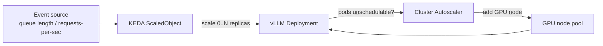

# Module 12.3 — Deployment Implementation with Azure

A production-focused guide to deploying GenAI models on Microsoft Azure, from Azure OpenAI Service to full MLOps pipelines with AKS.

---

## Table of Contents

1. [Azure GenAI Deployment Landscape](#azure-genai-deployment-landscape)
2. [Azure OpenAI Service](#azure-openai-service)
3. [Azure Machine Learning Endpoints](#azure-machine-learning-endpoints)
4. [Azure Container Apps (Serverless)](#azure-container-apps-serverless)
5. [Azure Kubernetes Service (AKS)](#azure-kubernetes-service-aks)
6. [MLOps with Azure ML Pipelines](#mlops-with-azure-ml-pipelines)
7. [Monitoring with Azure Monitor & Application Insights](#monitoring-with-azure-monitor--application-insights)
8. [Security: Azure Key Vault & Managed Identity](#security-azure-key-vault--managed-identity)
9. [End-to-End: Production Deployment Walkthrough](#end-to-end-production-deployment-walkthrough)
10. [Cost Management on Azure](#cost-management-on-azure)

---

## Azure GenAI Deployment Landscape

Azure provides multiple layers for GenAI deployment depending on how much control vs. convenience you need:

```
┌─────────────────────────────────────────────────────────────────────┐
│                     Azure GenAI Deployment Options                   │
│                                                                     │
│  ┌───────────────────────────────────────────────────────────────┐  │
│  │  MANAGED MODELS (Azure handles everything)                    │  │
│  │                                                               │  │
│  │  Azure OpenAI Service          Azure AI Studio (Catalog)      │  │
│  │  • GPT-4o, GPT-4, GPT-3.5     • Llama 3, Mistral, Phi-3     │  │
│  │  • DALL-E, Whisper, TTS        • Cohere, Falcon, etc.         │  │
│  │  • Embeddings models                                          │  │
│  └───────────────────────────────────────────────────────────────┘  │
│                                                                     │
│  ┌───────────────────────────────────────────────────────────────┐  │
│  │  MANAGED COMPUTE (You bring model, Azure runs infra)          │  │
│  │                                                               │  │
│  │  Azure ML Online Endpoints    Azure Container Apps            │  │
│  │  • Real-time inference        • Serverless GPU containers     │  │
│  │  • Auto-scaling               • Scale to zero                 │  │
│  │  • A/B testing built-in                                       │  │
│  └───────────────────────────────────────────────────────────────┘  │
│                                                                     │
│  ┌───────────────────────────────────────────────────────────────┐  │
│  │  FULL CONTROL (You manage model + infra)                      │  │
│  │                                                               │  │
│  │  Azure Kubernetes Service     Azure VMs (NC-series GPUs)      │  │
│  │  • Enterprise-grade K8s       • A100, H100, V100              │  │
│  │  • KEDA + GPU auto-scaling    • Bare metal performance        │  │
│  └───────────────────────────────────────────────────────────────┘  │
└─────────────────────────────────────────────────────────────────────┘
```

**Decision guide:**
- New project, OpenAI models → **Azure OpenAI Service**
- OSS model, need easy deployment → **Azure ML Endpoint**
- OSS model, scale-to-zero required → **Azure Container Apps**
- Enterprise, full control, GPU cluster → **AKS with KEDA**
- Complex ML pipelines, retraining → **Azure ML Pipelines**

---

## Azure OpenAI Service

The easiest path to GPT-4o, GPT-4, and other OpenAI models with Azure's enterprise guarantees (data residency, private endpoints, RBAC).

### Architecture

```
Your Azure Tenant
┌─────────────────────────────────────────────────────────┐
│                                                         │
│  App Service / AKS / Function                          │
│       │                                                 │
│       │  (Managed Identity — no keys in code)          │
│       ▼                                                 │
│  Azure OpenAI Service                                   │
│  ┌──────────────────────────────────────────────┐       │
│  │  Resource: my-openai-resource                │       │
│  │  Region: East US 2 (GPT-4o available)        │       │
│  │                                              │       │
│  │  Deployments:                                │       │
│  │    • gpt4o-prod    → GPT-4o (latest)         │       │
│  │    • gpt35-turbo   → GPT-3.5-Turbo           │       │
│  │    • text-embed    → text-embedding-3-large   │       │
│  └──────────────────────────────────────────────┘       │
│       │                                                 │
│       │  Private Endpoint (no public internet)         │
│       ▼                                                 │
│  Virtual Network (VNet)                                 │
└─────────────────────────────────────────────────────────┘
```

### Setup via Azure CLI

```bash
# Create resource group
az group create --name rg-genai-prod --location eastus2

# Create Azure OpenAI resource
az cognitiveservices account create \
  --name my-openai-resource \
  --resource-group rg-genai-prod \
  --kind OpenAI \
  --sku S0 \
  --location eastus2

# Deploy GPT-4o model
az cognitiveservices account deployment create \
  --name my-openai-resource \
  --resource-group rg-genai-prod \
  --deployment-name gpt4o-prod \
  --model-name gpt-4o \
  --model-version "2024-08-06" \
  --model-format OpenAI \
  --sku-capacity 30 \         # 30K TPM (tokens per minute)
  --sku-name Standard

# Get endpoint and key
az cognitiveservices account show \
  --name my-openai-resource \
  --resource-group rg-genai-prod \
  --query "properties.endpoint" -o tsv
```

### Python client with Managed Identity (no hardcoded keys)

```python
from openai import AzureOpenAI
from azure.identity import DefaultAzureCredential, get_bearer_token_provider
import os

# Managed Identity — works in Azure App Service, AKS, Functions automatically
token_provider = get_bearer_token_provider(
    DefaultAzureCredential(),
    "https://cognitiveservices.azure.com/.default",
)

client = AzureOpenAI(
    azure_endpoint=os.environ["AZURE_OPENAI_ENDPOINT"],
    azure_ad_token_provider=token_provider,
    api_version="2024-08-01-preview",
)


def chat(prompt: str, system: str = "") -> str:
    response = client.chat.completions.create(
        model="gpt4o-prod",         # deployment name (not model name)
        messages=[
            {"role": "system", "content": system},
            {"role": "user", "content": prompt},
        ],
        temperature=0.7,
        max_tokens=1024,
    )
    return response.choices[0].message.content


def embed(text: str) -> list[float]:
    response = client.embeddings.create(
        model="text-embed",         # your embedding deployment name
        input=text,
    )
    return response.data[0].embedding


# Streaming
def stream_chat(prompt: str):
    stream = client.chat.completions.create(
        model="gpt4o-prod",
        messages=[{"role": "user", "content": prompt}],
        stream=True,
    )
    for chunk in stream:
        if chunk.choices[0].delta.content:
            yield chunk.choices[0].delta.content
```

### Content filtering configuration

```python
# Azure OpenAI has built-in content filters — configure thresholds via portal
# You can also add custom blocklists

# Check filter results in response
response = client.chat.completions.create(
    model="gpt4o-prod",
    messages=[{"role": "user", "content": prompt}],
)

# Inspect content filter results
if hasattr(response.choices[0], "content_filter_results"):
    filters = response.choices[0].content_filter_results
    if filters.hate.filtered or filters.violence.filtered:
        raise ValueError("Content filtered by Azure OpenAI safety system")
```

---

## Azure Machine Learning Endpoints

Deploy your own fine-tuned or OSS models with Azure ML's managed inference infrastructure.

### Architecture

```
Model Registry (Azure ML)
    │  (versioned model artifacts)
    │
    ▼
Online Endpoint
┌────────────────────────────────────────────────┐
│  Endpoint: genai-endpoint.azureml.ms           │
│                                                │
│  Traffic split (for A/B testing):              │
│    deployment-v1 ──── 80%                      │
│    deployment-v2 ──── 20%  (canary)            │
│                                                │
│  Deployment v1:                                │
│  ┌──────────────────────────────────────────┐  │
│  │  Instance: Standard_NC6s_v3 (V100 GPU)   │  │
│  │  Min instances: 1                         │  │
│  │  Max instances: 5                         │  │
│  │  Scale metric: request_rate               │  │
│  └──────────────────────────────────────────┘  │
└────────────────────────────────────────────────┘
```

### Deploy custom model to Azure ML

```python
from azure.ai.ml import MLClient
from azure.ai.ml.entities import (
    ManagedOnlineEndpoint,
    ManagedOnlineDeployment,
    Model,
    Environment,
    CodeConfiguration,
)
from azure.identity import DefaultAzureCredential

# Connect to Azure ML workspace
ml_client = MLClient(
    credential=DefaultAzureCredential(),
    subscription_id="YOUR_SUBSCRIPTION_ID",
    resource_group_name="rg-genai-prod",
    workspace_name="my-aml-workspace",
)

# ── 1. Register model ────────────────────────────────────────────────────────
model = ml_client.models.create_or_update(
    Model(
        path="./models/mistral-7b-finetuned",   # local path or remote URI
        name="mistral-7b-finetuned",
        version="1",
        description="Mistral 7B fine-tuned on customer support data",
        type="custom_model",
    )
)

# ── 2. Create endpoint ────────────────────────────────────────────────────────
endpoint = ml_client.online_endpoints.begin_create_or_update(
    ManagedOnlineEndpoint(
        name="genai-endpoint",
        description="Production LLM inference endpoint",
        auth_mode="key",
    )
).result()

# ── 3. Create deployment ──────────────────────────────────────────────────────
deployment = ml_client.online_deployments.begin_create_or_update(
    ManagedOnlineDeployment(
        name="v1",
        endpoint_name="genai-endpoint",
        model=model.id,
        environment=Environment(
            conda_file="./conda.yml",
            image="mcr.microsoft.com/azureml/openmpi4.1.0-cuda11.8-cudnn8-ubuntu22.04",
        ),
        code_configuration=CodeConfiguration(
            code="./scoring",          # directory with score.py
            scoring_script="score.py",
        ),
        instance_type="Standard_NC6s_v3",   # 1x V100 GPU, 16 GB VRAM
        instance_count=1,
        scale_settings={
            "scale_type": "auto",
            "min_instances": 1,
            "max_instances": 4,
            "polling_interval": 30,
            "target_utilization_percentage": 70,
        },
    )
).result()

# Route 100% traffic to v1
ml_client.online_endpoints.begin_create_or_update(
    ManagedOnlineEndpoint(
        name="genai-endpoint",
        traffic={"v1": 100},
    )
).result()

print(f"Endpoint URI: {endpoint.scoring_uri}")
```

### `score.py` — the inference script

```python
# scoring/score.py
import os
import json
import torch
from transformers import AutoModelForCausalLM, AutoTokenizer

model = None
tokenizer = None


def init():
    """Called once when deployment starts."""
    global model, tokenizer
    model_path = os.environ.get("AZUREML_MODEL_DIR", "./model")

    tokenizer = AutoTokenizer.from_pretrained(model_path)
    model = AutoModelForCausalLM.from_pretrained(
        model_path,
        torch_dtype=torch.float16,
        device_map="auto",
    )
    model.eval()
    print("Model loaded successfully.")


def run(raw_data: str) -> str:
    """Called for each inference request."""
    data = json.loads(raw_data)
    prompt = data.get("prompt", "")
    max_new_tokens = data.get("max_tokens", 256)

    inputs = tokenizer(prompt, return_tensors="pt").to(model.device)

    with torch.no_grad():
        outputs = model.generate(
            **inputs,
            max_new_tokens=max_new_tokens,
            temperature=data.get("temperature", 0.7),
            do_sample=True,
            pad_token_id=tokenizer.eos_token_id,
        )

    generated = tokenizer.decode(
        outputs[0][inputs.input_ids.shape[1]:],
        skip_special_tokens=True,
    )
    return json.dumps({"text": generated})
```

### Invoke the endpoint

```python
from azure.ai.ml import MLClient
from azure.identity import DefaultAzureCredential

ml_client = MLClient(
    DefaultAzureCredential(),
    subscription_id="...",
    resource_group_name="rg-genai-prod",
    workspace_name="my-aml-workspace",
)

result = ml_client.online_endpoints.invoke(
    endpoint_name="genai-endpoint",
    request_file=None,
    request_body=json.dumps({"prompt": "Explain RAG in 3 sentences.", "max_tokens": 200}),
)
print(result)
```

### A/B testing with traffic split

```python
# Shift 20% traffic to v2 (new model version)
ml_client.online_endpoints.begin_create_or_update(
    ManagedOnlineEndpoint(
        name="genai-endpoint",
        traffic={"v1": 80, "v2": 20},
    )
).result()

# After validation: shift 100% to v2
ml_client.online_endpoints.begin_create_or_update(
    ManagedOnlineEndpoint(
        name="genai-endpoint",
        traffic={"v1": 0, "v2": 100},
    )
).result()
```

---

## Azure Container Apps (Serverless)

Container Apps provides serverless container hosting with scale-to-zero GPU support — ideal for variable traffic workloads.

### Architecture

```
Internet
   │
   ▼
Azure Container Apps Environment
┌─────────────────────────────────────────────────────────┐
│                                                         │
│  Container App: genai-inference                         │
│  ┌───────────────────────────────────────────────────┐  │
│  │  Revision: latest                                  │  │
│  │                                                   │  │
│  │  Replicas: 0 (idle) → 1-10 (under load)          │  │
│  │  Scale trigger: HTTP request queue length > 10    │  │
│  │                                                   │  │
│  │  Image: your-acr.azurecr.io/genai-api:latest      │  │
│  │  CPU: 4 cores  Memory: 16 Gi                      │  │
│  └───────────────────────────────────────────────────┘  │
│                                                         │
│  Azure Container Registry (ACR)                         │
│  Azure Key Vault (secrets)                              │
│  Azure Monitor (logs + metrics)                         │
└─────────────────────────────────────────────────────────┘
```

### Deploy via Azure CLI

```bash
# Create Container Apps environment
az containerapp env create \
  --name genai-env \
  --resource-group rg-genai-prod \
  --location eastus2

# Create container app
az containerapp create \
  --name genai-inference \
  --resource-group rg-genai-prod \
  --environment genai-env \
  --image your-acr.azurecr.io/genai-api:latest \
  --registry-server your-acr.azurecr.io \
  --registry-identity system \
  --target-port 8000 \
  --ingress external \
  --min-replicas 0 \
  --max-replicas 10 \
  --cpu 4 \
  --memory 16Gi \
  --scale-rule-name http-scaling \
  --scale-rule-type http \
  --scale-rule-http-concurrency 20 \
  --env-vars \
    ANTHROPIC_API_KEY=secretref:anthropic-api-key

# Add secrets from Key Vault
az containerapp secret set \
  --name genai-inference \
  --resource-group rg-genai-prod \
  --secrets "anthropic-api-key=keyvaultref:https://kv-genai.vault.azure.net/secrets/anthropic-key,identityref:/subscriptions/.../userAssignedIdentities/genai-identity"
```

### Bicep IaC template

```bicep
// main.bicep — full Container Apps deployment
param location string = 'eastus2'
param acrName string = 'genairegistry'
param appName string = 'genai-inference'

resource acr 'Microsoft.ContainerRegistry/registries@2023-07-01' = {
  name: acrName
  location: location
  sku: { name: 'Standard' }
  properties: { adminUserEnabled: false }
}

resource env 'Microsoft.App/managedEnvironments@2023-05-01' = {
  name: 'genai-env'
  location: location
  properties: {
    appLogsConfiguration: {
      destination: 'log-analytics'
      logAnalyticsConfiguration: {
        customerId: logAnalytics.properties.customerId
        sharedKey: logAnalytics.listKeys().primarySharedKey
      }
    }
  }
}

resource app 'Microsoft.App/containerApps@2023-05-01' = {
  name: appName
  location: location
  identity: { type: 'SystemAssigned' }
  properties: {
    managedEnvironmentId: env.id
    configuration: {
      ingress: {
        external: true
        targetPort: 8000
        transport: 'http'
      }
      secrets: [
        {
          name: 'anthropic-key'
          keyVaultUrl: 'https://kv-genai.vault.azure.net/secrets/anthropic-api-key'
          identity: 'system'
        }
      ]
    }
    template: {
      containers: [
        {
          name: 'api'
          image: '${acr.properties.loginServer}/genai-api:latest'
          resources: { cpu: 4, memory: '16Gi' }
          env: [
            { name: 'ANTHROPIC_API_KEY', secretRef: 'anthropic-key' }
          ]
        }
      ]
      scale: {
        minReplicas: 0
        maxReplicas: 10
        rules: [
          {
            name: 'http-scaling'
            http: { metadata: { concurrentRequests: '20' } }
          }
        ]
      }
    }
  }
}
```

---

## Azure Kubernetes Service (AKS)

For production workloads requiring full control, GPU node pools, and enterprise networking.

*Figure: KEDA scales the deployment on queue depth, then the cluster autoscaler adds GPU nodes if needed.*



> For how pod-level and node-level scaling fit together, see [12.5 Scaling & Reliability](../05_production_operations/README.md#scaling--reliability).

### AKS cluster setup with GPU node pool

```bash
# Create AKS cluster
az aks create \
  --resource-group rg-genai-prod \
  --name genai-aks \
  --node-count 2 \
  --node-vm-size Standard_D4s_v3 \
  --enable-managed-identity \
  --enable-addons monitoring \
  --generate-ssh-keys

# Add GPU node pool (NC A100 v4 — NVIDIA A100 80GB)
az aks nodepool add \
  --resource-group rg-genai-prod \
  --cluster-name genai-aks \
  --name gpupool \
  --node-count 1 \
  --node-vm-size Standard_NC24ads_A100_v4 \
  --node-taints sku=gpu:NoSchedule \
  --node-labels sku=gpu \
  --aks-custom-headers UseGPUDedicatedVHD=true \
  --enable-cluster-autoscaler \
  --min-count 0 \
  --max-count 4

# Get credentials
az aks get-credentials \
  --resource-group rg-genai-prod \
  --name genai-aks

# Install NVIDIA device plugin
kubectl apply -f https://raw.githubusercontent.com/NVIDIA/k8s-device-plugin/v0.14.1/nvidia-device-plugin.yml
```

### Complete AKS deployment for vLLM

```yaml
# k8s/vllm-deployment.yaml
apiVersion: apps/v1
kind: Deployment
metadata:
  name: vllm-server
  namespace: genai
spec:
  replicas: 1
  selector:
    matchLabels:
      app: vllm-server
  template:
    metadata:
      labels:
        app: vllm-server
    spec:
      nodeSelector:
        sku: gpu
      tolerations:
        - key: sku
          value: gpu
          effect: NoSchedule
      initContainers:
        # Pre-load model weights from Azure Blob Storage
        - name: model-downloader
          image: mcr.microsoft.com/azure-cli:latest
          command:
            - bash
            - -c
            - |
              az storage blob download-batch \
                --source model-weights \
                --destination /models/mistral-7b \
                --account-name genaimodelstorage
          volumeMounts:
            - name: model-storage
              mountPath: /models
          env:
            - name: AZURE_CLIENT_ID
              valueFrom:
                fieldRef:
                  fieldPath: spec.serviceAccountName
      containers:
        - name: vllm
          image: vllm/vllm-openai:latest
          args:
            - "--model"
            - "/models/mistral-7b"
            - "--served-model-name"
            - "mistral-7b"
            - "--tensor-parallel-size"
            - "1"
            - "--max-model-len"
            - "8192"
            - "--port"
            - "8000"
          resources:
            requests:
              nvidia.com/gpu: "1"
              memory: "20Gi"
              cpu: "4"
            limits:
              nvidia.com/gpu: "1"
              memory: "40Gi"
              cpu: "8"
          readinessProbe:
            httpGet:
              path: /health
              port: 8000
            initialDelaySeconds: 120
            periodSeconds: 10
          volumeMounts:
            - name: model-storage
              mountPath: /models
      volumes:
        - name: model-storage
          persistentVolumeClaim:
            claimName: model-cache-pvc
```

### KEDA (Kubernetes Event-driven Autoscaling) for GPU pods

```yaml
# k8s/keda-scaledobject.yaml
apiVersion: keda.sh/v1alpha1
kind: ScaledObject
metadata:
  name: vllm-keda
  namespace: genai
spec:
  scaleTargetRef:
    name: vllm-server
  minReplicaCount: 0        # scale to zero when idle (saves GPU cost)
  maxReplicaCount: 4
  cooldownPeriod: 300       # wait 5 min before scale-down
  pollingInterval: 15
  triggers:
    - type: azure-servicebus
      metadata:
        queueName: inference-requests
        namespace: genai-servicebus
        messageCount: "5"   # scale up when >5 messages queued
```

---

## MLOps with Azure ML Pipelines

Build end-to-end automated pipelines: data preparation → fine-tuning → evaluation → deployment.

### Pipeline architecture

```
Data Source (Azure Blob)
        │
        ▼
┌───────────────────────────────────────────────────────────┐
│                  Azure ML Pipeline                         │
│                                                           │
│  Step 1: Data Prep          Step 2: Fine-tuning           │
│  ┌──────────────────┐       ┌──────────────────┐          │
│  │ - Load raw data  │──────►│ - LoRA training  │          │
│  │ - Format as JSONL│       │ - Checkpoint save│          │
│  │ - Train/val split│       │ - Metrics logging│          │
│  └──────────────────┘       └────────┬─────────┘          │
│                                      │                    │
│  Step 3: Evaluation         Step 4: Register              │
│  ┌──────────────────┐       ┌──────────────────┐          │
│  │ - ROUGE/BLEU     │◄──────│ - Model artifacts│          │
│  │ - Custom evals   │       │ - Push to registry│         │
│  │ - Threshold gate │       │ - Tag with metrics│         │
│  └────────┬─────────┘       └──────────────────┘          │
│           │                                               │
│           │ PASS                                          │
│           ▼                                               │
│  Step 5: Deploy                                           │
│  ┌──────────────────┐                                     │
│  │ - Create endpoint│                                     │
│  │ - Canary deploy  │                                     │
│  │ - Smoke test     │                                     │
│  └──────────────────┘                                     │
└───────────────────────────────────────────────────────────┘
```

### Pipeline code with Azure ML SDK v2

```python
from azure.ai.ml import MLClient, Input, Output
from azure.ai.ml.dsl import pipeline
from azure.ai.ml import command
from azure.ai.ml.entities import AmlCompute
from azure.identity import DefaultAzureCredential

ml_client = MLClient(
    DefaultAzureCredential(),
    subscription_id="...",
    resource_group_name="rg-genai-prod",
    workspace_name="my-aml-workspace",
)

# ── Define pipeline components ────────────────────────────────────────────────

data_prep_component = command(
    name="data_preparation",
    display_name="Prepare Training Data",
    code="./components/data_prep",
    command="python prepare.py --raw_data ${{inputs.raw_data}} --output ${{outputs.prepared_data}}",
    inputs={"raw_data": Input(type="uri_folder")},
    outputs={"prepared_data": Output(type="uri_folder")},
    environment="azureml:AzureML-sklearn-1.0-ubuntu20.04-py38-cpu@latest",
    compute="cpu-cluster",
)

finetune_component = command(
    name="finetuning",
    display_name="LoRA Fine-tuning",
    code="./components/finetune",
    command=(
        "python finetune.py "
        "--base_model ${{inputs.base_model}} "
        "--data ${{inputs.training_data}} "
        "--output ${{outputs.finetuned_model}} "
        "--epochs ${{inputs.epochs}}"
    ),
    inputs={
        "base_model": Input(type="uri_folder"),
        "training_data": Input(type="uri_folder"),
        "epochs": Input(type="integer", default=3),
    },
    outputs={"finetuned_model": Output(type="uri_folder")},
    environment="azureml:AzureML-pytorch-1.13-ubuntu20.04-py38-cuda11.7-gpu@latest",
    compute="gpu-cluster",
    resources={"gpu": "1", "instance_type": "Standard_NC6s_v3"},
)

evaluate_component = command(
    name="evaluation",
    display_name="Evaluate Model Quality",
    code="./components/evaluate",
    command=(
        "python evaluate.py "
        "--model ${{inputs.model}} "
        "--test_data ${{inputs.test_data}} "
        "--metrics_output ${{outputs.metrics}}"
    ),
    inputs={"model": Input(type="uri_folder"), "test_data": Input(type="uri_folder")},
    outputs={"metrics": Output(type="uri_folder")},
    environment="azureml:AzureML-sklearn-1.0-ubuntu20.04-py38-cpu@latest",
    compute="cpu-cluster",
)


# ── Build the pipeline ────────────────────────────────────────────────────────

@pipeline(
    name="genai_finetune_deploy",
    description="Full MLOps pipeline: prep → finetune → eval → deploy",
)
def finetune_pipeline(raw_data: Input, base_model: Input, epochs: int = 3):
    prep = data_prep_component(raw_data=raw_data)
    finetune = finetune_component(
        base_model=base_model,
        training_data=prep.outputs.prepared_data,
        epochs=epochs,
    )
    evaluate = evaluate_component(
        model=finetune.outputs.finetuned_model,
        test_data=prep.outputs.prepared_data,
    )
    return {"finetuned_model": finetune.outputs.finetuned_model}


# ── Submit pipeline ───────────────────────────────────────────────────────────

pipeline_job = finetune_pipeline(
    raw_data=Input(path="azureml://datastores/training_data/paths/v1/"),
    base_model=Input(path="azureml://models/mistral-7b/versions/1/"),
    epochs=3,
)

pipeline_job = ml_client.jobs.create_or_update(
    pipeline_job, experiment_name="mistral-finetune"
)
print(f"Pipeline job: {pipeline_job.studio_url}")
```

---

## Monitoring with Azure Monitor & Application Insights

### Application Insights integration

```python
from applicationinsights import TelemetryClient
from applicationinsights.requests import WSGIApplication
import os

# Initialize Application Insights
tc = TelemetryClient(os.environ["APPLICATIONINSIGHTS_CONNECTION_STRING"])


def track_inference(
    model: str,
    input_tokens: int,
    output_tokens: int,
    latency_ms: float,
    success: bool,
):
    tc.track_event(
        "LLMInference",
        properties={
            "model": model,
            "success": str(success),
        },
        measurements={
            "input_tokens": input_tokens,
            "output_tokens": output_tokens,
            "latency_ms": latency_ms,
            "cost_usd": (input_tokens * 3.0 + output_tokens * 15.0) / 1_000_000,
        },
    )
    tc.flush()


# FastAPI middleware for automatic tracking
from opencensus.ext.azure.trace_exporter import AzureExporter
from opencensus.trace.samplers import ProbabilitySampler
from opencensus.ext.fastapi.fastapi_middleware import FastAPIMiddleware

app.add_middleware(
    FastAPIMiddleware,
    exporter=AzureExporter(
        connection_string=os.environ["APPLICATIONINSIGHTS_CONNECTION_STRING"]
    ),
    sampler=ProbabilitySampler(rate=1.0),
)
```

### KQL queries for Azure Monitor

```kusto
// Average latency per model over last 24 hours
customEvents
| where name == "LLMInference"
| where timestamp > ago(24h)
| summarize
    avg_latency = avg(todouble(customMeasurements["latency_ms"])),
    p95_latency = percentile(todouble(customMeasurements["latency_ms"]), 95),
    request_count = count(),
    total_cost = sum(todouble(customMeasurements["cost_usd"]))
  by model = tostring(customDimensions["model"]), bin(timestamp, 1h)
| order by timestamp desc


// Error rate alerting
customEvents
| where name == "LLMInference"
| where timestamp > ago(5m)
| summarize
    total = count(),
    errors = countif(tostring(customDimensions["success"]) == "False")
| extend error_rate = todouble(errors) / todouble(total)
| where error_rate > 0.05    // alert if >5% error rate
```

### Alert rules via Bicep

```bicep
resource latencyAlert 'Microsoft.Insights/scheduledQueryRules@2023-03-15-preview' = {
  name: 'genai-high-latency'
  location: location
  properties: {
    displayName: 'GenAI P95 Latency > 10s'
    severity: 2
    enabled: true
    evaluationFrequency: 'PT5M'
    windowSize: 'PT10M'
    criteria: {
      allOf: [
        {
          query: '''
            customEvents
            | where name == "LLMInference"
            | summarize p95 = percentile(todouble(customMeasurements["latency_ms"]), 95)
            | where p95 > 10000
          '''
          threshold: 0
          operator: 'GreaterThan'
        }
      ]
    }
    actions: {
      actionGroups: [oncallActionGroup.id]
    }
  }
}
```

---

## Security: Azure Key Vault & Managed Identity

The zero-secrets-in-code pattern using Azure's identity platform.

```
┌──────────────────────────────────────────────────────────────┐
│                  Zero-Secret Architecture                     │
│                                                              │
│  App Service / AKS Pod                                       │
│  ┌───────────────────────────────────────────────────────┐   │
│  │  System-assigned Managed Identity                     │   │
│  │  (auto-created, tied to app lifecycle)                │   │
│  └────────────────────┬──────────────────────────────────┘   │
│                       │  RBAC: "Key Vault Secrets User"      │
│                       ▼                                      │
│  Azure Key Vault                                             │
│  ┌───────────────────────────────────────────────────────┐   │
│  │  Secrets:                                             │   │
│  │    anthropic-api-key  → sk-ant-...                    │   │
│  │    openai-api-key     → sk-...                        │   │
│  │    db-connection-str  → postgresql://...              │   │
│  └───────────────────────────────────────────────────────┘   │
│                                                              │
│  No passwords in: code, config files, env vars, Docker images│
└──────────────────────────────────────────────────────────────┘
```

### Python: fetch secrets from Key Vault

```python
from azure.identity import DefaultAzureCredential, ManagedIdentityCredential
from azure.keyvault.secrets import SecretClient
from functools import lru_cache
import os

VAULT_URL = os.environ["AZURE_KEY_VAULT_URL"]  # https://kv-genai.vault.azure.net


@lru_cache(maxsize=None)
def get_secret(secret_name: str) -> str:
    """Fetch secret from Key Vault (cached — only fetches once per process)."""
    credential = DefaultAzureCredential()  # uses Managed Identity in Azure
    client = SecretClient(vault_url=VAULT_URL, credential=credential)
    return client.get_secret(secret_name).value


# Usage — no hardcoded keys anywhere
import anthropic

client = anthropic.Anthropic(api_key=get_secret("anthropic-api-key"))
```

### Managed Identity setup via Azure CLI

```bash
# Create user-assigned managed identity
az identity create \
  --name genai-app-identity \
  --resource-group rg-genai-prod

# Get the identity's principal ID
IDENTITY_PRINCIPAL=$(az identity show \
  --name genai-app-identity \
  --resource-group rg-genai-prod \
  --query principalId -o tsv)

# Grant Key Vault Secrets User role
az role assignment create \
  --role "Key Vault Secrets User" \
  --assignee $IDENTITY_PRINCIPAL \
  --scope $(az keyvault show --name kv-genai --query id -o tsv)

# Assign identity to App Service
az webapp identity assign \
  --resource-group rg-genai-prod \
  --name genai-app \
  --identities /subscriptions/.../resourceGroups/rg-genai-prod/providers/Microsoft.ManagedIdentity/userAssignedIdentities/genai-app-identity
```

---

## End-to-End: Production Deployment Walkthrough

Let's deploy a complete RAG-based Q&A application on Azure from scratch.

### System design

```
User ──► Azure Front Door (CDN + WAF)
              │
              ▼
         Azure API Management (rate limiting, auth, analytics)
              │
              ▼
         Azure Container Apps (FastAPI application)
         ┌────────────────────────────────────────────────┐
         │                                                │
         │  1. Embed user query (Azure OpenAI)            │
         │  2. Search Azure AI Search (vector search)     │
         │  3. Retrieve top-k documents                   │
         │  4. Generate answer (Azure OpenAI GPT-4o)      │
         │  5. Return answer + sources                    │
         │                                                │
         └────────────────────────────────────────────────┘
              │                    │
              ▼                    ▼
    Azure OpenAI Service    Azure AI Search
    (embeddings + chat)     (vector + hybrid search)
              │
              ▼
    Azure Blob Storage
    (document store)
```

### Complete application code

```python
# app/rag_app.py
import os
from fastapi import FastAPI
from pydantic import BaseModel
from openai import AzureOpenAI
from azure.search.documents import SearchClient
from azure.search.documents.models import VectorizedQuery
from azure.identity import DefaultAzureCredential

app = FastAPI(title="Azure RAG API", version="1.0")
cred = DefaultAzureCredential()

# Azure OpenAI client (Managed Identity auth)
from azure.identity import get_bearer_token_provider
token_provider = get_bearer_token_provider(
    cred, "https://cognitiveservices.azure.com/.default"
)
openai_client = AzureOpenAI(
    azure_endpoint=os.environ["AZURE_OPENAI_ENDPOINT"],
    azure_ad_token_provider=token_provider,
    api_version="2024-08-01-preview",
)

# Azure AI Search client
search_client = SearchClient(
    endpoint=os.environ["AZURE_SEARCH_ENDPOINT"],
    index_name="documents",
    credential=cred,
)


class QueryRequest(BaseModel):
    question: str
    top_k: int = 5


class QueryResponse(BaseModel):
    answer: str
    sources: list[str]


def embed(text: str) -> list[float]:
    response = openai_client.embeddings.create(
        model="text-embed",
        input=text,
    )
    return response.data[0].embedding


def retrieve_documents(query: str, top_k: int) -> list[dict]:
    query_embedding = embed(query)
    vector_query = VectorizedQuery(
        vector=query_embedding,
        k_nearest_neighbors=top_k,
        fields="content_vector",
    )
    results = search_client.search(
        search_text=query,           # hybrid: keyword + vector
        vector_queries=[vector_query],
        select=["id", "title", "content"],
        top=top_k,
    )
    return [{"id": r["id"], "title": r["title"], "content": r["content"]} for r in results]


def generate_answer(question: str, context_docs: list[dict]) -> str:
    context = "\n\n".join(
        f"[{doc['title']}]\n{doc['content']}" for doc in context_docs
    )
    response = openai_client.chat.completions.create(
        model="gpt4o-prod",
        messages=[
            {
                "role": "system",
                "content": (
                    "You are a helpful assistant. Answer the user's question based "
                    "only on the provided context. If the answer is not in the context, "
                    "say so clearly. Do not make up information."
                ),
            },
            {
                "role": "user",
                "content": f"Context:\n{context}\n\nQuestion: {question}",
            },
        ],
        temperature=0.3,
        max_tokens=1024,
    )
    return response.choices[0].message.content


@app.post("/query", response_model=QueryResponse)
async def query(request: QueryRequest):
    docs = retrieve_documents(request.question, request.top_k)
    answer = generate_answer(request.question, docs)
    sources = [f"{d['title']} (id: {d['id']})" for d in docs]
    return QueryResponse(answer=answer, sources=sources)


@app.get("/health")
async def health():
    return {"status": "ok"}
```

### Deploy to Container Apps

```bash
# Build and push to Azure Container Registry
az acr build \
  --registry genairegistry \
  --image rag-api:latest \
  .

# Deploy
az containerapp create \
  --name rag-api \
  --resource-group rg-genai-prod \
  --environment genai-env \
  --image genairegistry.azurecr.io/rag-api:latest \
  --target-port 8000 \
  --ingress external \
  --min-replicas 1 \
  --max-replicas 20 \
  --cpu 2 \
  --memory 4Gi \
  --env-vars \
    AZURE_OPENAI_ENDPOINT=https://my-openai-resource.openai.azure.com/ \
    AZURE_SEARCH_ENDPOINT=https://genai-search.search.windows.net \
    AZURE_KEY_VAULT_URL=https://kv-genai.vault.azure.net

# Test
curl -X POST https://rag-api.azurecontainerapps.io/query \
  -H "Content-Type: application/json" \
  -d '{"question": "What is our refund policy?", "top_k": 3}'
```

---

## Cost Management on Azure

### Azure cost breakdown for GenAI workloads

```
Monthly cost components:

Azure OpenAI Service
├── GPT-4o: $5 / 1M input tokens, $15 / 1M output tokens
├── GPT-3.5-Turbo: $0.50 / 1M input, $1.50 / 1M output
└── Embeddings (text-embedding-3-large): $0.13 / 1M tokens

Azure ML Endpoints (Standard_NC6s_v3 = 1x V100)
└── $2.07 / hour → ~$1,490 / month if always-on

Azure Container Apps
├── CPU: $0.000024 / vCPU-second
├── Memory: $0.000003 / GiB-second
└── Scale to zero = $0 when idle

Azure AI Search
├── Basic: $75/month (suitable for dev)
└── Standard S1: $250/month (production, with vector search)
```

### Cost optimization playbook

```python
# 1. Use prompt caching (Anthropic) or model-level caching (Azure OpenAI)
# Azure OpenAI caches prompts > 1024 tokens automatically with 50% discount

# 2. Commitment discounts via Azure Provisioned Throughput Units (PTUs)
# Pay upfront for consistent throughput — up to 60% cheaper than pay-as-you-go
# Suitable if you use >$3K/month of Azure OpenAI

# 3. Auto-shutdown ML endpoints when idle
import schedule
import time
from azure.ai.ml import MLClient

def shutdown_idle_endpoints():
    for endpoint in ml_client.online_endpoints.list():
        metrics = get_endpoint_metrics(endpoint.name, last_hours=2)
        if metrics["request_count"] == 0:
            ml_client.online_endpoints.begin_delete(name=endpoint.name)
            print(f"Shut down idle endpoint: {endpoint.name}")

schedule.every().hour.do(shutdown_idle_endpoints)

# 4. Set spending alerts
az consumption budget create \
  --budget-name genai-monthly-budget \
  --amount 1000 \
  --time-grain Monthly \
  --time-period-start 2025-01-01 \
  --time-period-end 2026-01-01 \
  --resource-group rg-genai-prod \
  --notifications \
    "enabled=true threshold=80 contactEmails=team@company.com operator=GreaterThan" \
    "enabled=true threshold=100 contactEmails=finance@company.com operator=GreaterThanOrEqualTo"
```

---

## Key Takeaways

1. **Azure OpenAI Service** is the fastest path to production with enterprise compliance.
2. **Managed Identity eliminates credentials** in code — always use it over API keys for Azure-to-Azure calls.
3. **Azure ML Endpoints** support traffic splitting natively — built for canary deployments.
4. **Container Apps** with scale-to-zero is ideal for cost-sensitive or spiky workloads.
5. **AKS + KEDA** handles enterprise GPU clusters with event-driven autoscaling.
6. **Application Insights** gives you LLM-specific observability with custom events and KQL queries.
7. **Azure Pipelines + Azure ML** automate the entire fine-tune-evaluate-deploy loop.

---

*Back to: [Module Overview →](../README.md)*
