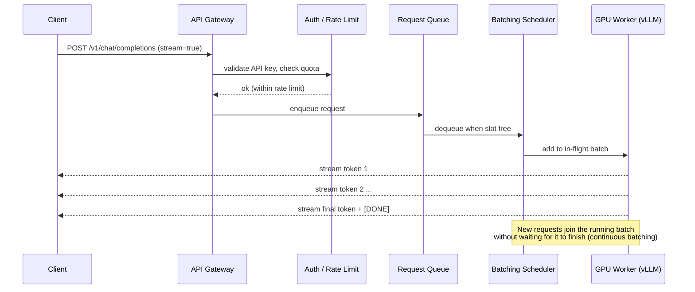
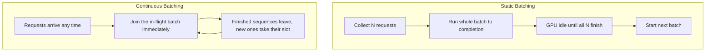

# Module 12.5 — Production Operations

How a GenAI service actually behaves once real traffic hits it. This section is the visual, conceptual glue between the techniques (Module 12.2) and the cloud-specific implementations (12.3 Azure, 12.4 AWS): it shows the mental models — request flow, scaling, releases, and observability — that the code in those modules implements.

---

## Table of Contents

1. [The Request Lifecycle](#the-request-lifecycle)
2. [Scaling & Reliability](#scaling--reliability)
3. [Release & Rollback](#release--rollback)
4. [Observability & Cost](#observability--cost)
5. [Key Takeaways](#key-takeaways)

---

## The Request Lifecycle

A single inference request is not "call the model and wait." It passes through a gateway, authentication, rate limiting, a queue, and a batching scheduler before a GPU ever sees it — then tokens stream back as they are generated. Understanding this path explains nearly every latency and throughput decision you will make.

*Figure: the journey of one inference request from client to streamed response.*



Why a queue and a scheduler instead of one-request-per-GPU? Because GPUs are most efficient when processing many sequences at once. The scheduler packs concurrent requests into a single batch and keeps the GPU saturated.

*Figure: static batching wastes the GPU between batches; continuous batching keeps it full.*



The other half of serving efficiency is the **KV-cache**: the attention keys/values for every token already generated are kept in GPU memory so they are not recomputed each step. This is why long contexts and many concurrent users consume GPU memory fast.

```
GPU Memory (e.g. 80 GB A100)
┌─────────────────────────────────────────────┐
│  Model weights (e.g. 7B @ fp16 ≈ 14 GB)       │
├─────────────────────────────────────────────┤
│  KV-cache  ── grows with (tokens × users)     │
│  [req A ███████      ]                         │
│  [req B ████         ]                         │
│  [req C ██████████   ]  ← evicted/blocked when │
│                          cache is full          │
├─────────────────────────────────────────────┤
│  Activations / scratch                         │
└─────────────────────────────────────────────┘
```

> **In practice:** Latency has two parts — time-to-first-token (queue wait + prompt processing) and inter-token latency (decode speed). Continuous batching improves throughput; it does not shorten a single request. When the KV-cache fills, new requests queue — that is the real meaning of "GPU at capacity."

**Maps to:** vLLM/continuous batching config in [02_deployment_techniques](../02_deployment_techniques/README.md#model-optimization-before-deployment); GPU node pools in [03_azure](../03_deployment_implementation_with_azure/README.md#azure-kubernetes-service-aks) and [04_aws_mlops](../03_deployment_implementation_with_azure/04_deployment_with_aws_mlops/README.md#sagemaker-real-time-endpoints).
