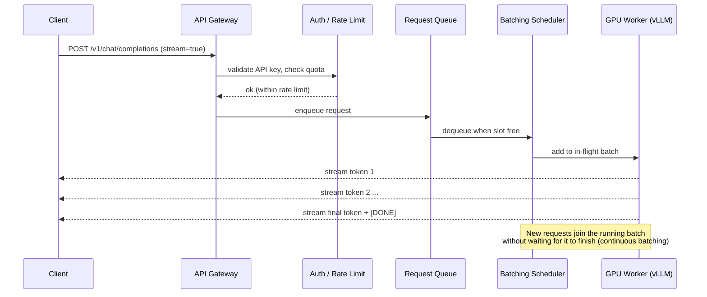
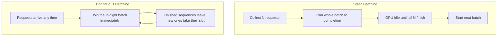
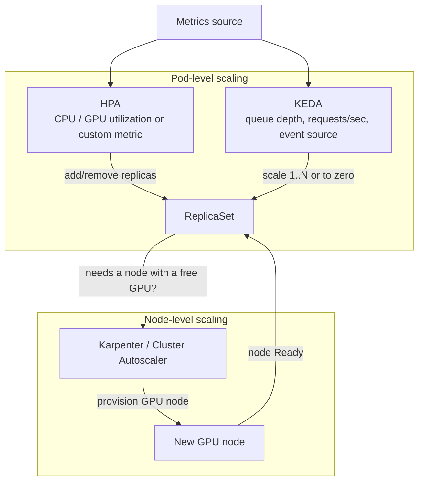
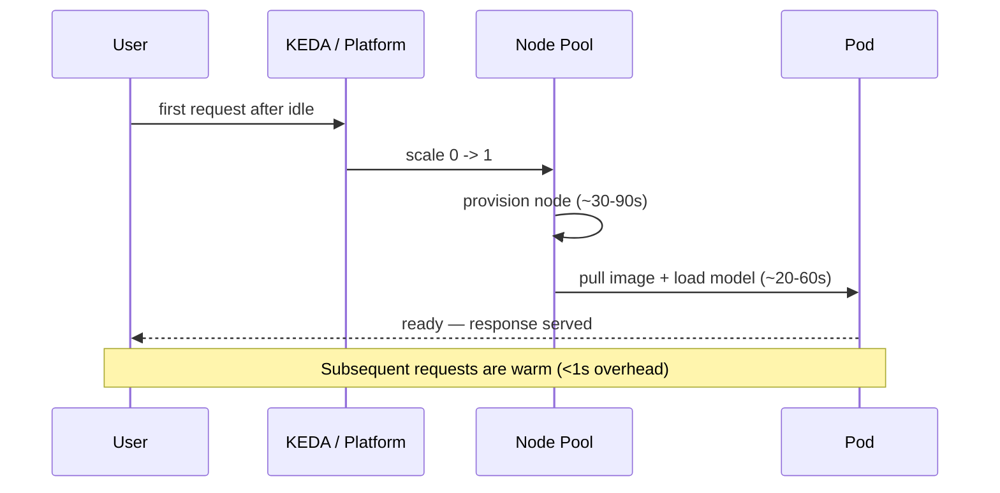
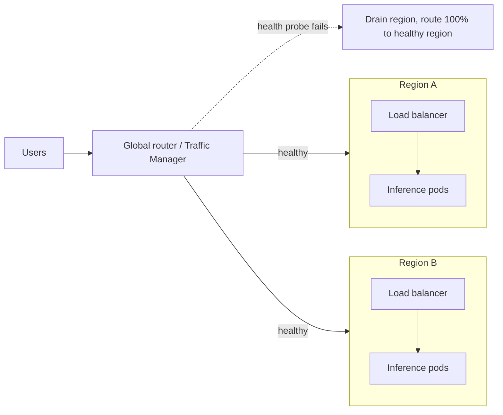
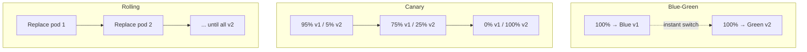
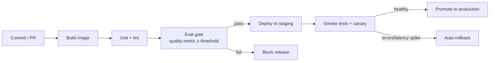
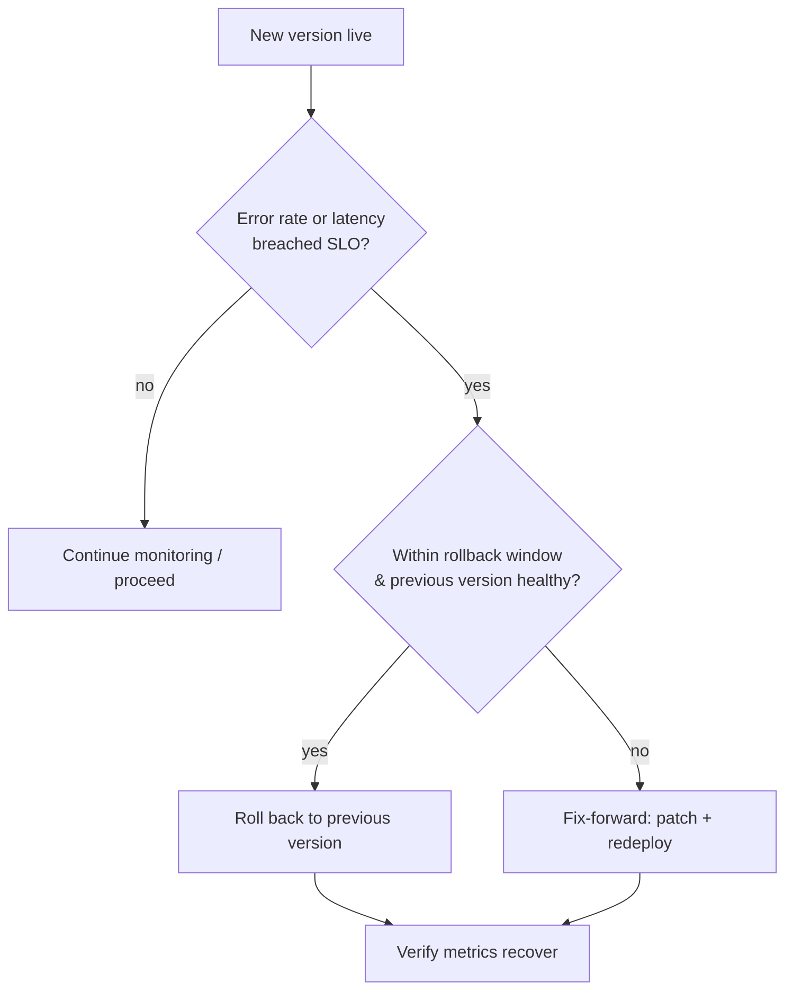
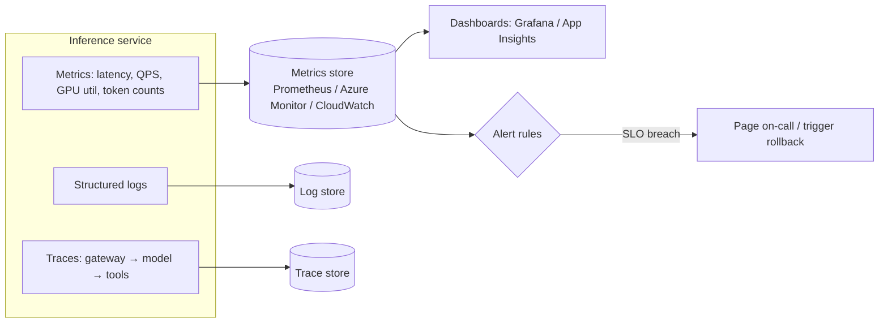
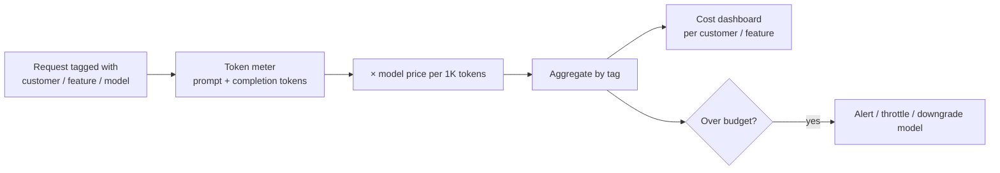

# Module 12.5 — Production Operations

How a GenAI service actually behaves once real traffic hits it. This section is the visual, conceptual glue between the techniques (Module 12.2) and the cloud-specific implementations (12.3 Azure, 12.4 AWS): it shows the mental models — request flow, scaling, releases, and observability — that the code in those modules implements.

---

## Table of Contents

1. [The Request Lifecycle](#the-request-lifecycle)
2. [Scaling & Reliability](#scaling--reliability)
3. [Release & Rollback](#release--rollback)
4. [Observability & Cost](#observability--cost)
5. [Key Takeaways](#key-takeaways)

---

## The Request Lifecycle

A single inference request is not "call the model and wait." It passes through a gateway, authentication, rate limiting, a queue, and a batching scheduler before a GPU ever sees it — then tokens stream back as they are generated. Understanding this path explains nearly every latency and throughput decision you will make.

*Figure: the journey of one inference request from client to streamed response.*



Why a queue and a scheduler instead of one-request-per-GPU? Because GPUs are most efficient when processing many sequences at once. The scheduler packs concurrent requests into a single batch and keeps the GPU saturated.

*Figure: static batching wastes the GPU between batches; continuous batching keeps it full.*



The other half of serving efficiency is the **KV-cache**: the attention keys/values for every token already generated are kept in GPU memory so they are not recomputed each step. This is why long contexts and many concurrent users consume GPU memory fast.

```
GPU Memory (e.g. 80 GB A100)
┌─────────────────────────────────────────────┐
│  Model weights (e.g. 7B @ fp16 ≈ 14 GB)       │
├─────────────────────────────────────────────┤
│  KV-cache  ── grows with (tokens × users)     │
│  [req A ███████      ]                         │
│  [req B ████         ]                         │
│  [req C ██████████   ]  ← evicted/blocked when │
│                          cache is full          │
├─────────────────────────────────────────────┤
│  Activations / scratch                         │
└─────────────────────────────────────────────┘
```

> **In practice:** Latency has two parts — time-to-first-token (queue wait + prompt processing) and inter-token latency (decode speed). Continuous batching improves throughput; it does not shorten a single request. When the KV-cache fills, new requests queue — that is the real meaning of "GPU at capacity."

**Maps to:** vLLM/continuous batching config in [02_deployment_techniques](../02_deployment_techniques/README.md#model-optimization-before-deployment); GPU node pools in [03_azure](../03_deployment_implementation_with_azure/README.md#azure-kubernetes-service-aks) and [04_aws_mlops](../03_deployment_implementation_with_azure/04_deployment_with_aws_mlops/README.md#sagemaker-real-time-endpoints).

---

## Scaling & Reliability

Traffic to a GenAI service is bursty. Scaling well means matching capacity to demand at two levels: scaling **pods** (replicas of your server) and scaling **nodes** (the actual GPU machines). Different signals drive each.

*Figure: the three layers of autoscaling and what triggers each.*



- **HPA** reacts to resource/custom metrics already exposed on running pods.
- **KEDA** reacts to *external* signals (queue length, requests/sec) and uniquely can scale **to zero**.
- **Karpenter / Cluster Autoscaler** adds machines when pods cannot be scheduled for lack of GPUs.

### Scale-to-zero and cold starts

Scaling to zero saves money on idle services but introduces a **cold start**: the next request must wait for a node, image pull, and model load.

*Figure: the cost of the first request after scaling from zero.*



### Multi-region failover & high availability

For resilience, run in more than one region behind a global router that health-checks each backend and fails over automatically.

*Figure: active-active topology with health-checked failover.*



> **In practice:** Pick scaling signals that lead demand, not lag it — queue depth (KEDA) reacts before CPU saturation does. Keep a warm minimum replica for latency-sensitive services; use scale-to-zero only where cold-start latency is acceptable. Rate limiting at the gateway is part of reliability: it protects the GPU fleet from being overwhelmed.

**Maps to:** KEDA `ScaledObject` and GPU node pools in [03_azure](../03_deployment_implementation_with_azure/README.md#azure-kubernetes-service-aks); Karpenter and SageMaker auto-scaling in [04_aws_mlops](../03_deployment_implementation_with_azure/04_deployment_with_aws_mlops/README.md#ecs--eks-container-deployment); serverless cold starts in [02_deployment_techniques](../02_deployment_techniques/README.md#serverless-techniques).

---

## Release & Rollback

Shipping a new model or app version safely means controlling how much traffic it sees and being able to undo instantly. The three core strategies trade speed of rollout against blast radius.

*Figure: how traffic shifts under blue-green, canary, and rolling releases.*



- **Blue-green:** two full environments, switch all traffic at once. Instant rollback (switch back), but double the resources during the cutover.
- **Canary:** shift traffic in small increments, watching metrics at each step. Smallest blast radius; slowest rollout.
- **Rolling:** replace replicas one batch at a time. No extra environment, but old and new run simultaneously mid-rollout.

### CI/CD pipeline with quality gates

Releases should be automated and gated — each stage must pass before the next runs.

*Figure: pipeline from commit to production with automated gates.*



### Rollback decision flow

When a release misbehaves, the decision to roll back should be mechanical, not a debate.

*Figure: deciding whether to roll back.*



> **In practice:** Use canary for model changes where quality regressions are subtle (you need real traffic to detect them) and blue-green for infrastructure changes you can validate before the switch. Always wire an automatic rollback trigger on error-rate/latency SLO breach — humans are too slow at 3 a.m. The eval gate is what makes a GenAI pipeline different from a normal one: a green unit-test run does not mean the model still answers well.

**Maps to:** blue-green/canary/rolling configs in [02_deployment_techniques](../02_deployment_techniques/README.md#deployment-strategies); Azure ML traffic-split deployments in [03_azure](../03_deployment_implementation_with_azure/README.md#azure-machine-learning-endpoints); SageMaker production variants in [04_aws_mlops](../03_deployment_implementation_with_azure/04_deployment_with_aws_mlops/README.md#sagemaker-real-time-endpoints).

---

## Observability & Cost

You cannot operate what you cannot see. Observability for a GenAI service combines the three classic signals — metrics, logs, traces — with two GenAI-specific ones: **token usage** and **answer quality**.

*Figure: how signals flow from the service to dashboards and alerts.*



A useful LLM dashboard groups panels by question, not by raw metric:

```
┌───────────────────────────┬───────────────────────────┐
│ Latency                   │ Reliability               │
│  • p50 / p95 TTFT         │  • error rate (4xx/5xx)   │
│  • inter-token latency    │  • timeouts / retries     │
├───────────────────────────┼───────────────────────────┤
│ Throughput & Capacity     │ Cost                      │
│  • requests/sec           │  • tokens/min (in/out)    │
│  • GPU utilization        │  • $ spend/hour           │
│  • queue depth            │  • $ per request          │
└───────────────────────────┴───────────────────────────┘
```

### Token spend & cost attribution

For LLM services, cost ≈ tokens. Attributing spend back to teams or customers requires tagging every request and aggregating by token counts × price.

*Figure: from a single request to a per-customer cost report.*



> **In practice:** Track p95, not averages — tail latency is what users feel. Always log `prompt_tokens` and `completion_tokens`; they are both your bill and your capacity signal. Tag requests at the gateway so cost attribution is automatic rather than a quarterly forensics exercise. Cache hits, shorter prompts, and routing easy requests to cheaper models are the three biggest cost levers.

**Maps to:** Prometheus/Grafana and middleware metrics in [02_deployment_techniques](../02_deployment_techniques/README.md#monitoring--observability); App Insights in [03_azure](../03_deployment_implementation_with_azure/README.md#monitoring-with-azure-monitor--application-insights); CloudWatch in [04_aws_mlops](../03_deployment_implementation_with_azure/04_deployment_with_aws_mlops/README.md#monitoring-with-cloudwatch--sagemaker-clarify).

---

## Key Takeaways

- A request flows gateway → auth/rate-limit → queue → batching scheduler → GPU → streamed tokens; the queue and KV-cache explain most latency and capacity behaviour.
- Continuous batching maximizes throughput, not single-request speed.
- Scale pods (HPA/KEDA) and nodes (Karpenter/Cluster Autoscaler) on signals that lead demand; scale-to-zero trades cost for cold-start latency.
- Choose canary for subtle model-quality risk, blue-green for validated infra cutovers; always wire automatic rollback on SLO breach.
- Observe metrics + logs + traces **plus** tokens and quality; tag requests for automatic cost attribution.

---

*Previous: [12.2 Deployment Techniques →](../02_deployment_techniques/README.md)*
*Next: [12.3 Azure Implementation →](../03_deployment_implementation_with_azure/README.md)*
